# WARRANT — руководство по архитектуре и работе системы

> [!abstract] О чём этот документ
>
> Как устроен WARRANT, какие данные и решения проходят через него, как взаимодействуют люди и агенты, что система гарантирует и чего нет. Документ читают четыре аудитории: архитектор, тимлид, программист WARRANT и команды проектов, которые подключают WARRANT к своему репозиторию (потребители). Он описывает **WARRANT 0.8.2** (тег `v0.8.2`, pack `core-sdd` 0.3.4, OpenSpec 1.13.1) по состоянию на **2026-09-29**.

## Содержание

- [[#0. Как читать этот документ]]
- [[#1. Система за пять минут]]
- [[#2. Место в фабрике SEF]]
- [[#3. Принципы и инварианты]]
- [[#4. Архитектура системы]]
- [[#5. Модель данных и состояния]]
- [[#6. Жизненный цикл Change]]
- [[#7. Политика и проверка]]
- [[#8. Потоки данных]]
- [[#9. Агенты и их взаимодействие]]
- [[#10. Доверие и принуждение]]
- [[#11. CI и вердикт по PR]]
- [[#12. Подключённый проект]]
- [[#13. Как разрабатывается сам WARRANT]]
- [[#14. Состояние и развитие]]
- [[#15. Эксплуатация и разбор сбоев]]
- [[#Приложение A. Команды CLI]]
- [[#Приложение B. Gates и checks]]
- [[#Приложение C. Коды находок и что с ними делать]]
- [[#Приложение D. Реестр ADR]]
- [[#Приложение E. Глоссарий]]
- [[#Приложение F. Источники и как проверять факты]]

---

## 0. Как читать этот документ

Глава отвечает на три вопроса: с чего начать, чему верить и как понимать обозначения.

### Маршруты по ролям

Числа — номера разделов; в панели Outline Obsidian они перечислены по порядку.

| Роль | Что нужно вынести | Обязательно | По необходимости |
|---|---|---|---|
| **Архитектор** | границы компонентов, инварианты, модель доверия, где норма расходится с реализацией | 1, 2, 3, 4, 5, 6, 7, 10, 11.3, 14.3 | 8, 9, приложение D |
| **Тимлид** | как идёт работа над изменением, кто что решает — человек, агент, CI; темп и риски процесса | 1, 6, 9.1–9.2, 10.4–10.5, 12.5, 13.2, 13.6, 14 | 9.3–9.6, 13.3–13.5, 15.3 |
| **Программист WARRANT** | устройство CLI, потоки данных, тесты, слой разработки | 4, 5, 7, 8, 9.3–9.5, 11, 13, 15 | 3, 6.2, приложения A–C |
| **Потребитель** (подключает WARRANT к своему проекту) | что вы получаете, как подключиться, что бывает красным и как это чинить | 1, 6.1, 6.4, 7.2, 12, 15.1, приложение C | 5.1, 7.7, 10.4–10.5, 11.6, приложения A и E |

Если у вас пятнадцать минут — прочитайте главу 1, затем разделы 6.4 (три PR), 12.2 (что нужно знать до начала) и 12.5 (работа над Change): этого достаточно, чтобы понимать, что происходит в PR.

### Как помечены утверждения

Чтобы читатель отличал то, что работает сегодня, от того, что только описано в норме, у ключевых утверждений стоит метка.

| Метка | Значение |
|---|---|
| ✅ **реализовано** | есть в коде и покрыто тестами; так работает 0.8.2 |
| 🟡 **частично** | работает часть нормы; что именно — сказано рядом |
| 📄 **только в норме** | описано в спецификации или ADR, кода нет |

> [!warning] Норма и реализация — не одно и то же
>
> Документы `docs/01–13` — нормативная спецификация, и в нескольких местах она опережает код или отстаёт от него. Раздел 14.3 собирает эти расхождения в одну таблицу. Когда в этом руководстве написано «работает так», это проверено по коду и данным репозитория, а не пересказано из нормы.

### Иерархия источников

Если источники противоречат друг другу, побеждает вышестоящий:

1. **Код и тесты** (`packages/cli`, `packs/`) — что система делает на самом деле.
2. **Main specs** (`openspec/specs/*`: 67 требований, 354 сценария) — проверяемая норма поведения.
3. **ADR** (`docs/adr/`, 45 штук) — архитектурные решения и их причины.
4. **Документы спецификации** (`docs/01–13`) — обзорная норма.
5. **Это руководство** — синтез; ничего не отменяет.

### Как ссылаться на факты

Адрес места в репозитории записывается как «файл → раздел или идентификатор»: `docs/04-lifecycle.md → §2`, `ADR-0011 п. 1`, `REQ-VER-014`, `I-97`. Номера строк не используются: они сдвигаются при любой правке. Пути `docs/…`, `packages/…`, `openspec/…` ведут в репозиторий WARRANT (`Homasters-max/SRA`). Потребителю они нужны только для углублённой проверки: всё, что нужно для работы, изложено в этом документе. Полный список ADR — в [[#Приложение D. Реестр ADR]], термины — в [[#Приложение E. Глоссарий]], способы проверить факт самому — в [[#Приложение F. Источники и как проверять факты]].

### Как читать диаграммы

Диаграммы — mermaid, Obsidian рисует их сам. Стрелка — вызов или поток данных; пунктирная стрелка — косвенная связь или то, чего пока нет в коде. На схемах компонентов (главы 1–2) заливка показывает зрелость: зелёная — реализовано, оранжевая — частично, жёлтая с пунктирной рамкой — заготовка.

---

## 1. Система за пять минут

Эта глава самодостаточна: если прочитать только её, вы поймёте, что такое WARRANT, из чего он состоит и как проходит одно изменение. Остальные главы раскрывают детали.

### 1.1 Что такое WARRANT и зачем он нужен

Когда код и спецификации пишут люди вместе с ИИ-агентами, на каждом шаге нужно уверенно отвечать на два вопроса. **WARRANT** — слой управления спецификациями и изменениями внутри фабрики SEF (Software Factory) — отвечает на них:

- **что разрешено** — какие шаги допустимы для этого изменения, при каком риске, кем одобрены;
- **что доказано** — какие проверки прошли, на чём, кто за это ручается.

Практически WARRANT состоит из трёх частей:

- командной строки `warrant` (TypeScript, Node ≥ 20.19; CI использует 22);
- **pack** `core-sdd` — набора данных с профилями, gates и проверками;
- job в CI, который проверяет каждый pull request.

Сервера, базы данных и очереди нет: всё состояние — JSON-файлы в самом репозитории.

WARRANT не пишет спецификации (это OpenSpec), не рассуждает о содержании (это SRA — reasoning-skills), не хранит смысл предметных объектов (это LATTICE). Он **вычисляет политику**, **ставит gates** (правила-«ворота») на переходах жизненного цикла и **принимает evidence** — записи о том, что доказано. Название — по модели Тулмина: *warrant* — основание, по которому evidence подтверждает утверждение, и одновременно разрешение на действие.

**Кому подходит.** Проектам, где изменения вносят ИИ-агенты и нужен проверяемый, воспроизводимый след: кто одобрил, что проверено, на каком коммите. **Что нужно учитывать заранее:**

- работает поверх GitHub и OpenSpec; единственный поддерживаемый frontend агента — Claude Code;
- каждое изменение проходит три PR (для документов и хозяйства набор проверок легче);
- защита ветки `main` (обязательные проверки, без которых GitHub не даёт слить PR) — настройка репозитория, а не WARRANT; на приватном репозитории без платного плана она недоступна, и тогда красный job — сигнал «не сливать», а не блокировка.

### 1.2 Понятия, без которых дальше не обойтись

| Понятие | Что это | Где живёт |
|---|---|---|
| **Change** | единица работы; совпадает с OpenSpec change. Проходит состояния `PROPOSED → SPECIFIED → APPROVED → IMPLEMENTING → VERIFYING → MERGED → ARCHIVED` | каталог `openspec/changes/<change>/` и запись `.warrant/changes/<change>.json` |
| **Gate** | правило перехода: агрегирует evidence в вердикт `PASS`, `FAIL`, `WAIVED`, `NOT_APPLICABLE` или `BLOCKED` | данные pack: `packs/core-sdd/gates/*.json` |
| **Evidence** | воспроизводимая запись «что доказано, на чём, чем, кто ручается» | `.warrant/evidence/<change>/EVID-*.json` |
| **Run** | одна попытка агента выполнить операцию над Change; Change : Run = 1 : N | `.warrant/runs/RUN-*.json` |
| **Waiver** | явное временное исключение из одного gate одного Change: с владельцем и сроком | `.warrant/waivers/WAV-*.json` |
| **Effective Policy** | набор требований для конкретного Change; **вычисляется** из классификации, профилей и pack, не хранится | результат `warrant resolve` |
| **Pack** | подключаемый набор политики: профили, gates, проверки, шаблоны | `packs/core-sdd/` (внутри CLI) |

### 1.3 Слова, которые встретятся сразу

| Слово | Что значит |
|---|---|
| **Maintainer** | человек с правом принимать доверительные решения: сливать PR, активировать waiver. Задаётся в `roles.maintainer` файла `warrant.json` |
| **spec-PR, impl-PR, archive-PR** | три pull request'а одного Change: спецификация, реализация, закрытие |
| **Пути политики** | файлы, правка которых меняет правила игры (`.warrant/**`, `.github/workflows/**` и другие). Их правит только Change профиля `factory-change` |
| **Context Pack** | контекст, который CLI выдаёт агенту при старте Run |
| **attestation** | кто ручается за происхождение evidence: CI, человек через PR или никто (локальный запуск) |
| **UNKNOWN** | открытый вопрос; blocking UNKNOWN запрещает реализацию, пока человек не примет решение |
| **base и head** | целевая ветка и ветка PR в момент проверки в CI (подробнее — 11.2) |
| **forge** | сервис хостинга репозиториев; сейчас это GitHub |
| **frontend** | среда агента, к которой WARRANT подключает hooks; сейчас это Claude Code |
| **fail closed** | при неизвестном или конфликте система отказывает, а не разрешает |

Полный список терминов — в [[#Приложение E. Глоссарий]].

### 1.4 Система на одной картинке

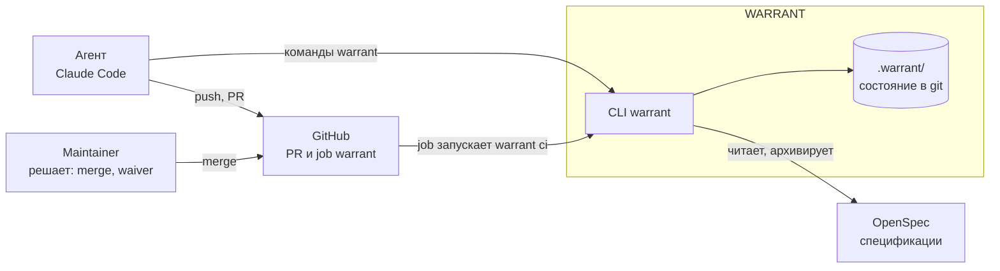

Агент работает через команды `warrant` и git; человек принимает доверительные решения в GitHub; job в CI независимо проверяет каждый PR той же командной строкой. Подробная схема контейнеров — в разделе 4.1.

### 1.5 Три идеи, на которых всё держится

1. **Всё состояние — файлы в git.** Нет скрытой памяти, сервера, базы. Запись о Change, evidence, waivers, Run агентов — JSON рядом с кодом. Любой вывод можно проверить, повторить и посмотреть в истории git; поэтому всё важное обязано попасть в PR и пройти его проверку.
2. **Принуждает детерминированный код, а не текст промпта** (инвариант INV-04). Агент рассуждает и **предлагает**; допустимость и итог вычисляет CLI. Вердикт детерминированной проверки не может отменить языковая модель.
3. **Доверие — к проверяемой ссылке, а не к писателю.** Запись «этот PR одобрен» заслуживает доверия, потому что её можно проверить по ссылке: URL слитого PR, URL запуска CI. `warrant ci` при каждом PR идёт в GitHub и сверяет ссылки, а сам CI никогда не пишет в репозиторий (раздел 10.1).

### 1.6 Как проходит одно изменение

Change проходит три PR. Состояния записи привязаны к PR так:

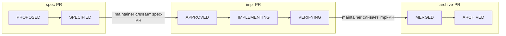

1. **Спецификация (spec-PR).** `warrant init change <имя>` создаёт каталог OpenSpec и запись в состоянии `PROPOSED`. Пишутся `proposal.md`, дельты `specs/**`, `design.md`, `tasks.md`; `warrant classify` вычисляет риск; субагент-ревьюер ищет дефекты; `warrant verify` проверяет gates; запись переходит в `SPECIFIED`; человек сливает PR.
2. **Реализация (impl-PR).** Первым коммитом записывается переход `APPROVED` со ссылкой на **уже слитый** spec-PR, затем `IMPLEMENTING`; код и тесты по группам задач; последним — `VERIFYING`. CI собирает результат слияния с `main`, запускает проверки и сохраняет evidence. Человек сливает PR.
3. **Закрытие (archive-PR).** `warrant ci fetch` забирает evidence CI, `transition MERGED` ссылается на слитый impl-PR, `warrant archive` переносит дельты в main specs и ставит `ARCHIVED`. Человек сливает PR; при росте версии ставится тег.

Неочевидный момент: запись перехода **отстаёт от события на один PR**. `APPROVED` фиксирует, что spec-PR уже слит, и потому появляется в impl-PR; `MERGED` — в archive-PR. Почему PR именно три — в разделе 6.4.

### 1.7 Что читать дальше

| Если вы… | Читайте |
|---|---|
| подключаете WARRANT к своему проекту | главу 12; затем 6.4 (три PR) и 15 (если что-то красное) |
| проектируете или оцениваете систему | главы 2, 3, 10 — границы, инварианты, модель доверия; затем 14.3 — где норма и код расходятся |
| ведёте работу над изменениями | главы 6 и 9; затем 13.2 и 14 |
| правите код WARRANT | главы 4, 5, 8, 11 и 13 |

---

## 2. Место в фабрике SEF

*Зачем читать: понять, где WARRANT стоит в фабрике, кто чем владеет и что из карты компонентов реально существует.*

### 2.1 Компоненты и границы

SEF — целое; WARRANT — один из компонентов SEF. У каждого свой вопрос и свой **единственный владелец** соответствующих данных (SSOT — single source of truth).

| Компонент | Отвечает на вопрос | Владеет | Статус |
|---|---|---|---|
| **OpenSpec** (stock 1.13.1, без форка) | Что требуется? | Change, proposal, specs, design, tasks, дельты, архив; `openspec validate` | ✅ реализовано, внешний |
| **WARRANT** | Что разрешено и что доказано? | классификация, риск, профили, Effective Policy, gates, waivers, evidence, контракт вызова reasoning, CLI и CI-принуждение | ✅ реализовано (этот документ) |
| **SRA** | Как рассуждать? | skills и их режимы | 🟡 один skill — `specification/adversarial-review` |
| **LATTICE** | Что это за объект и как он связан? | identity, связи, provenance, история, эпистемический статус объектов | 📄 контракты в норме; в этом репозитории — заготовка; реальный LATTICE — отдельный проект |
| **JEV** | Предлагает; authority нет | classifier: предлагает профили и риск | 📄 только документы |
| **SEF** (диспетчер) | оркестрация, запуск агентов, слияние | исполнение и допуск | 📄 дизайн; WARRANT — «инструмент на столе» и argv-gates |

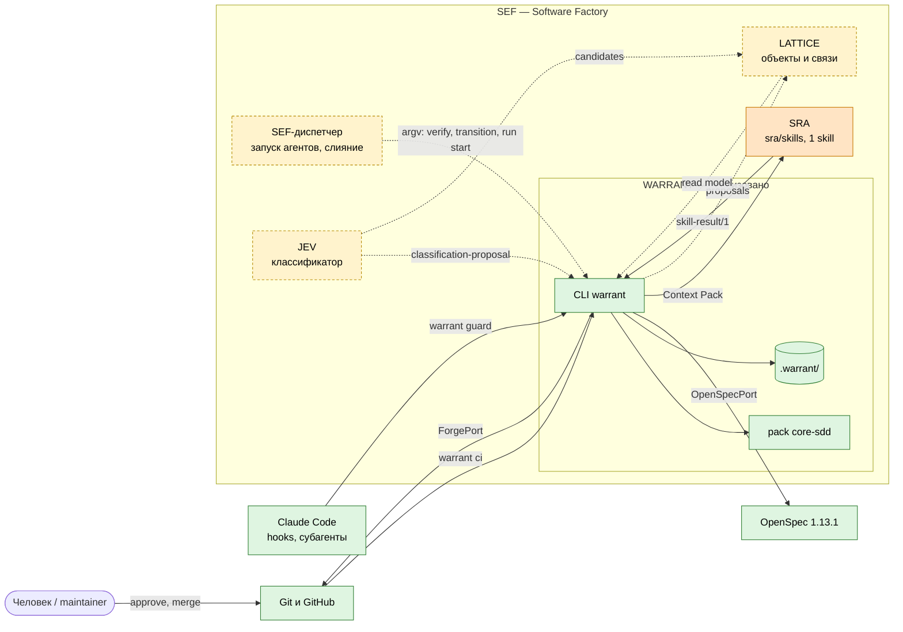

### 2.2 Направление зависимостей и правила границ

- **WARRANT → OpenSpec**: вызывает CLI `openspec` через порт; ничего не форкает. Схема workflow `warrant-sdd` — проектная (project-local), а `openspec/config.yaml` генерируется (ADR-0001, ADR-0015).
- **WARRANT → GitHub**: читает PR, запуски, артефакты и комментарии через `gh`; ничего в репозиторий не пишет.
- **WARRANT → SRA**: выдаёт Context Pack и принимает результат `skill-result/1`; сама рассуждающая часть — у SRA.
- **Остальные компоненты обращаются к LATTICE** только с предложениями (proposal). Ни один компонент не мутирует состояние другого; WARRANT стоит между источником и LATTICE как **authorizer** — сначала политика, потом валидация LATTICE.
- **SEF → WARRANT**: только argv (`warrant …`). Ядро WARRANT работает и без SEF.
- **Деградация**: недоступность компонента не ломает WARRANT; gates, для которых компонент — обязательный источник evidence, дают `BLOCKED`, а не `PASS` (fail closed, INV-10).

WARRANT намеренно **не владеет**: содержанием спецификаций (нет каталога `.warrant/specs/`), смыслом предметных понятий, кодом проекта и его историей.

### 2.3 Что существует в коде, а что — только контракт

> [!note] Что реально есть в коде
>
> Из всей карты SEF **в коде реализованы WARRANT, интеграции с OpenSpec, GitHub и Claude Code, и один skill SRA**. Для LATTICE-адаптера, очереди proposal, JEV и транспорта `sef-hub` кода нет — есть документы и проектные решения. Репозиторий называется `SRA`, но фактически это монорепозиторий WARRANT: от SRA в нём только каталог `sra/skills/`.

| Что | Статус |
|---|---|
| CLI `warrant` 0.8.2, pack `core-sdd` 0.3.4, CI-судья `warrant ci` | ✅ |
| Адаптер frontend `claude` (hooks, permissions, субагент) | ✅ единственный адаптер; `codex` и `opencode` — 📄 |
| Skill `specification/adversarial-review` 0.2.0 | ✅ единственный skill |
| Proposal-envelope `sef://proposal/1`, очередь `.warrant/proposals/`, pack `lattice`/`jev`/`sef` | 📄 |
| Транспорт `sef-hub`, attestation `sef-approval`/`sef-gate` | 📄 |
| Часть границы с SEF: `--base`, `WARRANT_STATE_DIR`, gate `spec-approved` | ✅ (ADR-0020) |

Две модели LATTICE в норме и на деле различаются: заготовка `lattice/` в этом репозитории (реестр решений, объектная модель «substrate») и реальный проект LATTICE, начатый 2026-09-27 как «память решений с происхождением и доверием». Контракты интеграции `docs/integrations/` написаны под первую; сопоставление со второй ещё не сделано. Для читателя-потребителя важно другое: LATTICE — **второй проект, живущий под WARRANT**, и именно опыт его подключения превратился в релизы 0.8.1 и 0.8.2.

---

## 3. Принципы и инварианты

*Зачем читать: принципы, на которых стоят все решения; зная их, можно предсказать поведение системы.*

### 3.1 Главный принцип

```text
Документы описывают устойчивые контракты.
Packs описывают подключаемые возможности.
Конфигурация описывает композицию, а не поведение.
Resolver вычисляет поведение.
Skills рассуждают.
Checks принуждают.
LATTICE хранит смысл.
Evidence показывает результат.
```

Производные принципы проектирования (`docs/01-principles.md → §6`):

- правильный процесс проще неправильного;
- минимум примитивов;
- **stock first**: OpenSpec используется без форка, расширяется только настройками и данными;
- данные вместо прозы;
- новое добавляется только по фактическим отказам (failure mode);
- любое вычисленное требование объяснимо (`warrant resolve --explain`).

### 3.2 Инварианты INV-01 … INV-11

Инварианты — то, что нельзя нарушать. Ниже — чем каждый принуждается сегодня. Колонка «предел» показывает, где принуждение кончается.

| ID | Инвариант | Чем принуждается | Статус и предел |
|---|---|---|---|
| INV-01 | Спецификация предшествует реализации | `warrant ci` проверяет, что `APPROVED` ссылается на слитый spec-PR, чей merge внёс `SPECIFIED`; gate `scope-valid` | ✅. «Approving review» на деле проверяется как `merged_by ∈ roles`: метода reviews в `ForgePort` нет |
| INV-02 | Вердикт L0/L1 не отменяется LLM (L2) | алгоритм gate считает только `PROVEN` нужного kind; L2 — отдельный gate | ✅ |
| INV-03 | Агент не одобряет своё изменение | `warrant ci`: `merged_by ∈ roles`, не агент, не автор PR | 🟡 пока `identities.agents` пуст — вместо отказа находки `SHARED_IDENTITY` и `APPROVER_IS_AUTHOR` |
| INV-04 | Prompt — не механизм принуждения | всё, что ниже | ✅ принцип |
| INV-05 | UNKNOWN не превращается молча в FACT | gate `blocking-unknowns-resolved` читает запись Change | 🟡 маркеры в прозе — предмет L2-ревью |
| INV-06 | У каждого вида знания один владелец | проектная дисциплина; `validate` ловит дубли ID объектов конфигурации | 🟡 |
| INV-07 | Skills и внешние источники только предлагают | `write_scope` Run + `warrant guard`; CI: запись без проверяемой ссылки не проходит | 🟡 shell не закрыт hook'ом — последняя инстанция CI |
| INV-08 | Система не ослабляет свои правила сама | пути политики → профиль `factory-change` → отдельные gates и человек на merge | 🟡 см. 14.3: `human-approval` на merge даёт risk-overlay, не профиль |
| INV-09 | Recovery для изменений production и данных | — | 📄 нет pack `data` |
| INV-10 | Неизвестное или конфликт → fail closed | resolver и gates: неизвестное → `MEDIUM`, `FAIL`, `ESCALATE`; `guard` при сбое → `deny` | ✅ |
| INV-11 | ИИ не единственный approver для разрушающих изменений | только класс «policy» (через INV-08); остальное — будущие packs | 📄 |

### 3.3 Правило выбора абстракции

Когда нужно добавить возможность, вопросы задаются по порядку; первый «да» определяет форму. Это защита от разрастания системы: нельзя решать политикой то, что решает схема, и нельзя решать проверкой то, что требует рассуждения.

| # | Вопрос | Если «да» — форма |
|---|---|---|
| 1 | Есть штатный механизм OpenSpec? | использовать OpenSpec |
| 2 | Это правило допустимого перехода? | **Policy**: профиль, overlay, gate |
| 3 | Проверяется детерминированно? | **Check** и gate |
| 4 | Повторяемое действие? | **Operation** |
| 5 | Новое долговечное знание? | **Artifact** |
| 6 | Reasoning, не сводимый к коду? | **Skill** (SRA) |
| 7 | Нужен другой граф артефактов? | схема OpenSpec |

Каждое правило живёт ровно в одном месте: в конституции (документ 01), политике (packs), проектных правилах (`.warrant/local/…`), правилах по путям (`rule/1` → `AGENTS.md`), ADR, spec или skill.

### 3.4 Ключевые архитектурные решения

Всего 45 ADR; десять определяют лицо системы. Полный реестр — в [[#Приложение D. Реестр ADR]].

| ADR | Решение | Что оно определило |
|---|---|---|
| 0001 | OpenSpec — единственный владелец жизненного цикла спецификации | WARRANT не форкает OpenSpec и не заводит второй формат spec |
| 0002 | Kernel + Packs | политика — данные; ослаблять правила нельзя, только усиливать |
| 0003 | Шесть эпистемических маркеров и раздельные оси статусов | нет общего поля `status`; skill не выносит вердикт |
| 0006 | Всё в JSON + JSON Schema | один объект — один файл; канонический вид; `warrant fmt` |
| 0009 / 0010 | Запись о Change пишет только CLI; доверие по ссылке | CI не пишет в репозиторий; `by: cli:local` — не основание доверия |
| 0011 | Топология PR: spec-PR → impl-PR → archive-PR | спецификация одобряется отдельно от кода |
| 0021 | Неизменяемость архива | исправление — новый Change со ссылкой `amends` |
| 0024 | Gate `spec-approved` | правка спецификации после одобрения видна и требует waiver |
| 0037 / 0038 | CI судит результат merge; закон и судья берутся из базы | PR не может задать требования к самому себе |
| 0039–0042, 0044 | Vertical slice и подключение проектов | опыт двух проектов превращается в релизы и правки нормы |

Норма меняется **только новым ADR**; прежние ADR не переписываются, а получают пометку `amended_by`. Самые часто уточняемые — 0014 (пять уточнений), 0018, 0020 (по четыре), 0010, 0011, 0034, 0013 (по три).

---

## 4. Архитектура системы

*Зачем читать: увидеть части системы и устройство CLI, чтобы ориентироваться в коде и поставке.*

### 4.1 Контейнеры

WARRANT состоит из пяти поставляемых частей и трёх внешних участников. Поставляемое распространяется **одним дистрибутивом** — git-тегом репозитория (`v0.8.2`): CLI, pack и skills имеют свои номера версий (CLI 0.8.2, pack 0.3.4, skill 0.2.0), но поставляются и выбираются одним тегом и по отдельности не устанавливаются. Выбор тега — это и есть выбор версии всего WARRANT для проекта.

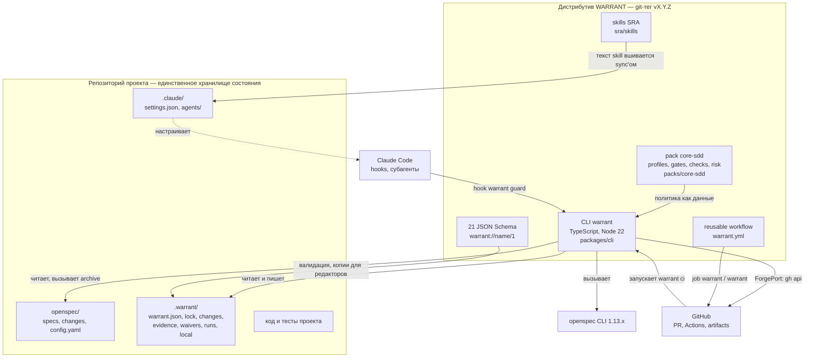

| Контейнер | Технология | Ответственность | Поставляется проекту |
|---|---|---|---|
| **CLI `warrant`** | TypeScript (ESM, `strict`), Node ≥ 20.19 (CI — 22) | всё исполняемое поведение: 20 команд, resolver, gates, запись состояния, `warrant ci`, `warrant guard` | ✅ да |
| **pack `core-sdd`** | JSON-данные, 35 файлов | профили, overlays, 13 gates, 2 checks, risk-пороги, таблица controller, шаблоны OpenSpec | ✅ да, внутри CLI (`source: bundled`) |
| **skills** | Markdown с frontmatter | reasoning-компоненты SRA; сейчас один — `adversarial-review` | ✅ да, внутри CLI |
| **схемы** | JSON Schema 2020-12 | форма каждого документа состояния и конфигурации | ✅ да, копии в `.warrant/schemas/` |
| **reusable workflow** | GitHub Actions | job `warrant / warrant`: собирает результат merge, запускает `warrant ci` | ✅ вызывается по тегу (ограничение 0.8.2 — см. 11.6) |
| **OpenSpec** | внешний CLI 1.13.x | владелец спецификаций и жизненного цикла Change | ❌ ставит проект |
| **GitHub** | внешний | PR, review, Actions, artifacts — источник проверяемых ссылок | ❌ |
| **Claude Code** | внешний | среда исполнения агента; принуждение hooks и permissions | ❌ |

Не входит в поставку: спецификация `docs/`, ADR, навыки разработки `.claude/skills/`, скрипты `scripts/dev/`, golden-фикстуры pack. Это слой разработки самого WARRANT (глава 13).

### 4.2 Что где лежит в репозитории WARRANT

| Каталог | Что | Поставляется |
|---|---|---|
| `packages/cli/` | CLI: `src/` (код), `test/` (4 уровня тестов), `schemas/` (21 схема) | ✅ |
| `packs/core-sdd/` | pack по умолчанию: `profiles/ gates/ checks/ overlays/ risk/ controller/ evidence/ openspec/`, `golden/` | ✅ кроме `golden/` |
| `sra/skills/` | reasoning-skills SRA | ✅ |
| `docs/` | спецификация 01–13, `adr/`, `backlog.md`, `handoff/`, `process/`, `archive/` | ❌ |
| `openspec/` | main specs (4 capability) и Changes — WARRANT судит сам себя | ❌ |
| `.warrant/` | конфигурация и состояние WARRANT как проекта под WARRANT | ❌ |
| `scripts/dev/` | инструменты разработки: `brief`, `cs`, хуки, `hygiene`, метрики | ❌ |
| `.claude/` | хуки разработки, навыки процесса (21), агенты (2) | ❌ (кроме сгенерированного `warrant-reviewer.md` как образца) |
| `lattice/` | заготовка отдельного проекта LATTICE; не трогать | ❌ |
| `.github/workflows/` | `ci.yml`, `warrant.yml` (reusable) | `warrant.yml` — вызывается по тегу |

### 4.3 Устройство CLI

CLI построен по схеме «функциональное ядро, императивная оболочка». Команды тонкие; вся логика — в `core/`, где она в основном чистая (данные на входе, данные на выходе); все процессы и обращения наружу спрятаны за **портами** и живут только в адаптерах.

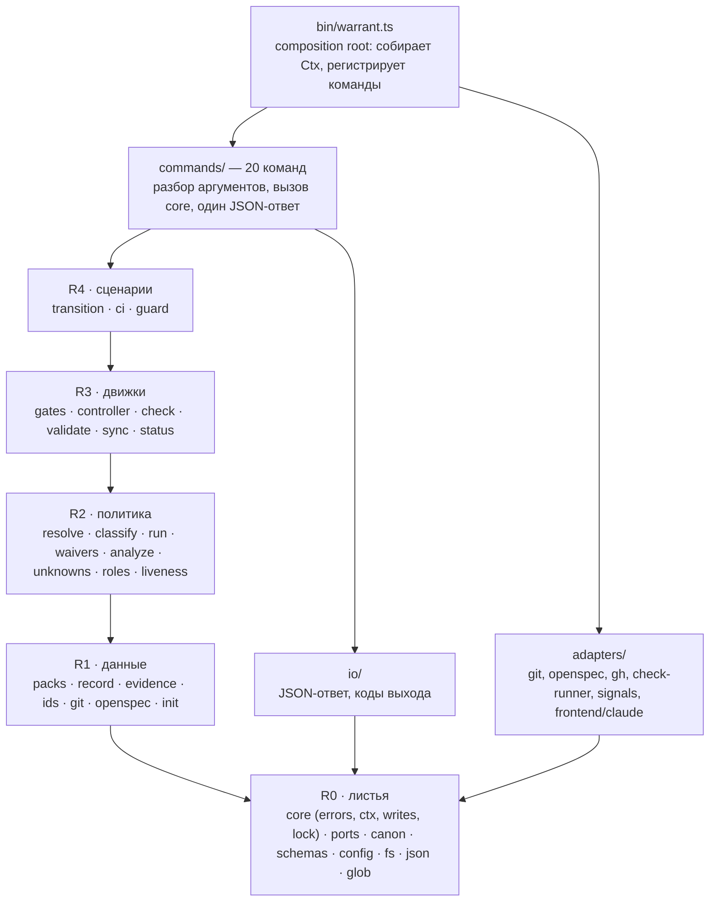

**Правило рангов** (ADR-0030, держит `architecture.test.ts`): модуль `core/*` импортирует только модули **своего или нижнего** ранга. Циклов нет (0 циклов на уровне файлов и модулей), нарушений рангов нет, список исключений (храповик) пуст. Команда не импортирует другую команду — только общий `commands/context.ts`. Процессы (`git`, `openspec`, `gh`, пользовательские checks) запускаются **только** в `src/adapters/**` (держит `levels.test.ts`).

Общие помощники и перечисления закреплены за единственным владельцем (37 помощников, 15 перечислений, 6 внешних пакетов — каждый подключается только в одном файле; `commander` и `cross-spawn` — только в `bin` и адаптерах): дубль объявления вне владельца ломает тест. Так словарь жизненного цикла (`CHANGE_STATES`, `PR_KIND_OF_STATE`) живёт в одном файле `core/record/lifecycle.ts`, а запись JSON — в одной функции `writeJsonFile`.

#### Модули по размеру

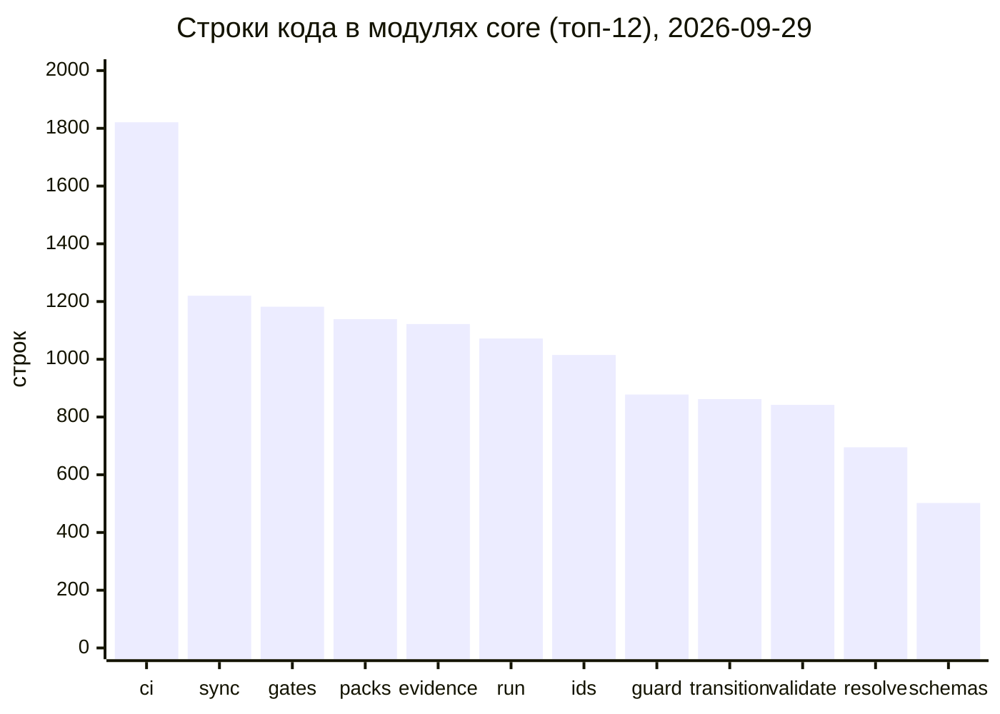

Ядро — 80 % кода (17 376 строк из 21 630); остальное — команды (2 496), адаптеры (1 021), `bin` (605) и вывод (132). Самые «широкие» по зависимостям модули — `core/ci` и `core/transition` (по 21 исходящему импорту): это сценарии, которые сводят воедино политику, git, GitHub и evidence.

#### Порты и адаптеры

Контекст выполнения `Ctx` собирается один раз в `bin/warrant.ts` и передаётся в каждую команду: `{ root, openspec, git, checks, clock, forge, signals, writes, warn }`. Неявного контекста нет — поэтому любую команду можно запустить в тесте с фейками без единого процесса.

| Порт | Что умеет | Адаптер | Что запускает |
|---|---|---|---|
| `GitPort` | 18 методов: `head`, `mergeBase`, `diffNames`, `treeId`, `worktreeAt`… | `git-cli.ts` | `git` |
| `OpenSpecPort` | 9 методов: `status`, `showChange`, `archive`, `newChange`… | `openspec-cli.ts` | `openspec … --json` |
| `ForgePort` | 5 методов: `pullRequest`, `workflowRun`, `listRuns`, `downloadArtifact`, `comment` | `forge-gh.ts` | `gh api`, `gh run download` |
| `CheckRunnerPort` | запуск проверки без shell, таймаут, остановка дерева процессов | `check-runner.ts` | команда проверки проекта |
| `ClockPort`, `SignalsPort` | «сегодня» в UTC; обработка прерывания | встроены | — |
| `FrontendAdapter` | перевод hook-JSON агента в нейтральное событие и обратно | `frontend/claude.ts` | — (чистая функция) |

Название frontend'а допустимо только в адаптере, генераторе `sync` и значении `--frontend`: логика `warrant guard` от Claude Code не зависит, поэтому позже добавится `codex` или `opencode` без изменения ядра.

#### Контракт вывода и коды выхода

Каждая команда печатает **один JSON-ответ** и завершается кодом выхода (исключение — `warrant guard --frontend <имя>`: он отвечает в формате самого агента). Порядок ключей ответа — часть контракта (на нём стоят golden-тесты).

```json
{ "command": "verify", "ok": false, "change": "my-change",
  "data": { "transition": "SPECIFIED->APPROVED", "gates": { "adversarial-review": "BLOCKED" },
            "controller_action": "WAIT", "next": "verify" },
  "errors": [ { "code": "GATES_NOT_PASSED", "message": "…", "path": "…", "hint": "…" } ] }
```

| Код | Значение | Где встречается |
|---|---|---|
| **0** | успех | все команды; `check` — 0 даже при `NOT_PROVEN`: запись сделана |
| **1** | нарушение или `STOP` | `validate --files`, `fmt --check`, `sync --check`, `analyze`, `ci` |
| **2** | ожидание: `WAIT` / `ESCALATE`; замок `BUSY` | `gate`, `verify`, `transition` при непройденных gates |
| **3** | конфигурация, `USAGE`, ошибка проверки, недоступен GitHub; и любой `WarrantError` без своего кода | `validate` при находках, `ci` при ошибке форжа |

> [!warning] Непройденный gate даёт код 2, а не 1
>
> Непройденный gate даёт код **2**, а не 1: единственное правило pack про `FAIL` возвращает `WAIT`. Код 1 от controller'а достижим только пользовательским pack'ом. Скрипты, которые различают «красный» и «ждёт», должны читать не код, а поле `data.controller_action`.

Ошибка всегда `{code, message, path?, hint?}`: `message` говорит, что не так, `hint` — как исправить (ADR-0034 п. 8). Общий флаг `--json` принимается, но сегодня ничего не меняет: вывод всегда JSON. Флаг `--dry-run` есть у части команд, пишущих состояние: `waive`, `transition`, `archive`, `run *`, `unknown *`, `ci`, `ci fetch`.

### 4.4 Стек и соглашения кода

- **TypeScript**, ESM `NodeNext`, `strict`, `exactOptionalPropertyTypes`; сборка через `tsc` в `packages/cli/dist`.
- **8 runtime-зависимостей**: `ajv` и `ajv-formats` (JSON Schema), `commander` (CLI), `canonicalize` (RFC 8785, канонический хэш), `ulid`, `semver`, `picomatch`, `cross-spawn`. Шесть из них закреплены за одним файлом-владельцем в `architecture.json`; `commander` используется только в `bin/warrant.ts`, `cross-spawn` — в адаптерах.
- **JSON пишется только через `writeJsonFile`**: порядок ключей по схеме, отступ 2, LF, запись атомарная (временный файл рядом и `rename`; на Windows повтор при `EPERM/EBUSY`).
- **Код работает на Linux и Windows**: пути через `path`, без shell, без внешних утилит.
- **Каждая внешняя интеграция** — метод порта, адаптер, фейк и сценарий контракта.

---

## 5. Модель данных и состояния

*Зачем читать: какие файлы и записи составляют состояние системы, кто их пишет и как они связаны.*

### 5.1 Файлы как база данных

У WARRANT нет базы данных: состояние — это **файлы в репозитории**, и у каждого файла один владелец-писатель.

```text
проект/
├── openspec/
│   ├── config.yaml                 генерируется sync
│   ├── schemas/warrant-sdd/        генерируется sync (workflow и шаблоны)
│   ├── specs/<capability>/spec.md  main specs — меняет только archive-PR
│   └── changes/
│       ├── <change>/               активный Change: proposal, specs (дельты), design, tasks
│       └── archive/<дата>-<change>/  неизменяемый архив
├── .warrant/
│   ├── warrant.json                конфигурация проекта (пишет человек)
│   ├── warrant.lock.json           lock: версии и хэши (пишет sync)
│   ├── schemas/*.1.schema.json     21 копия схем kernel (пишет sync)
│   ├── local/                      слой проекта: areas, checks, rules, свои gates и profiles
│   ├── changes/<change>.json       запись о Change (пишет только CLI)
│   ├── evidence/<change>/          EVID-*.json и manifest.json (пишет только CLI)
│   ├── waivers/WAV-<год>-NNN.json  waivers (пишет только CLI)
│   └── runs/RUN-*.json             Run агента (пишет только CLI)
├── .claude/                        только при frontend claude: hooks, permissions, субагент
└── AGENTS.md                       генерируется, если есть правила путей rule/1
```

| Класс | Файлы | Кто пишет | В git | Как держится |
|---|---|---|---|---|
| **Настройка** | `warrant.json`, `local/**`, workflow проекта | человек | да | `validate`, `fmt --check` |
| **Производное** | `openspec/config.yaml`, `openspec/schemas/**`, `.warrant/schemas/**`, lock, `.claude/settings.json` (свои записи), `warrant-reviewer.md`, `AGENTS.md` | `warrant sync` | да | `GENERATED_DRIFT`, `LOCK_MISMATCH` |
| **Состояние процесса** | `changes/*.json`, `evidence/**`, `waivers/*.json`, `runs/*.json`, `openspec/specs/**` | **только CLI** | да | `validate` — форма; `warrant ci` — происхождение |
| **Рабочее** | `evidence/**/raw/`, `runs/current`, замок check в `.git/warrant/` | CLI | **нет** | `.gitignore` |

Замечание про `raw/`: сырой вывод проверок (например `junit.xml`) в git не попадает; запись EVID хранит только его SHA-256. Файл Run, напротив, **коммитится вместе с работой**: по нему CI сверяет, работал ли агент под guard.

### 5.2 Связи между сущностями

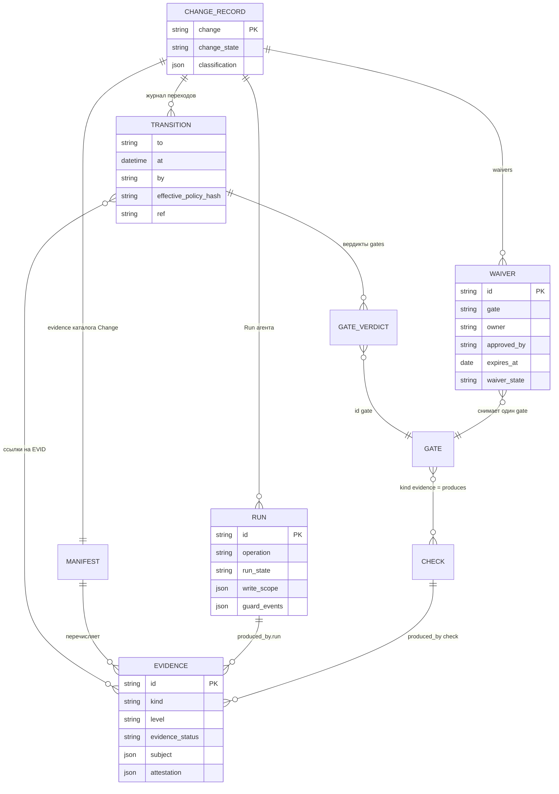

Сущности `CHANGE_RECORD`, `TRANSITION`, `MANIFEST`, `EVIDENCE`, `WAIVER` и `RUN` — файлы или записи внутри файлов в `.warrant/`; `GATE` и `CHECK` — данные pack. Значок `||--o{` читается «один ко многим».

Запись Change — центр модели: журнал переходов хранит, **когда** Change сменил состояние, **с каким вердиктом каждого gate**, **на каком evidence** и **по какой ссылке**. Все вычисляемые сущности — Effective Policy, отчёты, матрицы трассируемости — в файлах не хранятся: они проекции и вычисляются по запросу.

### 5.3 Оси статусов

Единого поля `status` нет. Статусов шесть, у каждого своя ось и свой владелец; смешивать их запрещено (ADR-0003).

| Ось | Поле | Значения | Кто определяет |
|---|---|---|---|
| Change | `change_state` | `PROPOSED`, `SPECIFIED`, `APPROVED`, `IMPLEMENTING`, `VERIFYING`, `MERGED`, `ARCHIVED`, `ABANDONED` | `warrant transition` по gates |
| Run | `run_state` | `QUEUED`, `RUNNING`, `SUCCEEDED`, `FAILED`, `CANCELLED` | `warrant run` (`QUEUED` в коде нигде не создаётся) |
| Evidence | `evidence_status` | `PROVEN`, `NOT_PROVEN`, `INCONCLUSIVE`, `NOT_APPLICABLE` | check-парсер или CLI; не skill |
| Gate | `gate_verdict` | `PASS`, `FAIL`, `WAIVED`, `NOT_APPLICABLE`, `BLOCKED` | алгоритм gate |
| Controller | `controller_action` | `CONTINUE`, `WAIT`, `STOP`, `ESCALATE` | таблица правил controller |
| Waiver | `waiver_state` | `PROPOSED`, `ACTIVE`, `EXPIRED`, `REVOKED` | `warrant waive` |

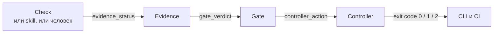

Три правила осей, которые чаще всего нарушают при интеграции:

- **Skill не выносит вердикт.** Он отдаёт находки (`findings`) и предложения; статус evidence выводит CLI: успех без `BLOCKER` → `PROVEN`, есть `BLOCKER` → `NOT_PROVEN`, сбой или отмена → `INCONCLUSIVE`. Ключи `gate_verdict` и `evidence_status` в ответе skill отклоняются схемой.
- **У gate нет `INCONCLUSIVE`.** Неубедительный результат проверки — это `FAIL`.
- **`BLOCKED` ≠ `FAIL`.** `BLOCKED` — «вычислить нельзя»: нет допустимой записи или входа. Controller отвечает на него `WAIT` с `next: verify`.

### 5.4 Идентификаторы

| Класс | Формат | Пример | Кто выдаёт |
|---|---|---|---|
| Change | имя каталога OpenSpec без даты, kebab-case; не переиспользуется | `lattice-issues` | автор при `warrant init change` |
| Уровень spec | `PREFIX-AREA-NNN`, где `PREFIX ∈ REQ, SCN, TASK, UNK, ASM`, `AREA` — 2–5 заглавных латинских букв из `.warrant/local/areas.json` | `REQ-KRN-036`, `SCN-VER-118` | `warrant id <PREFIX> <AREA>` |
| Сквозные | `EVID-<ULID>`, `RUN-<ULID>` | `EVID-01M3P2SVGCX2H1K7Q0N4RSPCW3` | CLI |
| Waiver | `WAV-<год>-NNN` | `WAV-2026-019` | `warrant waive` |
| Решения реализации | `I-N` — строка таблицы в `design.md`, сквозная нумерация | `I-97` | автор (навык `decision`) |

ID выдаёт **CLI, а не языковая модель**. Комментарий `<!-- id: REQ-… -->` стоит строго под заголовком требования и перед непустым телом; ворота `ids-valid` не дают менять ID начиная с `APPROVED`, а перенумеровать их командой `warrant id renumber` можно до `MERGED`. Реестра счётчиков нет: следующий номер — максимум по проекту плюс один, поэтому команда `warrant id` до записи идентификатора в файл может выдать один номер дважды (известное ограничение, BL-62).

### 5.5 Как выглядят данные

**Запись о Change** (сокращённо; `lattice-issues`, состояние `ARCHIVED`):

```json
{
  "change": "lattice-issues",
  "change_state": "ARCHIVED",
  "classification": { "profiles": ["chore", "factory-change"] },
  "transitions": [
    { "to": "PROPOSED", "at": "2026-09-28T21:25:42.745Z", "by": "cli:local" },
    { "to": "APPROVED", "at": "2026-09-28T21:55:10.739Z", "by": "cli:local",
      "effective_policy_hash": "sha256:6ea1c035…",
      "ref": "https://github.com/Homasters-max/SRA/pull/91",
      "gates": { "adversarial-review": "PASS", "human-approval": "PASS", "spec-valid": "PASS" },
      "evidence": ["EVID-01M3MZHGZ92Q04VA26FHB708AG"] },
    { "to": "MERGED", "ref": ".../pull/92",
      "gates": { "spec-approved": "WAIVED", "tests-passed": "PASS" } }
  ]
}
```

`by: "cli:local"` означает «кто записал», а не «кто ответственный»: личность человека живёт в evidence (`produced_by`) и в проверяемой ссылке `ref`.

**Evidence** (сокращённо; результат тестов, засвидетельствованный CI):

```json
{
  "id": "EVID-01M3P2SVGCX2H1K7Q0N4RSPCW3",
  "claim": { "text": "tests-passed passed for lattice-issues", "targets": [] },
  "kind": "test-report", "level": "L1", "evidence_status": "PROVEN",
  "subject": { "commit": "d1a84ae…", "base_commit": "9cc7413…", "tree": "e3efd62…" },
  "produced_by": { "type": "check", "id": "tests-passed" },
  "attestation": { "type": "ci", "ref": "https://github.com/Homasters-max/SRA/actions/runs/36539681936/attempts/1" },
  "metrics": { "tests": 1589, "failures": 0, "errors": 0, "skipped": 1 }
}
```

`subject` отвечает на вопрос «на чём получено»: коммит, дерево результата merge, у ревью спецификации — хэш дерева спецификации (`spec_tree`). Если текущее состояние не совпадает с `subject`, запись считается **устаревшей** (`STALE`) и в вердикте не учитывается.

**Waiver** (реальный, `WAV-2026-019`):

```json
{
  "$schema": "warrant://waiver/1", "id": "WAV-2026-019",
  "change": "lattice-issues", "gate": "spec-approved",
  "reason": "правка delta spec после APPROVED по ADR-0024 п. 4 …",
  "risk": "LOW",
  "compensating_controls": ["строки I-N в design.md, diff delta spec в impl-PR, ревью review-impl"],
  "owner": "human:Homasters-max", "approved_by": "human:Homasters-max",
  "expires_at": "2026-10-13", "waiver_state": "ACTIVE"
}
```

**Run** (реальный, ревью спецификации; `guard_events` пуст, потому что в самом репозитории WARRANT guard не включён):

```json
{
  "$schema": "warrant://run/1", "id": "RUN-01M3MZ709NYFEXRCXM4CT8CK7M",
  "change": "lattice-issues", "operation": "review",
  "skill": "specification/adversarial-review@0.2.0",
  "write_scope": [], "branch": "spec/lattice-issues",
  "run_state": "SUCCEEDED",
  "context_hash": "sha256:fb321fd5…", "effective_policy_hash": "sha256:6ea1c035…",
  "spec_tree": "sha256:7c6f200a…",
  "evidence": ["EVID-01M3MZHGZ92Q04VA26FHB708AG"], "guard_events": []
}
```

**Lock** — сводка «что установлено»: версия kernel, точная версия OpenSpec, для каждого pack — версия и хэш всех его файлов, для skills — версия и хэш, для каждого сгенерированного файла — SHA-256. Нарушение любой строки — `LOCK_MISMATCH`.

```json
{ "$schema": "warrant://lock/1", "kernel": "0.8.2", "openspec": "1.13.1",
  "packs":  { "core-sdd": { "version": "0.3.4", "source": "bundled", "hash": "sha256:4ce391ef…" } },
  "skills": { "specification/adversarial-review": { "version": "0.2.0", "hash": "sha256:23feaa7c…" } },
  "generated": { ".warrant/schemas/config.1.schema.json": "sha256:45b62c5d…", "…": "…" } }
```

### 5.6 Схемы и каноническая форма

Каждый документ состояния и конфигурации имеет JSON Schema и содержит `$schema: "warrant://<имя>/<major>"`. Схем 21: `common` (общие определения) и 20 документных.

| Группа | Схемы |
|---|---|
| Конфигурация проекта | `config`, `lock`, `areas`, `rule` |
| Политика (данные pack) | `pack`, `profile`, `overlay`, `gate`, `check`, `controller-rules`, `risk-floor`, `risk-levels` |
| Источники для OpenSpec | `openspec-rules`, `openspec-schema` |
| Состояние процесса | `change-record`, `evidence`, `evidence-manifest`, `waiver`, `run` |
| Контракт reasoning | `skill-result` |

Принципы формы (ADR-0006):

- один объект — один файл;
- JSON только канонический: порядок ключей по схеме, отступ 2 пробела, LF, завершающий перевод строки;
- описание каждого поля в схеме (`description`) служит одновременно документацией и подсказкой для языковой модели.

Проверяют это `warrant validate` (`NOT_CANONICAL`) и `warrant fmt --check`.

---

## 6. Жизненный цикл Change

*Зачем читать: как Change проходит путь от идеи до архива и почему pull request'ов три.*

### 6.1 Состояния и переходы

Цепочка линейная, но не «водопад»: назад разрешены ровно два перехода, а из любого состояния до `MERGED` Change можно отказаться (`ABANDONED`). После `MERGED` откат запрещён — исправление оформляется новым Change со ссылкой `amends`.

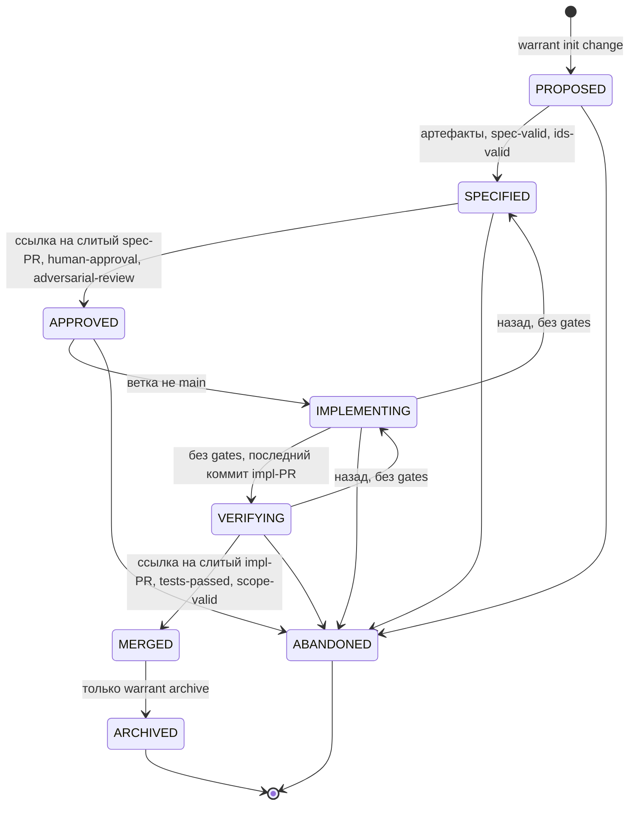

`ARCHIVED` и `ABANDONED` — замороженные состояния: запись, evidence и каталог архива больше не меняются (ADR-0021). Исправление ошибки в закрытом Change — новый Change с `amends`.

### 6.2 Таблица переходов

Gates даны для профиля `feature` с уровнем риска MEDIUM; отличия других профилей — в разделе 7.4. Обозначения: «CLI» — команда `warrant`, «CI» — job `warrant / warrant`.

| Переход | Что его вносит | Gates | Где судится |
|---|---|---|---|
| ∅ → `PROPOSED` | `warrant init change <имя>`: запись плюс `openspec new change --schema warrant-sdd` | — | локально |
| `PROPOSED` → `SPECIFIED` | `warrant transition … SPECIFIED`; входит в **spec-PR** | `required-artifacts-present`, `spec-valid`, `ids-valid` | локально; CI проверяет пути и структуру записи и для сведения пересчитывает gates следующего перехода |
| `SPECIFIED` → `APPROVED` | `transition … APPROVED --ref <URL слитого spec-PR> --by <maintainer>`; **первый коммит impl-PR** | плюс `blocking-unknowns-resolved`, `adversarial-review`, `human-approval` | локально; CI проверяет ссылку через GitHub |
| `APPROVED` → `IMPLEMENTING` | `transition … IMPLEMENTING` | `branch-isolated` (ветка не `main`) | локально |
| `IMPLEMENTING` → `VERIFYING` | `transition … VERIFYING`; **последний переход записи в impl-PR** | нет | — |
| `VERIFYING` → `MERGED` | `transition … MERGED --ref <URL слитого impl-PR>`; входит в **archive-PR** после `warrant ci fetch` | `tests-passed`, `scope-valid`, `analyze-clean`, `evidence-complete`, `ids-valid`, `spec-approved` | **CI** на результате merge impl-PR; в archive-PR — сверка evidence |
| `MERGED` → `ARCHIVED` | **только** `warrant archive` | `spec-valid`, `required-artifacts-present`, `ids-valid`, `analyze-clean` | локально; CI повторяет архивацию |
| назад: `VERIFYING → IMPLEMENTING`, `IMPLEMENTING → SPECIFIED` | `transition` | нет | — |
| до `MERGED` → `ABANDONED` | `transition … ABANDONED`; ветка `abandon/<change>` (по норме; проверка формы PR в CI самого WARRANT этот префикс пока не разрешает); каталог Change удаляется тем же коммитом | нет | CI: вид `abandon` |

Что важно понять о таблице:

- **Переход фиксирует акт, который уже случился в GitHub.** `APPROVED` записывается **после** слияния spec-PR и ссылается на него, `MERGED` — после слияния impl-PR. Поэтому запись попадает в **следующий** PR.
- **Ссылка обязательна** для `APPROVED` и `MERGED` (`--ref`, URL PR). Локальная запись — заявление; настоящей её делает проверка ссылки в CI.
- **`ARCHIVED` нельзя записать `transition`'ом**: только `warrant archive` — он сначала прогоняет `openspec validate --strict` и gates, потом вызывает `openspec archive`, и только затем ставит состояние. Стандартный `openspec archive` сам по себе не проверяет граф артефактов и архивирует даже пустой Change.
- **`human-approval` на `SPECIFIED → APPROVED` записывается до оценки gates**: человеческий акт остаётся в evidence, даже если другие gates не пройдены.

### 6.3 Controller: «что дальше»

Controller — чистая функция: по вердиктам gates и входам (открытые blocking UNKNOWN, конфликт политики, ожидающие одобрения…) она возвращает одно из четырёх действий.

| Действие | Смысл | Код выхода |
|---|---|---|
| `CONTINUE` | препятствий нет | 0 |
| `WAIT` | нужно действие: собрать evidence, снять блокировку, получить одобрение | 2 |
| `ESCALATE` | конфликт политики — решает человек | 2 |
| `STOP` | нельзя продолжать | 1 |

> [!note] Что реально вычисляет controller в 0.8.2
>
> Норма (`docs/04-lifecycle.md → §4`) описывает 11 правил, включая `next: implement / converge / archive`. Реализация в pack `core-sdd@0.3.4` — **три правила**: `policy-conflict → ESCALATE`, `gate-failed → WAIT`, `blocking-unknown → WAIT (next: clarify)`; плюс запасное правило ядра: есть `BLOCKED` → `WAIT (next: verify)`, иначе `CONTINUE`. Входы `open_tasks` и `analyze_findings` не вычисляются. Практический вывод: `next` бывает только `verify`, `clarify` или пустым; порядок работы задаёт **процесс** (раздел 6.4 и навыки процесса), а не подсказка controller'а. Отдельной команды `warrant next` нет.

### 6.4 Топология трёх PR

Change проходит через **три** pull request'а. Это центральное решение по доверию (ADR-0011): спецификация одобряется человеком отдельно от кода, а результат слияния каждого PR проверяемо привязан к следующему шагу.

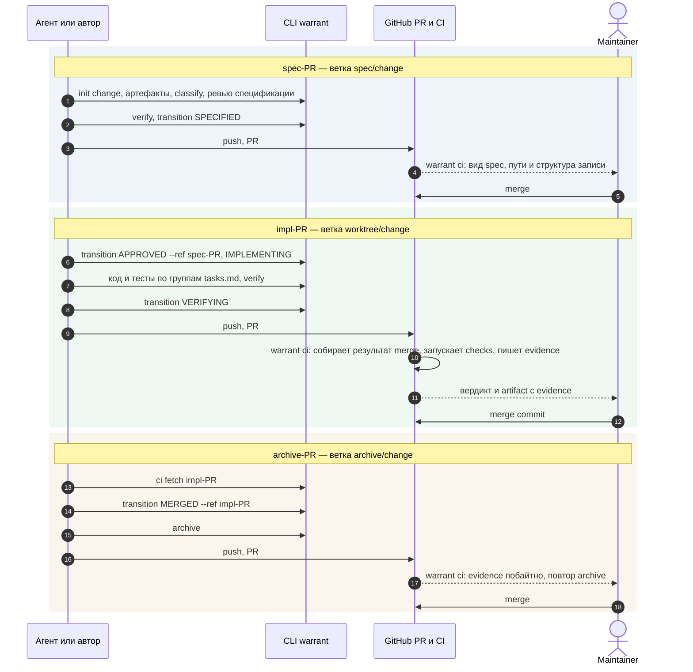

| PR | Ветка | Что в diff | Переходы записи | Как определяется вид |
|---|---|---|---|---|
| **spec-PR** | `spec/<change>` | артефакты `openspec/changes/<change>/**`, запись, evidence ревью и spec-report, файлы Run, waivers этого Change (создаются как `PROPOSED`, к слиянию активированы) | `PROPOSED` → `SPECIFIED` | запись на HEAD в `PROPOSED` / `SPECIFIED` |
| **impl-PR** | `worktree/<change>` | код, тесты, `tasks.md`, строки `I-N` в `design.md`, запись, evidence | `APPROVED`, `IMPLEMENTING` первым коммитом; `VERIFYING` последним | запись в `APPROVED` / `IMPLEMENTING` / `VERIFYING` |
| **archive-PR** | `archive/<change>` | evidence CI, результат `warrant archive`: каталог архива и изменённые main specs, запись | `MERGED`, затем `ARCHIVED` | запись в `MERGED` / `ARCHIVED` |
| **abandon-PR** | `abandon/<change>` | удаление каталога Change и `ABANDONED` | `ABANDONED` | запись в `ABANDONED` |
| PR без Change | `process/`, `docs/`, `fix/` | документы, инструменты, правки вне Change | — | нет записи в diff; вид `none` |

**Вид PR определяет запись Change в diff, а не имя ветки.** Имя ветки — соглашение, его проверяет отдельный шаг CI разработки WARRANT. Два Change в одном PR — нарушение топологии (`TOPOLOGY_VIOLATION`).

**Зачем три PR**, а не один:

- Один PR «всё сразу» одобряет спецификацию и код одним махом — инвариант «спецификация раньше реализации» невозможно проверить (ADR-0011, Alternatives).
- Spec без PR — нет места для ревью, а одобрение неотличимо от действия агента.
- Архивация внутри impl-PR отвергнута: пришлось бы доказывать, что правка main specs равна результату `openspec archive`. В отдельном archive-PR CI **повторяет архивацию** и сравнивает.

> [!info] Только merge commit
>
> impl-PR вливается **исключительно merge-коммитом**: `transition MERGED` отказывает (`COMMIT_NOT_MERGED`), если коммит, на котором получено evidence, не является вторым родителем merge-коммита на линии `main`. Squash и rebase в настройках репозитория выключаются: они уничтожают ссылочную связь между PR и коммитом.

### 6.5 Пример: Change за одни сутки

Change `lattice-issues` (PR #91 → #92 → #93) прошёл путь от `PROPOSED` до `ARCHIVED` за 10,7 часа; активной работы в этом времени около трёх часов, между 23:31 и 07:47 — перерыв.

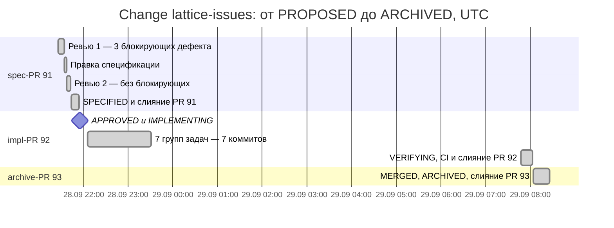

Что видно на примере:

- ревью 1 нашло 3 блокирующих дефекта (`NOT_PROVEN`) — спецификацию поправили; ревью 2 дало `PROVEN`;
- при реализации пришлось уточнить дельту; правка после `APPROVED` нарушает gate `spec-approved`, поэтому оформлен waiver `WAV-2026-019`, который активировал maintainer;
- CI прогнал 1 589 тестов и записал evidence с attestation `ci`.

### 6.6 Кто что решает

| Кто | Что решает | Чем подтверждается |
|---|---|---|
| **Агент** | предлагает: артефакты, код, тесты, находки ревью; создаёт waiver в состоянии `PROPOSED` | ничем — это предложение |
| **CLI (локально)** | допустимость перехода, вычисление gates, запись состояния | детерминированные проверки; записи помечены `by: cli:local` и считаются черновиками |
| **CI (`warrant ci`)** | подлинность: ссылки через GitHub, цепочка переходов, evidence от CI, повтор архивации | независимый пересчёт на результате merge и сверка с GitHub |
| **Maintainer** | доверительные акты: merge PR, активация waiver, решение blocking UNKNOWN комментарием в PR, настройки репозитория | слитый PR под аккаунтом из `roles.maintainer` |

Человек вмешивается ровно там, где нужен доверительный акт; всё обратимое делает агент или CI.

---

## 7. Политика и проверка

*Зачем читать: как вычисляются требования к Change и как gates выносят вердикт.*

### 7.1 От классификации к вердикту

Политика для конкретного Change не записана, а **вычисляется** — из классификации изменения, профилей и pack. Результат воспроизводим: хэш политики (`effective_policy_hash`) записывается в каждый прямой переход, кроме `PROPOSED`, и CI проверяет, что он совпадает с политикой базы.

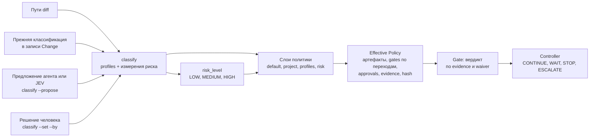

### 7.2 Классификация и риск

**Классификация** отвечает на два вопроса: к каким классам относится изменение (profiles) и какой у него риск (пять измерений).

| Измерение риска | Значения по возрастанию |
|---|---|
| `data_loss` | NONE < LOW < MEDIUM < HIGH |
| `reversibility` | EASY < MODERATE < DIFFICULT < IRREVERSIBLE |
| `blast_radius` | LOCAL < COMPONENT < SYSTEM < CROSS_SYSTEM |
| `security_impact` | NONE < LOW < MEDIUM < HIGH |
| `compatibility` | COMPATIBLE < DEPRECATING < BREAKING |

Значение каждого измерения — **максимум** из четырёх источников: прежняя запись, **floor** (детерминированный минимум по путям diff), **предложение** (агент или JEV, только как proposal) и **решение человека**. Человек может подтвердить или повысить; понизить ниже floor можно только с явным одобрением (`--ref`, в состояниях `PROPOSED` и `SPECIFIED`), иначе `BELOW_FLOOR`; ниже значения, уже записанного или предложенного, человек опустить не может. Профили только объединяются, ничего не убирается. Итог вычисляет CLI: агент не решает, «низкий ли риск». Неизвестное измерение (`UNKNOWN`) поднимает уровень как минимум до MEDIUM. Явное поле `classification.risk_level` перекрывает вычисление.

**Уровень риска** выводится из измерений:

- `HIGH` — любое из: `data_loss` MEDIUM и выше, `reversibility` DIFFICULT и выше, `security_impact` HIGH, `blast_radius` SYSTEM и выше, `compatibility` BREAKING;
- `LOW` — только если **все пять** измерений на минимуме;
- иначе `MEDIUM`. Неизвестное или незаданное измерение уровень до LOW не опускает; на практике LOW «почти недостижим».

**Floors core-sdd** (минимум по путям): `**/migrations/**` → `data_loss` MEDIUM и `reversibility` MODERATE; `**/auth/**`, `**/security/**` → `security_impact` MEDIUM; `.warrant/**`, `openspec/schemas/**`, `openspec/config.yaml` → `blast_radius` SYSTEM.

> [!warning] Профиль `feature` не выбирается по путям
>
> У профиля `feature` пустой `match.paths`. Поэтому изменение кода без документов получает классификацию без профилей: политика сводится к `core-default` и `risk-medium` — **без** `tests-passed` и `human-approval`. Профиль `feature` задаётся явно: `warrant classify --propose` или `--set profile=feature --by <maintainer>`. И наоборот, любой `*.md` или `package.json` в diff (например, `proposal.md`) добавляет профиль `chore`. Поэтому, когда в diff impl-PR появились новые пути, влияющие на профиль или риск (документы, `package.json`, `**/auth/**`, `**/migrations/**`, пути политики), классификацию нужно пересчитать: `warrant classify <change> --base main`. Иначе CI найдёт расхождение с базой (`RECORD_MISMATCH`, причина `classification`). Это одно из самых частых недоразумений при подключении (глава 12).

| Пути в diff | Профиль | Уровень риска |
|---|---|---|
| только код (`src/…`) | нет | MEDIUM по умолчанию |
| `docs/**`, любой `*.md`, `package.json`, `package-lock.json` | `chore` | по измерениям |
| `.warrant/**`, `openspec/schemas/**`, `openspec/config.yaml` | `factory-change` и floor `blast_radius: SYSTEM` | HIGH |
| `.github/workflows/**`, `packs/**`, `packages/cli/{src,schemas}/**`, `packages/cli/package.json`, `sra/skills/**` | `factory-change` | MEDIUM без floor |
| `**/migrations/**`, `**/auth/**`, `**/security/**` | — | floors: MEDIUM … HIGH |

### 7.3 Композиция слоёв

Слои применяются по порядку **default → project → profiles → risk**; на каждом слое требования только **добавляются**. Ослабить политику нельзя нигде — только waiver на конкретные gates.

| Слой | Что даёт | Источник |
|---|---|---|
| default | безусловные overlays pack — в `core-sdd` это `core-default` | pack |
| project | безусловные overlays проекта | `.warrant/local/` |
| profiles | выбранные профили и цепочка `extends` (родитель раньше) | pack, проект |
| risk | условные overlays: `match` по `risk_level`, профилям или измерению | pack, проект |

Правила слияния слоёв:

| Поле политики | Правило |
|---|---|
| `artifacts.required`, `gates.*`, `evidence.required`, `approvals` | объединение множеств |
| `artifacts.recommended` | объединение за вычетом того, что стало `required` |
| `artifacts.forbidden` | абсолютно: пересечение с `required` не разрешается в пользу одного из них, а даёт конфликт |

«Последний победил» невозможен. Конфликт (артефакт и обязателен, и запрещён; требование evidence, которое не читает ни один gate) → `POLICY_CONFLICT` → `ESCALATE`. Если в `match` указано неизвестное поле, условие считается невыполненным (fail closed).

Проект может **усилить** объект pack локальным override (`"overrides": "<pack>:<id>"` в `.warrant/local/`); ослабляющий override отклоняется (`OVERRIDE_WEAKENS`). `warrant resolve <change> --explain` показывает происхождение каждого требования: какой профиль или overlay его принёс.

### 7.4 Pack `core-sdd`

Единственный pack в 0.8.2: 3 профиля, 4 overlays, 13 gates, 2 проверки, таблица controller из 3 правил, схема OpenSpec `warrant-sdd` и её шаблоны.

**Профили** (ADR-0013 — «добавлять только по фактическому отказу»; остальные из нормы отложены):

| Профиль | Для чего | Обязательные артефакты | Особенности |
|---|---|---|---|
| `feature` | новое поведение | `proposal`, `specs`, `design`, `tasks` | полный набор evidence: `test-report`, `review`, `human-approval` |
| `chore` | документы и «хозяйство» без спецификаций | `proposal`, `tasks` | самый слабый набор gates; спецификации не требует — такие Change ставят `skip_specs: true` в `.openspec.yaml` |
| `factory-change` | изменение самой фабрики (наследует `feature`) | как `feature` | добавляет `factory-golden-passed`; запрещает capability `PRODUCTION_WRITE`; срабатывает по путям политики |

**Overlays**: `core-default` (`spec-valid` на трёх переходах, `ids-valid` на четырёх, `spec-approved` на merge — всегда), `risk-low` (ничего), `risk-medium` (+`adversarial-review` на `SPECIFIED → APPROVED`), `risk-high` (+`adversarial-review`, +`human-approval` на `VERIFYING → MERGED`, +одобрение maintainer на merge).

**Какие gates на каких переходах** (объединение по слоям, риск MEDIUM):

| Gates | `→ SPECIFIED` | `→ APPROVED` | `→ IMPLEMENTING` | `→ MERGED` | `→ ARCHIVED` |
|---|:-:|:-:|:-:|:-:|:-:|
| `ids-valid` | ✓ | ✓ | | ✓ | ✓ |
| `required-artifacts-present` | ✓ | ✓ | | | ✓ |
| `spec-valid` | ✓ | ✓ | | | ✓ |
| `blocking-unknowns-resolved` | | ✓ | | | |
| `adversarial-review` | | ✓ | | | |
| `human-approval` | | ✓ | | (HIGH) | |
| `branch-isolated` | | | ✓ | | |
| `tests-passed` | | | | ✓ | |
| `scope-valid` | | | | ✓ | |
| `analyze-clean` | | | | ✓ | ✓ |
| `evidence-complete` | | | | ✓ | |
| `spec-approved` | | | | ✓ | |
| `factory-golden-passed` | | | | ✓ (`factory-change`) | |

Всего пар «переход — gate» в политике Change: `chore` 15–17, `feature` 20–21, `factory-change` 21–22 — в зависимости от риска. Реальный вклад уровня HIGH — `human-approval` и одобрение maintainer на merge: `adversarial-review` уже входит в профиль `feature`.

**Проверки** (checks — исполняемые, детерминированные, без LLM):

| Check | Что делает | Производит | Питает gates |
|---|---|---|---|
| `openspec-validate` | `openspec validate <change> --strict --json` | `spec-report` | `spec-valid` |
| `tests-passed` | команду задаёт **проект** (в pack команды нет); парсер `junit` | `test-report` | `tests-passed`, `factory-golden-passed` |

Проект без своего `tests-passed` не пройдёт `VERIFYING → MERGED` (`CHECK_NOT_CONFIGURED`). Gates L0 (детерминированная политика: ID, артефакты, scope, unknowns, analyze) проверок не запускают — их считает сам CLI.

Собственное состояние Change (его запись, evidence и файлы Run) в сверку с floors и путями профилей не входит: правка только их не делает Change ни `factory-change`, ни HIGH.

**Golden-фикстуры** (`packs/core-sdd/golden/{chore,feature,factory-change}`): три мини-проекта с ожидаемыми `resolve`, `status`, `verify`. Они не дают политике **измениться незаметно**: gate `factory-golden-passed` требуют, чтобы golden-тесты проходили для любых правок политики. Обновляются только командой `npm run golden:update`.

### 7.5 Вердикт gate

Алгоритм детерминирован; одни и те же входы всегда дают один и тот же вердикт.

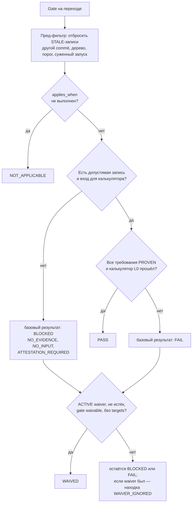

Три уровня проверки (INV-02: уровни не отменяют друг друга): **L0** — детерминированная политика (артефакты, ID, scope, unknowns, analyze), **L1** — детерминированные проверки и тесты, **L2** — ревью языковой моделью. Проверка L2 не может отменить `FAIL` уровня L0 или обязательный `FAIL` уровня L1.

Запись evidence считается устаревшей (`STALE`) и не учитывается пред-фильтром; тогда gate получает `BLOCKED`. Это происходит, если:

- изменился коммит, на котором получена запись (`subject.commit`), либо `base_commit`; для ревью спецификации вместо коммитов сравнивается дерево спецификации, для записей CI — дерево результата merge;
- у ревью спецификации изменилось дерево `proposal.md` + `specs/**` (правка `design.md` и `tasks.md` ревью **не** устаревает);
- у записи CI дерево результата merge отличается от текущего (сдвинулся `main`);
- порог проверки не совпадает с текущим параметром;
- запись получена суженным запуском (`--paths`);
- запись применила waiver, который уже не действует.

### 7.6 Evidence

Каждая запись отвечает: **что доказано** (`claim`), **чем** (`kind`), **на чём** (`subject`), **кто ручается** (`attestation`).

| Kind | Производит | Метрики |
|---|---|---|
| `test-report` | check `tests-passed` | `tests`, `failures`, `errors`, `skipped` |
| `spec-report` | check `openspec-validate` | `issues` |
| `review` | Run `review` со skill `adversarial-review` | счётчики `BLOCKER`, `MAJOR`, `MINOR`, `INFO` |
| `human-approval` | человек через `warrant transition` | — |

**Attestation** — кто подтверждает происхождение записи:

| Тип | Кто ручается | Ссылка | Состояние |
|---|---|---|---|
| `ci` | запись создана CLI внутри запуска CI | URL запуска Actions (с номером attempt) | ✅; выводится из окружения, а не из аргументов |
| `human-review` | человек через слитый PR | URL PR | ✅; проверяет `warrant ci` |
| `none` | локальный запуск | — | ✅; такие записи — черновики |
| `signature` | подпись ключа | id подписи | 📄 в схеме есть, проверки нет |

**Воспроизводимые** результаты (L0/L1) не подписываются: локальная запись — черновик, CI пересчитывает. **Невоспроизводимые** (одобрение человека, ревью моделью) требуют attestation. Ревью моделью в 0.8.2 записывается с `attestation: none` и пометками `limitations` («produced locally, unattested», «same model family as author»).

Пропущенный тест нельзя выдать за пройденный. Парсер `junit` читает имя каждого `<testcase>`. Любой упавший тест даёт `NOT_PROVEN`; **пропущенный** тест даёт `NOT_PROVEN`, если в его имени есть `SCN-…` — даже когда остальные тесты прошли. Если пропущены все тесты, результат — `INCONCLUSIVE`.

### 7.7 Waivers

Waiver — явное, ограниченное во времени исключение из **одного** gate **одного** Change. Это единственный способ ослабить политику.

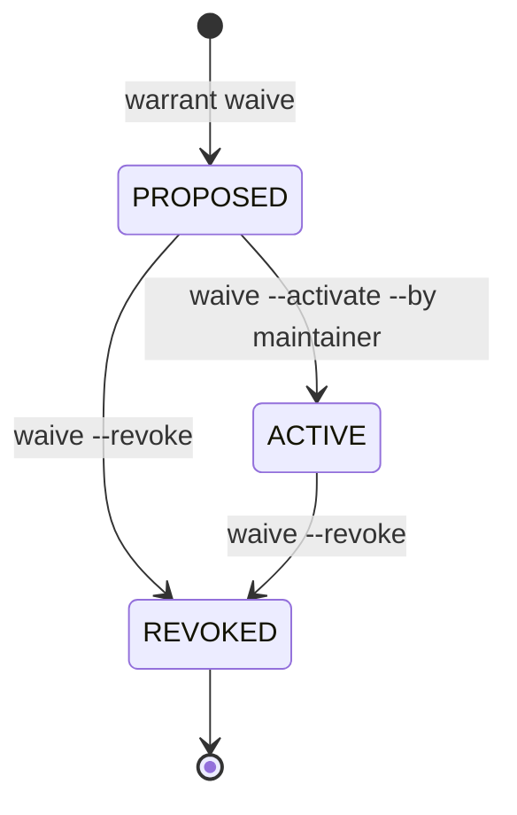

- **Кто**: создать (`PROPOSED`) может агент; **активирует и отзывает только** человек из `roles.maintainer`.
- **Что обязательно**: `reason`, `risk`, `compensating_controls`, `owner`, `expires_at`; `approved_by` — после активации.
- **Когда засчитывается**: состояние `ACTIVE`, срок не истёк (UTC), `approved_by` ∈ `roles`, gate помечен `waivable`, у waiver нет `targets[]`. Иначе — находка `WAIVER_IGNORED` с причиной.
- **Срок**: состояние `EXPIRED` CLI сам не записывает — просроченный waiver просто перестаёт учитываться; `validate` предупреждает.
- **Не снимаются никогда**: `human-approval`, `scope-valid`, `spec-valid`, `ids-valid`, `required-artifacts-present`, `blocking-unknowns-resolved`, `tests-passed`, `evidence-complete`, `factory-golden-passed`.
- **Снимаются**: `branch-isolated`, `analyze-clean`, `adversarial-review`, `spec-approved`.

Один из самых частых случаев (наряду с `adversarial-review` и `analyze-clean`, которые снимали в ранних фазах) — `spec-approved`: правка дельты спецификации после одобрения (уточнения, найденные при реализации) делает gate `FAIL` с причиной `SPEC_CHANGED_AFTER_APPROVAL`; waiver с записью в `design.md` (строка `I-N`) легализует правку и оставляет её видимой ревьюеру.

### 7.8 Analyze: согласованность спецификации, задач и тестов

`warrant analyze` (и gate `analyze-clean`) детерминированно находят три вида расхождений:

- `UNSATISFIED` — у требования нет задачи в `tasks.md` или ни один его сценарий не встречается в тестах;
- `CONFLICT` — `tasks.md` ссылается на несуществующее требование или сценарий;
- `ORPHAN` — изменённый тест ссылается на неопределённый сценарий.

Связь строится по идентификаторам в тексте. Семантическую согласованность («правильно ли тест проверяет сценарий») эта проверка не оценивает — это задача ревью.

---

## 8. Потоки данных

*Зачем читать: как данные и следы движутся по системе при типичных операциях.*

### 8.1 Сквозной поток изменения: что производится и кем подтверждается

Поток удобно читать как цепочку **следов**: на каждой стадии появляются файлы, и следующая стадия имеет право на них опираться, только если их подлинность подтвердил кто-то, кроме автора.

| # | Стадия | Что производится | Где лежит | Кто подтверждает |
|---|---|---|---|---|
| 1 | Постановка | запись `PROPOSED`, каталог Change | `.warrant/changes/`, `openspec/changes/<c>/` | локальный CLI |
| 2 | Спецификация | `proposal.md`, дельты `specs/<cap>/spec.md` с `REQ`/`SCN`, `design.md`, `tasks.md`; ID выдаёт `warrant id` | `openspec/changes/<c>/` | `openspec validate --strict`, gates `ids-valid`, `required-artifacts-present` |
| 3 | Классификация | профили и измерения риска | запись, поле `classification` | floor по путям (детерминированно), человек может повысить |
| 4 | Ревью спецификации | Run `review`, envelope результата, evidence `review` | `runs/RUN-*.json`, `RUN-*.result.json`, `evidence/<c>/` | схема `skill-result/1`; статус выводит CLI |
| 5 | Проверка | evidence `spec-report`, вердикты gates в `manifest.gates` | `evidence/<c>/` | детерминированный check |
| 6 | `SPECIFIED` | запись перехода; **spec-PR** | запись, PR | `warrant ci` вида `spec`: пути, структура записи |
| 7 | Одобрение | merge spec-PR человеком; в первом коммите impl-PR — `APPROVED` со ссылкой и evidence `human-approval` | запись, evidence | CI проверяет ссылку через GitHub: `merged_by ∈ roles` |
| 8 | Реализация | код, тесты, отметки в `tasks.md`, строки `I-N`, файлы Run с событиями guard | код, `design.md`, `runs/` | guard во время работы; `scope-valid` и `analyze-clean` при проверке |
| 9 | Проверка результата | `VERIFYING`; **impl-PR**; CI прогоняет checks на результате merge и пишет evidence `test-report` с attestation `ci` | artifact `evidence-<c>-<attempt>` | CI |
| 10 | Слияние | merge-коммит impl-PR человеком | git | решение maintainer |
| 11 | Закрытие | `ci fetch` кладёт evidence CI в репозиторий; `MERGED` со ссылкой; `warrant archive` переносит дельты в main specs | `evidence/`, `openspec/specs/`, `openspec/changes/archive/` | `warrant ci` вида `archive`: побайтное сравнение с artifact, повтор архивации |
| 12 | Релиз | аннотированный тег `v<версия>` на merge-коммите archive-PR | git-тег | `versions:check` |

### 8.2 `warrant verify`: одна команда изнутри

`verify` = запустить проверки перехода → записать evidence → вычислить gates → спросить controller. Один и тот же сценарий использует `gate` (без запуска проверок), `archive` (с принудительным `openspec validate --strict`) и `status` (без записи).

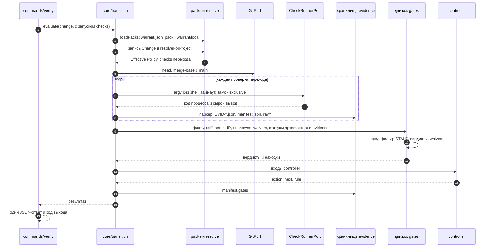

Пишет `verify` только в `evidence/<change>/`: записи evidence, `manifest.json` (вместе с полем `gates`) и сырой вывод проверок. Запись Change и `openspec/**` он не трогает — переход записывает отдельная команда `transition`.

> [!tip] Быстро или полностью
>
> `verify` **запускает все проверки перехода**: на `VERIFYING → MERGED` это полный набор тестов проекта, и он же пишет новые evidence. Чтобы только посмотреть состояние, используйте `warrant status <change>` (ничего не запускает и не пишет) или `warrant gate <change>` (считает вердикты по уже записанным evidence, проверки не запускает).

### 8.3 Evidence: локально и в CI

Правило одного запуска (ADR-0010): для перехода `VERIFYING → MERGED` CI засчитывает только те записи проверок, которые **записаны в этом же прогоне**; закоммиченные локальные результаты L0/L1 для CI — лишь черновики. Локальный `verify` на `VERIFYING → MERGED` для `tests-passed` всегда даёт `BLOCKED (ATTESTATION_REQUIRED)`: «нужны записи от CI». Это норма, а не поломка.

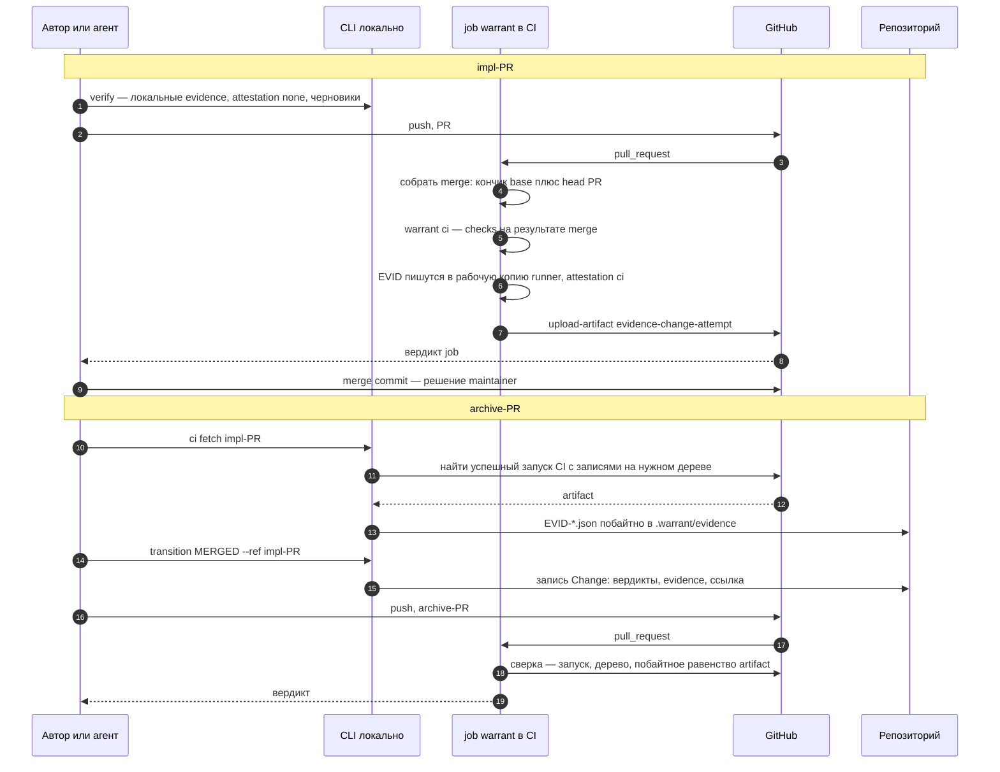

Запомните два факта. **CI никогда не пишет в репозиторий**: запись делает только локальный CLI. **CI-artifact хранится ограниченное время** (по умолчанию в GitHub — 90 дней; это настройка репозитория). Если `main` сдвинулся между запуском и слиянием или artifact истёк, применяется восстановление: `workflow_dispatch` с `merge_commit=<M>` повторяет запуск на нужном дереве.

### 8.4 `warrant sync`: откуда берутся производные файлы

`sync` — чистый планировщик: он строит байты каждого генерируемого файла, а затем либо пишет разницу, либо (`--check`, `validate`) сверяет план с диском. Разойтись «команде» и «проверке» нельзя: они используют один план.

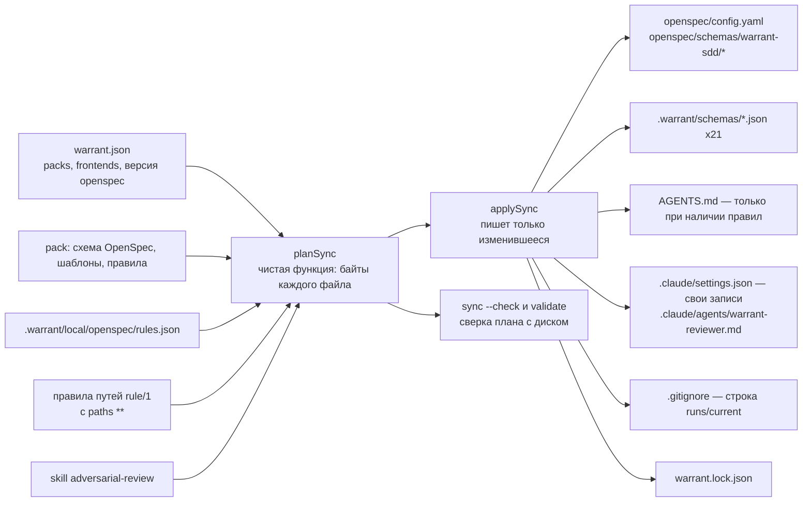

Побочный эффект: если `sync` изменил файл, который Claude Code читает **при старте** сессии (`.claude/agents/**`, `.claude/settings.json`, `AGENTS.md`), команда выдаёт находку `FRONTEND_RESTART_REQUIRED` — сессию нужно перезапустить. С версии 0.8.2 `sync` не создаёт `CLAUDE.md`: Claude Code читает `AGENTS.md` сам.

---

## 9. Агенты и их взаимодействие

*Зачем читать: кто участвует в работе, как они взаимодействуют и какие границы у агента.*

### 9.1 Кто действует и через что

В процессе участвуют шесть видов действующих сторон. Стороны не обмениваются сообщениями напрямую: связь идёт **через файлы, аргументы командной строки и pull request'ы**.

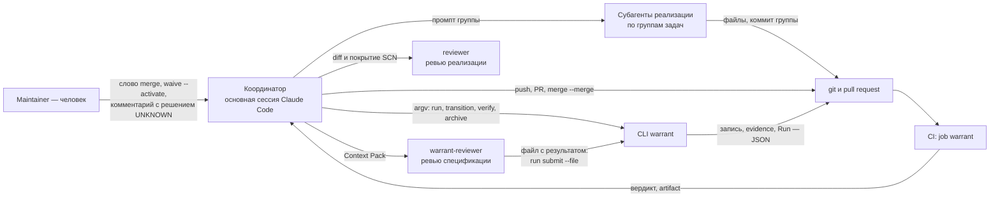

| Действующий | Что делает | Чего не делает |
|---|---|---|
| **Maintainer** (человек) | решения о доверии: merge, активация waiver, решение blocking UNKNOWN, настройки репозитория | рутинные обратимые операции — их делает агент |
| **Координатор** (сессия Claude Code) | ведёт Change, вызывает CLI, git и `gh`, раздаёт работу субагентам | не одобряет себя и не сливает PR без слова maintainer'а |
| **Субагенты реализации** | выполняют одну группу задач `tasks.md` | не правят main specs, чужие группы, не делают push и PR |
| **`warrant-reviewer`** | ищет дефекты спецификации, сдаёт envelope | не пишет в проект: Write разрешён только во временный каталог ОС |
| **`reviewer`** | сверяет реализацию со спецификацией до merge | только читает |
| **CLI и CI** | детерминированные проверки и запись состояния | не запускают агентов и не вызывают языковую модель |

### 9.2 Главное: CLI пассивен

> [!important] WARRANT не запускает агентов
>
> `warrant run start` только **создаёт запись Run** и **печатает Context Pack**. Skill сам не вызывается; кто исполняет Run — определяет внешняя сессия: Claude Code, субагент, позже диспетчер SEF. Controller и «операции» — метки состояния, а не диспетчер. Оркестрация агентов — фаза 7 дорожной карты, в коде её нет.

Из девяти операций нормы (`classify`, `clarify`, `specify`, `review`, `implement`, `analyze`, `verify`, `converge`, `archive`) как **Run** реализованы три: `specify`, `implement`, `review`. `classify`, `analyze`, `verify`, `archive` — обычные команды CLI; `clarify` и `converge` — только слова в таблице нормы.

### 9.3 Run: одна попытка агента

Run фиксирует границы и след одной попытки: что можно писать, что произошло, что получено.

| Операция | Допустима в состоянии | `write_scope` (что можно писать) | Что производит |
|---|---|---|---|
| `specify` | `PROPOSED` | `openspec/changes/<change>/**` | коммиты автора |
| `implement` | `IMPLEMENTING` | `paths.src/**`, `paths.tests/**`, `tasks.md`, `design.md`, `specs/**` Change — **не** `proposal.md` | коммиты автора |
| `review` | `PROPOSED` | пусто (только чтение) | evidence `review` |

Правило `implement` намеренно разрешает править `design.md` и дельты (там ведётся журнал решений `I-N`), но не `proposal.md`: правка спецификации после одобрения ловится gates `spec-approved` и требует waiver.

**Команды Run**: `warrant run start <change> --operation …` (создаёт Run, печатает Context Pack), `run finish [--state]` (закрывает; `CANCELLED` — отмена), `run submit --file <путь>` (только для `review`: принять envelope). Возобновления нет: прерванный Run отменяется и стартует новый. Активный Run один на рабочее дерево.

**Context Pack** — это не отдельный файл, а JSON-ответ `run start`:

| Поле | Содержимое |
|---|---|
| `items[]` | пути и SHA-256 существующих `proposal.md`, `specs/**`, `design.md`, `tasks.md` Change (содержимое не вкладывается, агент читает файлы сам) |
| `rules[]` | правила путей `rule/1`, у которых есть существующий файл внутри области Run |
| `write_scope[]`, `scope[]` | разрешённая область записи и её сужение через `--scope` |
| `context_hash` | SHA-256 от канонического JSON `{items, rules}`; копируется в evidence |

> [!note] Расхождение нормы и кода
>
> Норма (docs/07 §3, 06a §6) описывает более широкий контекст: ADR, glossary, эффективная политика, версия skill. В коде в хэш входят только `items` и `rules`; `effective_policy_hash` хранится в Run отдельным полем. Чтение прочего контекста (main specs, ADR, документов) ничем не ограничивается: `READ_*` — информативные capabilities.

**Envelope `warrant://skill-result/1`** — единственный формат ответа skill. Обязательные поля: `$schema`, `skill` (с версией, например `specification/adversarial-review@0.2.0`), `run`, `run_state`, `findings[]`, `provenance` (`started_at`, `finished_at`; необязательно `context_hash`, `model`). Необязательные: `proposals[]`, `unknowns[]`, `assumptions[]`, `decisions_required[]`, `artifacts_to_update[]`, `recommended_operations[]`. Находка: `id`, `marker` (`FACT` или `INFERENCE`), `severity` (`BLOCKER`, `MAJOR`, `MINOR`, `INFO`), `category`, `statement`. Что CLI делает с результатом: проверяет схему и что `run` и `skill` совпадают с ожидаемыми, сохраняет envelope, создаёт evidence и **сам выводит статус**. Массивы `proposals[]`, `unknowns[]` и `decisions_required[]` сегодня сохраняются, но CLI их **не исполняет**.

### 9.4 Ревью спецификации: `warrant-reviewer`

Ревью — единственный skill-процесс, доведённый до конца. Он реализует состязательную проверку: **отдельный контекст** ищет дефекты в спецификации, которую написал другой.

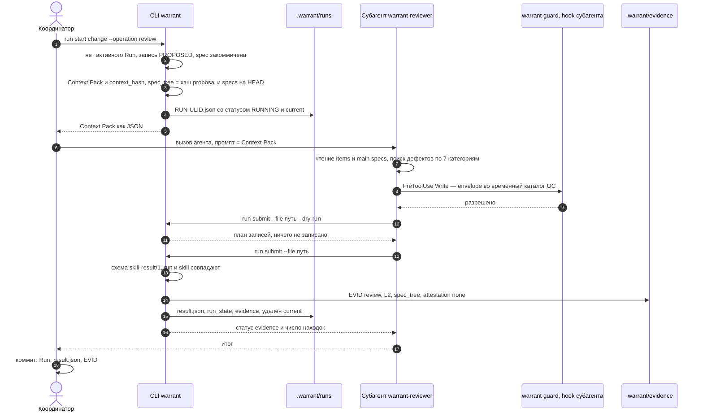

- **Что ищет**: семь категорий — двусмысленность, отсутствующие границы, актёры, поведение при ошибках, скрытые допущения, противоречия, утечка реализации. `BLOCKER` ставится только по критерию «реализация неверна или непроверяема»; сомнение — `MAJOR` с маркером `INFERENCE`.
- **Что получает**: статус evidence — `PROVEN` (нет `BLOCKER`), `NOT_PROVEN` (есть `BLOCKER`), `INCONCLUSIVE` (сбой или отмена). Дальше эту запись читает gate `adversarial-review`.
- **Когда ревью устаревает**: при правке `proposal.md` или `specs/**` (дерево `spec_tree` изменилось); правка `design.md` и `tasks.md` не мешает.
- **Ограничения**: субагент запускается той же семьёй моделей, что и автор (запись несёт пометку `same model family as author`); независимая модель появится, когда будет установлена (BL-28). Файл субагента генерирует `warrant sync` из текста skill.
- **Повтор безопасен**: `run submit` идемпотентен — повтор после обрыва переиспользует запись, а другой envelope для того же Run даёт `EVIDENCE_CONFLICT`.

### 9.5 Guard: границы агента внутри сессии

`warrant guard` — hook Claude Code. Перед каждой правкой файла или командой shell он получает событие, читает активный Run и отвечает: разрешить или отклонить с подсказкой. **Hook — ускоритель, а не гарантия**: он даёт мгновенную обратную связь, а окончательное принуждение — за CI.

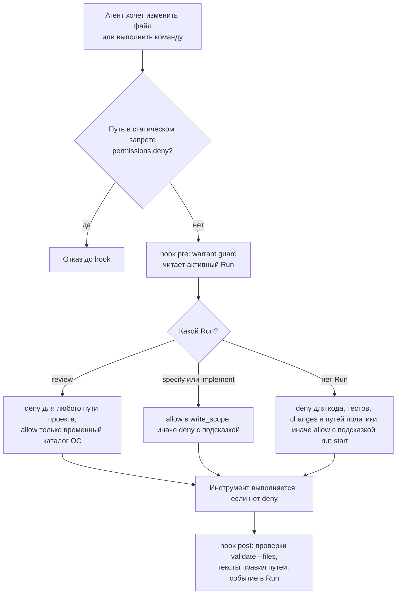

**Решения guard до правки** (`pre`; при любом сбое — `deny`, fail closed):

| Ситуация | Решение |
|---|---|
| Run `review`, правка проекта | `deny` любого пути; вне проекта — только временный каталог ОС (файл envelope) |
| Run `specify` / `implement`, путь вне `write_scope ∩ scope` | `deny` с подсказкой по классу пути |
| Нет Run; путь под `paths.src`, `paths.tests`, `openspec/changes/**`, состояние, которое пишет CLI (`.warrant/changes`, `evidence`, `runs`, `waivers`), или путь политики | `deny`; подсказка зависит от пути: `warrant run start …` (код, тесты, Change), команды CLI (состояние), «правит человек в Change профиля `factory-change`» (пути политики) |
| Нет Run, прочие пути | разрешено, но с подсказкой |
| Shell под Run `review` | разрешена строгая форма `warrant run submit`, `status`, `gate`, `--help`, `git status/log/diff/show`, `cd`, `run finish --state CANCELLED`; всё с перенаправлениями и подстановками — `deny` |
| Shell: прямой запуск «тяжёлой» проверки (`exclusive` или `local ≠ allowed`) | `deny` с подсказкой `warrant check <change> <id>` |

**После правки** (`post`) guard всегда разрешает, но добавляет подсказки: находки `validate --files` (не более 10 строк) и тексты правил путей, которых агент в этом Run ещё не видел. Каждое событие при активном Run записывается в `guard_events[]` — это след, по которому CI замечает работу «в обход» (`FRONTEND_HOOKS_INACTIVE`: в diff есть код, а событий `post` в Run нет).

**Что пишет `warrant sync` в проект с frontend `claude`** (файл `.claude/settings.json`, только «свои» записи, чужие ключи сохраняются):

| Что | Содержимое |
|---|---|
| `permissions.deny` | запрет `Edit` на `.warrant/changes/**`, `.warrant/evidence/**`, `.warrant/runs/**`, `openspec/specs/**`, `openspec/config.yaml`, `openspec/schemas/**`; запрет `git push origin main`, `gh pr merge`, `openspec archive` |
| `hooks.PreToolUse` | `Edit`, `Write`, `NotebookEdit`, `Bash` → `warrant guard --frontend claude` |
| `hooks.PostToolUse` | `Edit`, `Write`, `NotebookEdit` → `warrant guard --frontend claude` |
| `.claude/agents/warrant-reviewer.md` | субагент с текстом skill и собственным hook `Bash\|Write` |

Известный предел: запрет на `Edit`/`Write` не мешает записи через shell. Поэтому запись без проверяемой ссылки всё равно не пройдёт `warrant ci`.

> [!note] В самом репозитории WARRANT guard не включён
>
> WARRANT разрабатывается сессиями Claude Code **без** продуктового guard (ADR-0023): в `.claude/settings.json` лежат только хуки разработки, `frontends` в `warrant.json` не задан. Продуктовый guard там работает лишь внутри субагента `warrant-reviewer`. Реальные Run `specify` и `implement` с событиями guard есть в подключённых проектах (пример `warrant-slice`: 133 события, 4 отказа, ни один не обойдён).

### 9.6 Реализация по группам задач

Как организована работа над кодом в самом WARRANT (в подключённом проекте её организует правило процесса проекта). Основная сессия — **координатор** — раздаёт группы `tasks.md` субагентам: одна группа — один субагент.

```mermaid
sequenceDiagram
  autonumber
  participant K as Координатор
  participant Sub as Субагент группы
  participant H as хуки разработки
  participant W as worktree и git
  participant ST as group-stats

  K->>Sub: промпт: контекст группы, что прочитать, за что не отвечаешь, как остановиться, формат отчёта
  H-->>Sub: SubagentStart — указатель на навык code-search
  loop задачи группы
    Sub->>H: PreToolUse на чтение и поиск
    H-->>Sub: deny чтения кода целиком и поиска по коду вне cs
    Sub->>W: cs skeleton, чтение диапазонами, правки кода и тестов
    opt отклонение от spec
      Sub->>W: строка I-N в design.md
    end
  end
  Sub->>W: group-done: проверки, галочки, git commit -F
  Sub-->>K: отчёт: сделано, решения I-N, тронутые файлы, замечено, проверки
  K->>W: сам гоняет проверки, сверяет файлы с задачами
  K->>ST: метрики группы
  alt три красных прогона подряд или отказ хука
    Sub-->>K: стоп и отчёт, обход запрещён
  end
```

Субагенты реализации в самом WARRANT работают **не под Run и не под guard**: запись вне задач ловят ревью, `scope-valid` и CI, а не запрет до действия. Подробности процесса — в главе 13.

### 9.7 SRA-skills

Skill — единица reasoning; владелец — SRA. WARRANT задаёт только контракт вызова и результата:

- **Вход**: Context Pack Run (см. 9.3).
- **Выход**: envelope `skill-result/1`.
- **Authority по умолчанию**: чтение, рассуждение, предложение (`READ + REASON + PROPOSE`); изменение состояния, изменение политики и создание evidence — нет. Путь изменения: skill → предложение → политика и одобрение → детерминированная мутация в CLI → evidence.

Реализован один skill — `specification/adversarial-review@0.2.0` (файл `sra/skills/specification/adversarial-review/SKILL.md`, frontmatter: `name`, `version`, `description`). Он подключается через `provides.skills` pack, версия и хэш фиксируются в lock, а текст вшивается `sync`'ом в `warrant-reviewer.md`. Остальные skills из нормы (`consistency`, `clarification`, `authoring`, доменные) — идеи; манифест skill, схемы `skill-invocation` и `recipe` из нормы не реализованы (манифестом служит frontmatter).

### 9.8 Границы автономии агента

| Агент **может** | Агент **не может**, чем принуждается |
|---|---|
| писать артефакты Change и код в пределах `write_scope` | писать в `.warrant/changes/`, `.warrant/evidence/`, `.warrant/runs/`, main specs, `config.yaml`, схемы — static deny, guard, `warrant ci` |
| создавать waiver в состоянии `PROPOSED`, предлагать классификацию | активировать waiver, понижать риск ниже floor — только человек из `roles.maintainer`, `BELOW_FLOOR` |
| запускать `verify`, `check`, `transition`, `run` | выпускать вердикты и статусы — их вычисляет CLI; схема отклоняет `gate_verdict` в ответе skill |
| выдавать предложения UNKNOWN и находки | закрывать blocking UNKNOWN самому — только `DECISION` со ссылкой на комментарий maintainer'а в PR, проверяемой CI |
| пушить ветки `spec/…`, `worktree/…`, `archive/…`, открывать PR | сливать в `main`, пушить в `main` — static deny, права GitHub App / аккаунта; слияние — слово maintainer'а |
| читать всё | — (чтение не принуждается) |

Ограничение: пока агент и человек работают под **одним аккаунтом GitHub**, CI не может отличить их акты — вместо отказа выдаётся информационная находка `SHARED_IDENTITY` (подробнее — раздел 10.4).

---

## 10. Доверие и принуждение

*Зачем читать: чему система доверяет, чем принуждает и где её гарантии заканчиваются.*

### 10.1 Доверие по проверяемой ссылке

Центральная идея безопасности WARRANT (ADR-0009, ADR-0010): **доверять нужно не тому, кто записал, а тому, что можно проверить**.

- **CI никогда не пишет в репозиторий.** Всю запись в `.warrant/**` делает локальный CLI; CI только читает, судит и складывает результаты в artifact.
- **Локальная запись — заявление.** Поле `by: "cli:local"` означает «записано локальным CLI» и не является основанием доверия. Запись перехода в `APPROVED` или `MERGED` настоящая, если её **ссылка** (`ref`) подтверждается через GitHub.
- **Требования к PR берутся не из PR.** Роли, пути политики, классификация, политика — из дерева **базы** (ADR-0038).

Что отвергнуто при проектировании:

| Вариант | Почему отвергнут |
|---|---|
| CI пушит результаты в ветку PR | сбрасывает одобрение и создаёт второго писателя состояния |
| отдельная ветка для состояния | второй источник истины |
| одобрение комментарием `/approve` | неотличим от комментария агента под тем же токеном |
| подписи ключами | для MVP избыточны |

| Чему CI доверяет | Чему CI не доверяет |
|---|---|
| Ответам API GitHub: PR слит, кем слит, какой коммит, статус запуска | Содержимому PR как источнику требований: записи Change, `roles`, `paths`, политике |
| Дереву **базы** (`HEAD^1`) и lock базы | Аргументам `--by` и `--ref` — это заявления |
| Собственному пересчёту L0 и L1 в этом же запуске | Закоммиченным L0/L1 evidence — это черновики |
| Решению maintainer'а о слиянии: `merged_by ∈ roles` | Shell агента, hooks и промптам |

Что именно проверяет `warrant ci` для ссылки на PR (`APPROVED` → spec-PR, `MERGED` → impl-PR):

1. PR принадлежит этому репозиторию и **слит**;
2. слил его аккаунт из `roles` (роль берётся из `approvals[]` перехода, по умолчанию `maintainer`), причём не агент из `identities.agents`; при непустом `identities.agents` — и не автор PR;
3. для `APPROVED`: merge-коммит лежит на первой родительской линии базы и **внёс** в запись Change переход `SPECIFIED`;
4. для `MERGED`: merge-коммит — `M`, второй родитель `M` совпадает с коммитом, на котором получены записи CI;
5. запись `human-approval` (если есть) сделана тем же человеком, что слил PR, — и для `APPROVED`, и для `MERGED`. Поэтому `--by` в `warrant transition` должен совпадать с логином того, кто слил PR.

### 10.2 Слои принуждения

Принуждение эшелонировано: от быстрого локального отказа к последней инстанции. Каждый слой ловит то, что пропустил предыдущий.

```mermaid
flowchart LR
  AG["Агент<br/>Claude Code"] -->|"1 — статический запрет<br/>permissions.deny"| A1["отказ до hook"]
  AG -->|"2 — hook warrant guard<br/>pre и post"| A2["deny или подсказка"]
  AG --> CLI["3 — CLI warrant<br/>переходы, gates,<br/>единственный писатель состояния"]
  AG -.->|"shell в обход hooks"| BYP["запись файлов напрямую"]
  CLI --> CI["4 — CI: warrant ci<br/>ссылки через GitHub, запись из базы,<br/>evidence побайтно"]
  BYP --> CI
  CI --> FG["5 — GitHub и maintainer<br/>merge commit, слово человека"]
  META["6 — мета-тесты<br/>форма проекта и процесса"] -.-> CI
```

| Слой | Где живёт | Что делает | Как обходится |
|---|---|---|---|
| 1. Статический запрет | `.claude/settings.json`, `permissions.deny` (генерирует `sync`) | запрещает `Edit` на состояние и main specs; `git push origin main`, `gh pr merge`, `openspec archive` | shell; любой путь к API |
| 2. Hook `warrant guard` | `PreToolUse` и `PostToolUse` | отклоняет запись вне `write_scope`, без Run, под Run `review`; подсказывает | shell-обёртки; hooks не установлены |
| 3. CLI | `warrant transition`, `check`, `waive`, `id`, `validate` | порядок переходов, единственный писатель состояния, атомарная запись, замок проверок | правка файла руками — ловит слой 4 |
| 4. CI | job `warrant` | пересчёт и сверка; вердикт PR | правка workflow в самом PR (см. 11.3) |
| 5. GitHub и человек | настройки репозитория, слово «merge» | только merge commit; решение о слиянии | общий аккаунт (10.4) |
| 6. Мета-тесты | `packages/cli/test/unit/meta/` | форма проекта: ранги модулей, уровни тестов, корень репозитория | — |

`warrant validate` и `warrant ci` защищают от разного. `validate` проверяет **форму** и согласованность файлов: схемы, хэши, канонический вид, ID. Вручную написанную, но формально корректную запись он не отличит от настоящей. Это делает только `warrant ci`: сверяет ссылки, цепочку переходов и политику базы, а evidence сравнивает побайтно с CI-artifact.

### 10.3 Правила состояния и процесса → механизм → предел

Принуждение инвариантов INV-01 … INV-11 разобрано в разделе 3.2; здесь — остальные правила, которые держит система.

| Правило | Чем держится | Где ломается или обходится |
|---|---|---|
| Запись, evidence, waivers, ID пишет только CLI | static deny, guard, `validate` (форма), `warrant ci` (происхождение) | форма валидируется, но происхождение — только в CI |
| Main specs меняет только archive-PR | `scope-valid`, `warrant ci`: `SPECS_NOT_ARCHIVED` (повтор архивации) | у `ARCHIVED` и `ABANDONED` нет ссылки — остаточный риск MVP |
| impl-PR — только merge commit | настройки репозитория + `COMMIT_NOT_MERGED` | настройки автоматически не проверяются |
| JSON канонический | `validate` (`NOT_CANONICAL`), `warrant fmt` | — |
| Генерируемое не правится руками | `validate`: `GENERATED_DRIFT`, `LOCK_MISMATCH` | — |

### 10.4 Идентичность агента и общий аккаунт

Чтобы «агент не одобряет своё изменение» было принуждением, а не пожеланием, CI должен отличать акты агента от актов человека. Целевая модель (ADR-0010 п. 4, ADR-0044 п. 3):

- агент действует под **отдельной идентичностью** — GitHub App (логин вида `имя[bot]`), без права merge; токен установки лежит только в окружении агента;
- логин агента записывается в `identities.agents` файла `warrant.json`; `validate` не позволяет одному логину быть и агентом, и maintainer (`CONFIG_INVALID`);
- при непустом `identities.agents` CI отказывает (`REF_NOT_VERIFIED`, причина `merged_by`), если PR слил агент или автор PR; решение blocking UNKNOWN, написанное агентом, не засчитывается.

**Состояние на 0.8.2**: механизм в CLI реализован (🟡), но проекты обычно начинают без GitHub App. Пока `identities.agents` пуст, `warrant ci` при проверке каждого акта (ссылка `APPROVED` или `MERGED`, решение UNKNOWN) выдаёт информационную находку `SHARED_IDENTITY`: агент и maintainer используют один аккаунт. Если PR слил его автор, добавляется `APPROVER_IS_AUTHOR`. Код выхода не меняется. Это переходный режим: он делает риск видимым в каждом PR. WARRANT **не проверяет**, что токен человека недоступен агенту, — это граница доверия самого проекта (создание App, разделение токенов и защита ветки `main`).

### 10.5 Что WARRANT гарантирует и чего не гарантирует

**Гарантирует** (при корректном подключении):

- вердикт PR выносится из дерева **базы**, а не из PR; PR не может ослабить свою классификацию, роли, пути политики;
- `APPROVED` и `MERGED` подтверждаются ссылкой на слитый PR через GitHub; impl-PR судится по evidence CI на дереве результата merge; archive-PR сверяется побайтно с artifact и повтором архивации;
- стабильные ID неизменны с `APPROVED`; спецификация после одобрения заморожена (gate `spec-approved`, обход — waiver); main specs меняет только archive-PR; сгенерированные файлы держит lock; токены известных видов (GitHub, `sk-…`, AWS, JWT, приватные ключи) в `.warrant/**` и `.claude/**` ловятся;
- запись состояния атомарна; каждая находка — JSON `{code, message, path, hint}` и код выхода.

**Не гарантирует** (границы доверия):

| Что | Почему |
|---|---|
| Что слияние заблокировано | защиту ветки включает владелец репозитория, WARRANT её не настраивает. На приватном репозитории без платного плана она недоступна, и красный job остаётся сигналом «не сливать». В репозитории WARRANT защита `main` включена (обязательные проверки), но администратор может её обойти |
| Различие агента и человека под одним аккаунтом | нужен GitHub App и `identities.agents`; разделение токенов WARRANT не проверяет |
| Кто выполнил `--by` и `waive --activate` | локальное заявление; GitHub его не видит |
| Что агент не писал файлы в обход hooks | deny на `Edit`/`Write` не закрывает shell; страховка — CI |
| Что код не попал в проект мимо Change | PR без Change (вид `none`) проверяется только по путям состояния и политики; кодовые PR проекта — забота правила процесса и job проекта |
| Качество тестов и спецификаций | evidence = отчёт проверки проекта; `analyze` считает вхождения ID; семантику оценивает только ревью |
| Независимость ревью моделью | ревью тем же семейством моделей, `attestation: none` |
| Подписи | схема допускает `signature`, проверки нет |
| Данные и production-семантика (INV-09, INV-11) | нет packs `data`, `security`, `arch` |

### 10.6 Угрозы и ответы

| Угроза | Ответ системы | Остаточный риск |
|---|---|---|
| Агент правит запись Change или evidence вручную | static deny, guard; `validate`; в CI — `RECORD_MISMATCH`, `EVIDENCE_NOT_VERIFIED` (побайтная сверка) | запись в обход hooks до попадания в CI |
| PR ослабляет правила, по которым судится | закон и судья из базы HEAD^1; исполняемое из PR (`.github/workflows/**`, `packages/cli/src/**`) — пути политики `factory-change` | run `pull_request` исполняет workflow **из самого PR**; защита — путь политики и внимание maintainer'а |
| Локальные результаты тестов выдаются за настоящие | правило одного запуска: для `VERIFYING → MERGED` засчитывается только запись CI | — |
| Правка спецификации после одобрения | gate `spec-approved` (дерево `proposal.md` + `specs/**`) | waivable — правка видна ревьюеру, но допустима |
| Пропущенный тест выдаётся за пройденный | `junit`: пропущенный тест с `SCN-…` → `NOT_PROVEN` | тест без `SCN-` в имени |
| Подмена политики через override | `OVERRIDE_WEAKENS`; пути `.warrant/**` → `factory-change` | — |
| Правка закрытого архива | `scope-valid`; замороженные записи (`frozen`) | у `ARCHIVED` нет ссылки |
| Секрет в состоянии | `validate`: `SECRET_LIKE` | — |

---

## 11. CI и вердикт по PR

*Зачем читать: как job в CI выносит вердикт по pull request и почему ему можно доверять.*

### 11.1 Workflow и job

| Файл | Триггеры | Что содержит |
|---|---|---|
| `.github/workflows/ci.yml` | `push` в `main`, `pull_request`, `workflow_dispatch` | job `test` (ubuntu — одним job, windows — двумя параллельными shard `vitest --shard`: `npm test`; `typecheck` и `warrant validate` — один раз на ОС) и job `warrant` — вызов reusable workflow |
| `.github/workflows/warrant.yml` | `workflow_call` | job `warrant` (ubuntu, 30 минут): вердикт PR |

**Reusable workflow** `warrant.yml` — то, что подключённый проект вызывает из своего workflow (у установки CLI по тегу в 0.8.2 есть ограничение — см. 11.6). Входы: `warrant` (тег `vX.Y.Z`; значение `checkout` разрешено только в репозитории WARRANT), `setup` (команды проекта после checkout), `node-version` (22), `openspec-version` (1.13.1), `merge_commit` (восстановление). Права — только чтение; секретов нет; проверка в GitHub называется `warrant / warrant`.

```mermaid
flowchart TD
  T["pull_request или workflow_dispatch"] --> C1["checkout головы PR, fetch-depth 0"]
  C1 --> C2["проверка входа warrant:<br/>тег vX.Y.Z или checkout, до установки чего-либо"]
  C2 --> C3["собрать merge самому:<br/>кончик base + head PR, git merge --no-ff"]
  C3 --> C4["setup-node, setup проекта,<br/>openspec, CLI warrant"]
  C4 --> C5["warrant ci — вывод в ci.json"]
  C5 --> C6["summary: вид PR, Change, коды находок"]
  C5 --> C7["upload artifact evidence-change-attempt<br/>только impl-PR"]
  C5 --> V["вердикт job = код warrant ci"]
```

Merge-коммит собирает **сам job**, а не берётся готовый `refs/pull/N/merge`: при повторном запуске (Re-run) GitHub не пересобирает merge-ссылку, и вердикт был бы вынесен по устаревшему дереву (ADR-0037). Конфликт слияния — `exit 3`: «обновите ветку».

Job запускается на `pull_request` и `workflow_dispatch`, но не на `push` в `main`. Проверки кода в PR без Change выполняет отдельный job проекта (здесь — job `test`); `warrant ci` для вида `none` проверяет только пути состояния и политики.

### 11.2 Порядок суждения

`warrant ci` вызывается на **проверочном merge-коммите**, который собирает сам job: `HEAD^1` — кончик базы (`main`), `HEAD^2` — голова PR. Это не тот коммит, который создаст maintainer при слиянии: тот называется `M`, и с ним связаны запись перехода `MERGED` и команда `ci fetch`.

```mermaid
flowchart LR
  B["кончик base — main<br/>HEAD^1"] --> J["проверочный merge,<br/>который собирает job<br/>HEAD"]
  H["голова PR<br/>HEAD^2"] --> J
  J -->|"warrant ci судит этот коммит;<br/>evidence: subject.tree = его дерево"| V["вердикт и CI-artifact"]
  H --> M["merge commit слияния M —<br/>его создаёт maintainer"]
  B --> M
  M -->|"ci fetch ищет записи<br/>на M^2 и на дереве M"| A["archive-PR"]
```

Порядок суждения фиксирован.

```mermaid
flowchart TD
  S["HEAD — merge-коммит<br/>HEAD^1 = кончик base, HEAD^2 = голова PR"] --> K["Предмет: Change и вид PR<br/>по записи в diff HEAD^1..HEAD"]
  K --> B["Развернуть дерево HEAD^1,<br/>загрузить pack, роли, пути оттуда"]
  B --> R1["judgeRecord — структура записи<br/>RECORD_MISMATCH"]
  R1 --> R2["judgeRefs — ссылки APPROVED и MERGED через GitHub<br/>REF_NOT_VERIFIED"]
  R2 --> R3["judgeDecisions — решения UNKNOWN в комментариях PR"]
  R3 --> R4["judgePaths — допустимые пути по виду<br/>SCOPE_VIOLATION"]
  R4 --> D{"Вид PR"}
  D -- spec --> SP["gates SPECIFIED→APPROVED — только информация"]
  D -- impl --> IM["checks VERIFYING→MERGED на результате merge,<br/>evidence ci, gates по политике базы"]
  D -- archive --> AR["evidence побайтно с artifact,<br/>повтор openspec archive"]
  D -- none --> NO["только пути состояния и политики"]
  SP --> OUT["код 0, 1 или 3"]
  IM --> OUT
  AR --> OUT
  NO --> OUT
```

Коды выхода `warrant ci`: **0** — нарушений нет; **1** — нарушение PR (см. таблицу); **3** — конфигурация, `USAGE`, провал проверки, недоступен GitHub (`FORGE_UNAVAILABLE`). «Ожидания» у CI нет: `WAIT` тоже нарушение.

| Код находки | Когда |
|---|---|
| `TOPOLOGY_VIOLATION` | diff меняет записи двух и более Change |
| `RECORD_MISMATCH` | структура записи нарушена; причины: `prefix` (журнал не продолжает журнал базы), `change_state`, `chain`, `effective_policy_hash`, `gates`, `evidence`, `frozen`, `classification`, `policy`, `ci_evidence`, `unknowns` |
| `REF_NOT_VERIFIED` | ссылка не подтверждена; причины: `repository`, `merged`, `merged_by`, `change`, `merge_commit`, `by`, `decision` |
| `SCOPE_VIOLATION` | в PR есть пути, недопустимые для его вида |
| `GATE_NOT_PASSED` | в impl-PR gate `FAIL` или `BLOCKED` |
| `CHANGE_NOT_VERIFYING` | запись в impl-PR не в состоянии `VERIFYING` (красный до последнего коммита impl-PR — штатно) |
| `EVIDENCE_NOT_VERIFIED` | archive-PR: запись не совпадает с artifact или запуском |
| `SPECS_NOT_ARCHIVED` | main specs не равны результату повторной архивации |
| информационные | `APPROVER_IS_AUTHOR`, `SHARED_IDENTITY`, `ROLES_CHANGED`, `FRONTEND_HOOKS_INACTIVE`, `DECISION_NOT_VERIFIED` — код выхода не меняют |

### 11.3 PR не задаёт требований к самому себе

Проблема (ADR-0038): семь раундов ревью одной из фаз находили одну причину — PR сам поставлял часть требований, по которым его судили (профили по путям, роли, пути кода и тестов). **Решение**: всё, из чего выводятся требования, читается из дерева **базы** одним контекстом. PR предъявляет только **предмет** суждения — запись Change, evidence, код.

- Встроенный pack приходит с CLI, а не из дерева PR; его подмена видна как расхождение хэша с lock базы и трактуется как «PR меняет закон».
- В impl-PR такое изменение допустимо только при профиле `factory-change`; в spec- и archive-PR — `SCOPE_VIOLATION` на `warrant.lock.json`.
- Новый `MERGED` обязан нести `effective_policy_hash` политики **базы** и опираться на записи CI для gates, питаемых проверками. Вердикты CI при этом не пересчитывает заново: проверяется «что требовалось», а не «что получилось».
- Исполняемое из PR (`.github/workflows/**`, `packages/cli/src/**`) входит в пути профиля `factory-change`: правка судьи видна классификацией — Change получает профиль `factory-change`, проходит полный spec-flow и требует одобрения maintainer'а. Gate `factory-golden-passed` применяется только к путям `.warrant/**`, `openspec/schemas/**`, `openspec/config.yaml`, `packs/**`, `packages/cli/schemas/**` и `sra/skills/**`.

> [!warning] Остаточный риск
>
> Запуск `pull_request` исполняет workflow **из самого PR**. В репозитории WARRANT судья ставится из checkout результата merge; в подключённом проекте — по тегу. Защита — путь политики и внимание maintainer'а: job не может проверить сам себя.

### 11.4 Что допустимо в PR каждого вида

| Вид PR | Разрешено | Запрещено |
|---|---|---|
| `spec` | артефакты и состояние **своего** Change, waivers своего Change | код и тесты (`paths.src`, `paths.tests`), чужие Change, пути политики вне своего состояния, `openspec/specs/**` |
| `impl` | всё, кроме `openspec/specs/**`, `changes/archive/**`, чужих Change; пути политики — только при `factory-change` (gate `scope-valid`) | main specs, архив |
| `archive` | свой каталог архива, `openspec/specs/**`, удаление `changes/<c>/**`, evidence и запись | код, тесты, чужие Change |
| `abandon` | своё состояние и удаление каталога Change | остальное |
| `none` | документы, инструменты, правки вне Change | `openspec/changes/**`, `.warrant/{changes,evidence,runs}/**`, `openspec/specs/**`, пути политики |

### 11.5 impl-PR: как CI получает evidence

1. Job собирает результат merge и запускает checks перехода `VERIFYING → MERGED` **на рабочем дереве результата merge**.
2. Записи создаются с attestation `ci`: тип и ссылка выводятся из окружения GitHub Actions (`GITHUB_ACTIONS`, `GITHUB_RUN_ID`, номер попытки), а не из аргументов.
3. Записи пишутся в рабочую копию runner'а и выгружаются как artifact `evidence-<change>-<attempt>`.
4. Gates `tests-passed` и `factory-golden-passed` принимают только attestation `ci`; gate `human-approval` в CI отложен (`deferred`) — его питает `transition`.

Тесты репозитория WARRANT прогоняются дважды: в job `test` (матрица ОС) и как check `tests-passed` внутри `warrant ci`. Второй прогон нужен для того, чтобы evidence относилось к **дереву результата merge** (`subject.tree`).

Повторный запуск неудачного job нужно делать для **всего** запуска (Re-run all): при повторе только упавших job `warrant` уходит в попытку 2 без artifact, и `ci fetch` не найдёт записи (`NO_CI_EVIDENCE`).

### 11.6 Как вызвать из проекта

```yaml
on:
  pull_request: {}
  workflow_dispatch:
    inputs:
      merge_commit: { required: true, type: string }
jobs:
  warrant:
    name: warrant
    if: github.event_name == 'pull_request' || github.event_name == 'workflow_dispatch'
    permissions: { contents: read, actions: read, pull-requests: read, issues: read }
    uses: Homasters-max/SRA/.github/workflows/warrant.yml@v0.8.2
    with:
      warrant: v0.8.2            # тот же тег, что и в uses
      setup: npm ci              # команды проекта после checkout
      merge_commit: "${{ inputs.merge_commit || '' }}"
```

Тег в `uses:` и во входе `warrant:` — один и тот же: это и есть pin версии WARRANT для проекта.

> [!warning] Известное ограничение 0.8.2: установка CLI по тегу
>
> Шаг установки reusable workflow ставит CLI по тегу напрямую: `npm i -g github:Homasters-max/SRA#<тег>`. На runner'е внешнего проекта такой `warrant` не находит свои зависимости и падает сразу при запуске: `ERR_MODULE_NOT_FOUND: Cannot find package 'commander'`. Ошибка воспроизводится стабильно, повторный запуск не помогает. Шаг `setup` обходом не служит: он выполняется **до** установки CLI. Проверенный обход — собственная копия job в вашем workflow по образцу `warrant.yml`, где CLI ставится в два шага: `npm pack` тега и установка получившегося архива. Так CLI ставили проекты до 0.8.2. Исправление — в самом `warrant.yml` (шаг «Install warrant»); следите за релизами.

```yaml
      - name: Install warrant
        run: |
          cd "$RUNNER_TEMP"
          tgz=$(npm pack "github:Homasters-max/SRA#v0.8.2" | tail -1)
          npm i -g "$RUNNER_TEMP/$tgz"
```

Остальные шаги job — checkout головы PR, сборка merge, установка Node и OpenSpec, `warrant ci` — берите из `warrant.yml` без изменений.

---

## 12. Подключённый проект

Глава для команд, которые подключают WARRANT к своему репозиторию, и для тех, кто отвечает за такие подключения. Она отвечает на вопросы: что вы получаете, как подключиться, как выглядит работа над Change, где вы сейчас и что делать дальше, что бывает красным и как обновляться.

Как пользоваться: подключаетесь впервые — читайте 12.1–12.5 подряд; работаете над Change — 12.5 и 12.6; что-то красное — 12.8 и 12.9; обновляете версию — 12.11.

### 12.1 Что вы получаете и что подготовить самим

| Вы получаете | Как |
|---|---|
| CLI `warrant` | из git-тега репозитория WARRANT; pin версии = выбор тега |
| Pack `core-sdd` с профилями, gates, проверками и шаблонами OpenSpec | внутри CLI (`source: bundled`), отдельно не скачивается |
| Skill `specification/adversarial-review` и субагент `warrant-reviewer` | внутри CLI; субагент генерирует `warrant sync` |
| Reusable workflow `warrant.yml` — job `warrant / warrant` | вызывается по тегу из вашего workflow; ограничение 0.8.2 — см. 11.6 |
| Frontend `claude`: hooks, запреты, `AGENTS.md` из правил | генерирует `warrant sync`, если в `warrant.json` указано `frontends: ["claude"]` |

| Что нужно подготовить самим | Почему не входит в поставку | Что делать |
|---|---|---|
| Правило процесса для агента и навыки процесса (`change-*-pr`, `git-*`) | это слой разработки WARRANT | написать правило процесса (`.warrant/local/rules/*.json` → `AGENTS.md`) |
| Проверка `tests-passed` под ваш стек и workflow | зависят от вашего стека | создать по образцу из 12.7 |
| GitHub App агента, `identities.agents`, защита ветки | настраивает владелец репозитория | см. 10.4 |
| Файл `.gitattributes` с `* text=auto eol=lf` | `init` его не пишет | добавить (на Windows CRLF меняет хэши) |
| Инструменты разработки WARRANT (`brief`, `cs`, git-хуки, `hygiene`) | не предназначены для проектов | — |
| Миграции и changelog | их нет | об изменениях сообщают аннотация тега, ADR и `docs/backlog.md` |

### 12.2 Семь особенностей, которые нужно знать до начала

1. **Профиль `feature` не выбирается по путям.** Код без документов получает пустую классификацию и облегчённую политику; `feature` и уровень риска задаются явно (`classify --propose` или `--set … --by`). Любой `*.md` в diff добавляет `chore`; когда в diff impl-PR появляются новые пути, влияющие на профиль или риск, классификацию нужно пересчитать: `classify --base main` (подробнее — 7.2).
2. **Пути политики WARRANT заданы в профиле `factory-change`**: `.warrant/**`, `.github/workflows/**`, `openspec/schemas/**`, `openspec/config.yaml`, а также `packs/**`, `packages/cli/src/**`, `packages/cli/schemas/**`, `packages/cli/package.json`, `sra/skills/**` (последние пять — пути самого WARRANT; если у вас есть такие каталоги, они тоже попадут под `factory-change`). Правка вашего `.github/workflows/**` — это Change профиля `factory-change` со всеми тремя PR. Уровень HIGH (`blast_radius: SYSTEM`) возникает, если в diff есть `.warrant/**` (в том числе lock), `openspec/schemas/**` или `openspec/config.yaml`. **Смена pin версии WARRANT — такой Change**: она меняет lock и workflow.
3. **`tests-passed` локально не может стать зелёным.** `warrant verify` на переходе `VERIFYING → MERGED` всегда даёт `BLOCKED (ATTESTATION_REQUIRED)`; зелёным этот gate делает только CI. Команды проверки в pack нет — её задаёт проект. `verify` запускает ваши тесты целиком.
4. **Bootstrap идёт коммитом прямо в `main`**, а не через PR: у пустой базы нет `.warrant/warrant.json`, и `warrant ci` на PR первоначального подключения завершается красным (`CONFIG_MISSING`; известное ограничение BL-77).
5. **После смены тега CLI (любого) выполните `warrant sync`**: смена минорной версии без него даёт `LOCK_MISMATCH`, смена патча — `GENERATED_DRIFT`, если поменялись сгенерированные файлы.
6. **`warrant init --force` перезаписывает** `warrant.json`, `local/areas.json` и `local/openspec/rules.json` заготовкой: пропадают `roles`, `paths`, `frontends`, `identities`, `defaults` и реестр AREA. Не запускайте его на настроенном проекте.
7. **В 0.8.2 reusable workflow не устанавливает работающий CLI по тегу у внешних проектов** — используйте копию job с `npm pack` (подробнее — 11.6).

### 12.3 Подключение с нуля

#### Предпосылки

| Что | Значение |
|---|---|
| Node | ≥ 20.19 (workflow ставит 22) |
| OpenSpec | глобально, `1.13.x` |
| `gh` | нужен для `warrant ci` и `ci fetch`; авторизация `gh auth login` или `GH_TOKEN` |
| Основная ветка | называется `main`: она принята по умолчанию как база для `classify`, `check`, `gate`, `verify`, `analyze` и в gate `branch-isolated`. С другой веткой — везде `--base <ref>` |
| Настройки репозитория | impl-PR вливается **только** «Create a merge commit» |

#### Установка CLI

Пакет в npm не публикуется. Из локального чекаута репозитория WARRANT: `npm i -g <путь к репозиторию>` (сборка запускается сама). Из тега: `npm pack github:Homasters-max/SRA#<тег>`, затем `npm i -g ./<файл>.tgz`. Прямая форма `npm i -g github:…#<тег>` не исполняет сборку, а на Windows (npm 10) ещё и не работает (BL-52).

#### Что делает `warrant init`

Проверяет, что нет `.warrant/warrant.json` (`ALREADY_INITIALIZED`); пишет `warrant.json`, пустые `local/areas.json` и `local/openspec/rules.json`, каталоги `changes/ waivers/ evidence/ runs/` с `.gitkeep`, строку `.warrant/evidence/**/raw/` в `.gitignore`; затем вызывает `sync`. Ключ `--frontend claude` дописывает `frontends: ["claude"]` и включает hooks — после этого Claude Code нужно перезапустить.

#### Что нужно настроить руками

Агенту писать `.warrant/local/**` нельзя: это путь политики. Настраивает человек.

| Файл | Что положить |
|---|---|
| `.warrant/warrant.json` | `roles.maintainer` — GitHub-логины; `paths.src`, `paths.tests`; при необходимости `defaults.check_timeout_s`, `identities.agents` |
| `.warrant/local/areas.json` | реестр AREA: `{"SRCH": {"capability": "search"}}` — без него `warrant id` и `ids-valid` дают `AREA_UNKNOWN` |
| `.warrant/local/checks/tests-passed.json` | проверка тестов вашего стека (12.7) |
| `.github/workflows/warrant.yml` | job `warrant` (11.6) |
| `.gitattributes` | `* text=auto eol=lf` |
| правило процесса | `.warrant/local/rules/process.json` с `paths: ["**"]` — попадёт в `AGENTS.md` и в подсказки агенту |

#### Чек-лист первого дня

Проект готов к работе, когда выполнено всё:

1. `warrant --version` печатает нужную версию, `openspec --version` входит в диапазон `1.13.x`.
2. `warrant validate` возвращает `ok`, `warrant sync --check` не находит расхождений.
3. Заполнены `roles.maintainer`, `paths.src`, `paths.tests` и `local/areas.json`.
4. Есть `local/checks/tests-passed.json`, и команда проверки проходит локально.
5. Добавлен `.gitattributes`.
6. В настройках репозитория разрешён только «Create a merge commit».
7. Bootstrap закоммичен в `main`, job `warrant` настроен (11.6) и запускается на пробном PR.
8. Первый spec-PR получил зелёный `warrant / warrant` (вид `spec`), и maintainer слил его merge-коммитом.

### 12.4 Конфигурация `.warrant/warrant.json`

Схема `warrant://config/1`, лишние ключи запрещены. Обязательны `$schema`, `kernel`, `openspec`, `packs`.

| Поле | Что значит | Используется ли |
|---|---|---|
| `kernel` | `major.minor` CLI (сейчас `"0.8"`) | читается, но **не сверяется**: совместимость держит `kernel` в lock |
| `openspec` | диапазон версии OpenSpec | да: вне диапазона — `OPENSPEC_VERSION` |
| `packs.<id>.version` | диапазон версии pack (`^0.3.4`) | да: `LOCK_MISMATCH`, если pack вне диапазона |
| `defaults.check_timeout_s` | таймаут проверок по умолчанию (1800) | да |
| `paths.src`, `paths.tests` | каталоги кода и тестов | да: область Run `implement`, правило «код только в impl-PR», `analyze`, `FRONTEND_HOOKS_INACTIVE` |
| `roles.<role>` | GitHub-логины; `maintainer` обязателен для `--by`, активации waiver и проверки слияния | да |
| `identities.agents[]` | логины агентов (GitHub App) | да, см. 10.4 |
| `frontends` | `["claude"]` — включает hooks и запреты | да |
| `paths.adr`, `paths.glossary`, `packs.<id>.params`, `trusted_signers` | зарезервировано | не используются |

```json
{ "$schema": "warrant://config/1", "kernel": "0.8", "openspec": "1.13.x",
  "packs": { "core-sdd": { "version": "^0.3.4" } },
  "defaults": { "check_timeout_s": 1200 },
  "paths": { "src": "src", "tests": "test" },
  "roles": { "maintainer": ["your-github-login"] },
  "identities": { "agents": [ { "login": "your-agent[bot]", "kind": "bot" } ] },
  "frontends": ["claude"] }
```

### 12.5 Как выглядит работа над Change

Три PR — три набора команд. «Агент» — сессия Claude Code или человек; все команды выполняются в вашем репозитории.

#### spec-PR, ветка `spec/<change>`

| # | Шаг | Команда или действие |
|---|---|---|
| 1 | завести Change | `warrant init change <имя>` — имя в kebab-case, не повторяется |
| 2 | написать артефакты | при включённом frontend `claude` правка `openspec/changes/**` возможна только в Run: `warrant run start <change> --operation specify`; ID выдаёт `warrant id REQ <AREA>` и `warrant id SCN <AREA>`; пишутся `proposal.md`, `specs/<cap>/spec.md`, `design.md`, `tasks.md`; затем `warrant run finish` |
| 3 | проверить формат | `openspec validate <change> --strict` |
| 4 | классифицировать | `warrant classify <change> --base main --propose '{…}'` — задаёт `feature` и риск |
| 5 | ревью спецификации | закоммитить артефакты (ревью читает только закоммиченную спецификацию: иначе `SPEC_UNCOMMITTED`); `warrant run start <change> --operation review` → субагент `warrant-reviewer` → `warrant run submit --file …`; либо waiver на `adversarial-review` |
| 6 | проверить gates | `warrant verify <change>` |
| 7 | зафиксировать | `warrant transition <change> SPECIFIED` — на том же коммите, что и `verify`: новый коммит между ними сделает evidence устаревшим (`STALE`) |
| 8 | PR | job `warrant / warrant` показывает вид `spec`; зелёный — maintainer сливает **merge-коммитом** |

#### impl-PR, ветка `worktree/<change>` или своя, от `main` со слитым spec-PR

| # | Шаг | Команда или действие |
|---|---|---|
| 1 | первый коммит: одобрение и старт | `warrant verify <change>` (после слияния spec-PR прежний `spec-report` устарел — без этого `transition APPROVED` вернёт `GATES_NOT_PASSED`, хотя запись `human-approval` всё равно будет записана); затем `warrant transition <change> APPROVED --ref <URL слитого spec-PR> --by <логин того, кто слил spec-PR>` и `warrant transition <change> IMPLEMENTING` |
| 2 | реализация | `warrant run start <change> --operation implement`; код, тесты с `SCN-…` в имени, отметки в `tasks.md`; решения по ходу — строки `I-N` в `design.md` |
| 3 | пересчитать классификацию | `warrant classify <change> --base main` — если в diff появились новые пути, влияющие на профиль или риск |
| 4 | последний коммит | `warrant transition <change> VERIFYING` |
| 5 | по желанию — посмотреть результат | `warrant verify <change> --transition "VERIFYING->MERGED"`: запустит ваши тесты; `tests-passed` останется `BLOCKED (ATTESTATION_REQUIRED)` — это норма. Для быстрого взгляда — `warrant status` |
| 6 | PR | job красный `CHANGE_NOT_VERIFYING`, пока не сделан коммит 4; затем CI прогоняет проверки на результате merge и выгружает evidence; maintainer сливает **merge-коммитом** |

#### archive-PR, ветка `archive/<change>`, от `main` со слитым impl-PR

| # | Шаг | Команда или действие |
|---|---|---|
| 1 | забрать evidence CI | `warrant ci fetch <номер impl-PR>` |
| 2 | зафиксировать слияние | `warrant transition <change> MERGED --ref <URL слитого impl-PR>`; `--by <логин, слившего impl-PR>` нужен только если в политике Change есть gate `human-approval` на этом переходе (риск HIGH) |
| 3 | закрыть | `warrant archive <change>` (проверки → `openspec archive` → `ARCHIVED`) |
| 4 | PR | job вида `archive`; maintainer сливает; при росте версии — тег |

Цена цикла: даже маленькое изменение проходит три PR. Длительность Change в самом WARRANT — от 0,5 до 20,9 часа, медиана около 6 часов (в неё входит ожидание maintainer'а). Изменения без спецификации (`chore`, документы, `skip_specs: true`) проходят тот же путь с меньшим набором gates.

### 12.6 Где я и что дальше

`warrant status <change>` показывает состояние, но не называет следующий шаг: поле `next` бывает только `verify`, `clarify` или пустым (правила controller проекта могут добавить свои значения). Ориентируйтесь на эту таблицу.

| `change_state` | Что это значит | Что делать дальше |
|---|---|---|
| `PROPOSED` | Change создан, спецификация пишется | закончить артефакты, `classify`, ревью, `verify`, `transition SPECIFIED` — это spec-PR |
| `SPECIFIED` | spec-PR готов или слит | пока spec-PR не слит — ждать maintainer'а; после слияния — открыть impl-PR и записать `APPROVED` |
| `APPROVED` | одобрение записано первым коммитом impl-PR | `transition IMPLEMENTING` |
| `IMPLEMENTING` | идёт реализация | код, тесты, Run `implement`; в конце — `transition VERIFYING` |
| `VERIFYING` | impl-PR готов к слиянию | дождаться job `warrant`; maintainer сливает merge-коммитом |
| `MERGED` | impl-PR слит, идёт закрытие | `warrant archive` в archive-PR |
| `ARCHIVED` | Change завершён | — |
| `ABANDONED` | Change отменён | — |

**Как читать вывод `warrant status`.** Команда не пишет и не запускает проверки. Она показывает состояние записи, политику, статусы артефактов OpenSpec, расхождения записи с файлами и вердикты gates по **уже записанным** evidence:

```json
{ "command": "status", "ok": true, "change": "demo",
  "data": {
    "change_state": "PROPOSED",
    "effective_policy": { "hash": "sha256:…", "risk_level": "MEDIUM" },
    "artifacts": { "proposal": "ready", "specs": "blocked", "design": "blocked", "tasks": "blocked" },
    "stale": [],
    "verification": {
      "transition": "PROPOSED->SPECIFIED",
      "gates": { "ids-valid": "PASS", "spec-valid": "BLOCKED" },
      "findings": [ { "code": "NO_EVIDENCE", "gate": "spec-valid",
                      "message": "no admissible spec-report record; run the check that produces it" } ],
      "controller_action": "WAIT", "next": "verify" } } }
```

- `gates` — вердикты gates **следующего** перехода; `BLOCKED` — не хватает evidence, это не «провал».
- `findings` — причины по кодам; `hint` подсказывает команду.
- `controller_action` — `CONTINUE`, `WAIT`, `STOP` или `ESCALATE` (см. 6.3).
- `stale[]` — расхождения записи с файлами: каталог Change пропал, `ARCHIVED` без записи перехода, `ABANDONED` с оставшимся каталогом.

`warrant verify <change>` делает то же, но сначала запускает проверки перехода и записывает evidence.

### 12.7 Расширение: проверки и правила проекта

Слой проекта — каталог `.warrant/local/`: загрузчик читает **каждый** JSON под ним.

| Что | Файл | Правила |
|---|---|---|
| **Проверка тестов** (обязательна) | `local/checks/tests-passed.json` | `overrides: "core-sdd:tests-passed"`; `run.command` — argv без shell, `{out}` — каталог вывода; парсер `junit`; `execution.exclusive: true` |
| Реестр AREA | `local/areas.json` | объявляет только человек |
| Контекст и правила OpenSpec | `local/openspec/rules.json` | язык артефактов и правила попадают в `openspec/config.yaml` |
| Правила путей `rule/1` | `local/rules/<id>.json` | `paths: ["**"]` → `AGENTS.md`; иначе подсказка при правке файла; в сумме ≤ 16 КиБ |
| Свои gates, профили, overlays, правила controller | `local/<путь>.json` с `$schema` | новый id — без `overrides`; замена чужого — `"overrides": "<pack>:<id>"` и **только усиление** |
| Локальный pack | `local/<id>/pack.json` | подключается в `packs` |

Пример проверки для стека Node с `node:test`:

```json
{ "$schema": "warrant://check/1", "id": "tests-passed", "version": "1.0.0",
  "overrides": "core-sdd:tests-passed", "level": "L1",
  "run": { "command": ["node", "--test", "--test-reporter=junit",
                       "--test-reporter-destination={out}/junit.xml", "test/**/*.test.js"] },
  "execution": { "exclusive": true, "timeout_s": 600 } }
```

Что **нельзя** без собственного pack: пороги и floors риска, виды evidence, skills, шаблоны, вторая схема workflow OpenSpec. Gate без `requires_evidence` и без встроенного калькулятора вычислить нельзя (`NO_INPUT`). Парсеров результатов два: `junit` и `openspec-validate`.

**Gate по конкретной проверке**: `requires_evidence: [{ kind, status, check: "dev-check" }]` — записи других проверок того же вида не маскируют вашу.

### 12.8 Красное и как это чинить

Формат ошибки — `{code, message, path?, hint?}`; `hint` называет исправление. Ниже — то, что встречается чаще всего, по этапам. Полный каталог — в [[#Приложение C. Коды находок и что с ними делать]].

| Этап | Симптом | Причина | Что сделать |
|---|---|---|---|
| Подключение | `CONFIG_MISSING` на PR подключения | у базы нет `.warrant/warrant.json` | bootstrap коммитом в `main` |
| Подключение | `LOCK_MISMATCH` после обновления CLI | lock записан другой версией kernel | `warrant sync` |
| Подключение | `GENERATED_DRIFT` | сгенерированный файл правили руками | `warrant sync`; такие файлы не править |
| Подключение | `NOT_CANONICAL` | JSON не в канонической форме | `warrant fmt` |
| Подключение | `FRONTEND_RESTART_REQUIRED` | `sync` изменил файл, читаемый при старте Claude Code | перезапустить сессию |
| spec-PR | `AREA_UNKNOWN` | AREA не объявлена | человек дописывает `local/areas.json` |
| spec-PR | `ID_PLACEMENT` | комментарий `<!-- id: … -->` не сразу под заголовком или пустое тело | исправить место комментария |
| spec-PR | `ID_DUPLICATE` | одинаковый ID выдан дважды | `warrant id renumber <старый> <новый> --change <c>` до `APPROVED` (после — `ID_IMMUTABLE`) |
| spec-PR | `NO_EVIDENCE` (`BLOCKED`) | нужного evidence ещё нет | `warrant verify <change>` |
| spec-PR | `STALE` | запись получена на другом коммите или дереве | повторить `verify`; после правки `proposal.md` или `specs/**` — новое ревью |
| spec-PR | `SPEC_UNCOMMITTED` | ревью запрошено при незакоммиченной спецификации | закоммитить артефакты |
| impl-PR | `GATES_NOT_PASSED` | не пройдены gates перехода | закрыть gates по `findings` или оформить waiver; перед `APPROVED` — `warrant verify` |
| impl-PR | `CHECK_NOT_CONFIGURED` | у `tests-passed` нет команды | создать `local/checks/tests-passed.json` |
| impl-PR | `ATTESTATION_REQUIRED` | локальный `tests-passed` на `VERIFYING → MERGED` | норма; зелёным делает CI |
| impl-PR | `RECORD_MISMATCH`, причина `classification` | профили в записи беднее требуемых базой | `warrant classify <change> --base main` |
| impl-PR | `CHANGE_NOT_VERIFYING` | запись не в `VERIFYING` | последним коммитом `transition VERIFYING` |
| impl-PR | `SCOPE_VIOLATION` | PR меняет пути чужого вида | вынести правку в PR нужного вида; пути политики — в Change `factory-change` |
| impl-PR | `REF_NOT_VERIFIED` | ссылка не тот PR, PR не слит, слит не из `roles`, либо `--by` не совпал со слившим | верная ссылка; слияние аккаунтом из `roles`; `--by` — логин слившего |
| archive-PR | `COMMIT_NOT_MERGED` | impl-PR ещё не слит или слит не merge-коммитом | слить merge-коммитом; squash и rebase недопустимы |
| archive-PR | `NO_CI_EVIDENCE` | у нужного запуска CI нет artifact (истёк или нужен Re-run all) | recovery: `gh workflow run <workflow> -f merge_commit=<M>`, затем снова `ci fetch` |
| Любой | `BUSY` | замок проверки занят | дождаться; если процесса нет — удалить файл замка из подсказки |
| Любой | `SHARED_IDENTITY` (информационная) | `identities.agents` пуст | завести GitHub App агента и заполнить `identities.agents` |

### 12.9 Что делать, если…

| Ситуация | Что делать |
|---|---|
| В `main` слили другой PR, и job показывает `STALE` по дереву | перезапустить **весь** запуск CI: job заново соберёт merge с новым кончиком `main` |
| Artifact с evidence истёк или после Re-run только упавших job нет записей (`NO_CI_EVIDENCE`) | recovery-запуск `gh workflow run <workflow> -f merge_commit=<M>`, затем `warrant ci fetch <pr>` |
| Job завершился с `exit 3` из-за конфликта слияния | обновить ветку от `main` и запустить job снова; затем пересчитать классификацию `classify --base main` |
| Нужно отказаться от Change | `warrant transition <change> ABANDONED` в ветке `abandon/<change>`: запись замораживается, каталог Change удаляется тем же коммитом; PR вида `abandon` |
| Ошибка найдена в уже закрытом Change (`MERGED`, `ARCHIVED`) | новый Change со связью `warrant link <новый> --amends <закрытый>` (связь ставится в `PROPOSED` или `SPECIFIED`) |
| Спецификацию пришлось изменить после `APPROVED` | планируйте spec так, чтобы этого не требовалось. Если правка неизбежна, из `IMPLEMENTING` допустим переход назад в `SPECIFIED` (без gates) и новый spec-PR; waiver `spec-approved` в impl-PR превращает Change в профиль `factory-change` (waiver лежит в пути политики) |
| Сессия агента оборвалась, Run завис | `warrant run finish --state CANCELLED`, затем новый Run: возобновления нет |
| Нужно закрыть blocking UNKNOWN | решение `DECISION` со ссылкой на комментарий maintainer'а (12.10); комментарий должен быть в том же spec-PR, чей URL записан в `--ref` перехода `APPROVED` |

### 12.10 Waivers и UNKNOWN в проекте

**Waiver** запрашивает агент или автор: `warrant waive <change> <gate> --reason … --risk LOW|MEDIUM|HIGH --control … --owner human:<логин> --expires YYYY-MM-DD`. Он остаётся `PROPOSED`, пока maintainer не выполнит `warrant waive --activate <WAV> --by <логин>`. Практика: перечисляйте waivers **первым разделом** тела spec-PR; слово maintainer'а «merge» значит и активацию перечисленных waivers. Waiver — файл в `.warrant/waivers/**`, то есть путь политики: в spec- и archive-PR он допустим для **своего** Change, а в impl-PR классификация потребует `factory-change`. Поэтому нужные waivers заводите на этапе spec-PR.

**Blocking UNKNOWN** — открытый вопрос, блокирующий реализацию: `warrant unknown add … --blocking`. Закрыть его можно только решением `DECISION` со ссылкой на комментарий maintainer'а в PR: `warrant unknown resolve … --as decision --ref <URL комментария>`. `warrant ci` проверяет через GitHub, что автор комментария — maintainer, а в тексте есть идентификатор UNKNOWN. Комментарий должен стоять в том же spec-PR, чей URL записан в `--ref` перехода `APPROVED`; в чужом PR он даёт информационную находку `DECISION_NOT_VERIFIED`. Агент, закрывший вопрос самостоятельно, CI не убедит.

### 12.11 Версии, pin и обновление

**Что такое pin.** Тег в `uses:` и во входе `warrant:` вашего workflow. Он выбирает сразу CLI, pack, skill и схемы — они поставляются одним дистрибутивом. Диапазоны в `warrant.json` (`packs.core-sdd.version`, `openspec`) — только страховка совместимости.

| Что | Как версионируется | Что проверяет |
|---|---|---|
| CLI | semver в `package.json`, тег `vX.Y.Z` | lock хранит версию CLI (`0.8.2`); при проверке сравнивается `major.minor` |
| Pack | semver в `pack.json` | диапазон в `warrant.json`, хэш в lock |
| Skill | версия во frontmatter | версия и хэш в lock |
| Схемы | `warrant://<имя>/<major>` | `$schema` каждого документа |

**Порядок обновления**

1. Новый тег CLI — локально и в workflow (`warrant:` и `uses:@тег` — один и тот же).
2. `warrant sync` — обновит версию в lock, копии схем, сгенерированные файлы.
3. При необходимости поднять `packs.core-sdd.version`.
4. Перезапустить сессию Claude Code (`FRONTEND_RESTART_REQUIRED`).
5. Проверить имя проверки `warrant / warrant` в настройках защиты ветки, если она у вас включена.

**Смена pin — это Change профиля `factory-change`.** Файл workflow и lock находятся в путях политики, поэтому обновление WARRANT в проекте проходит те же три PR с ревью (так поступили оба подключённых проекта); риск такого Change — HIGH, потому что меняется `.warrant/warrant.lock.json`. PR, меняющий встроенный pack, без профиля `factory-change` отклоняется как «PR меняет закон».

Совместимость: до 1.0 любой релиз может потребовать `sync`; политики BREAKING и команд миграции нет. О содержании релиза можно узнать из аннотации тега (`git tag -n vX.Y.Z`), реестра ADR и `docs/backlog.md`. Команда `npm run versions:check` относится к разработке самого WARRANT и вам недоступна.

### 12.12 Обратная связь: как отказ проекта становится релизом

Опыт двух подключённых проектов стал тремя релизами: `warrant-slice` (sample-проект на Python, приёмка MVP) → 0.8.0; LATTICE (TypeScript) → 0.8.1 и 0.8.2. Контур повторяемый:

```mermaid
flowchart LR
  P["Отказ или вопрос<br/>в подключённом проекте"] --> B["Строка BL-N<br/>в backlog WARRANT"]
  B --> C["Change фабрики<br/>профиль factory-change"]
  C --> R["Archive-PR и тег vX.Y.Z"]
  R --> N["Change pin в проекте:<br/>новый тег, warrant sync"]
  N --> P
```

Сообщение о дефекте WARRANT передаётся maintainer'у WARRANT; он заводит строку `BL-N` в `docs/backlog.md` и оформляет Change фабрики. Чтобы превратить отказ в исправление, приложите: код и текст находки, версию CLI и тег pin, Change и PR, где это проявилось, шаги воспроизведения. Перед обращением стоит проверить, что причина не в обвязке проекта (workflow, проверка тестов, правила процесса): цена цикла «тег → pin → PR» велика, и обвязку обычно быстрее поправить у себя.

---

## 13. Как разрабатывается сам WARRANT

WARRANT разрабатывается **под собой**: каждое изменение в нём — Change, который проходит три PR и судится job'ом `warrant`. Эта глава — для программистов WARRANT и тимлидов, а для потребителей — как образец процесса и способ понять, чем слой разработки отличается от продукта.

### 13.1 Два слоя

```mermaid
flowchart TB
  subgraph PROD["Продукт — поставляется проектам"]
    P1["CLI warrant"]
    P2["pack core-sdd"]
    P3["skills SRA"]
    P4["reusable workflow"]
  end
  subgraph DEV["Слой разработки WARRANT — не поставляется"]
    D1["scripts/dev — brief, cs, hygiene, git-hook, метрики"]
    D2[".claude — 21 навык процесса, 2 агента, хуки"]
    D3["docs — спецификация, ADR, backlog, handoff"]
    D4["мета-тесты — ранги модулей, уровни, форма"]
  end
  DEV -->|"строит и проверяет"| PROD
  PROD -->|"судит собственные Change: dogfooding"| DEV
```

- Защита в разработке — **после действия**: топология PR, ревью человека, CI, `validate`; продуктового guard в основной сессии нет (ADR-0023). Слой разработки — самописные хуки в `.claude/settings.json`.
- Принцип слоя: **правило о форме принимается только вместе с проверкой** (тест, `validate`, CI-шаг, хук); проза остаётся только для правил «о решении». Из 42 правил `docs/process/rules.md` 38 держатся проверкой или процедурой, 4 — правила о решении:

| Чем держится правило | Правил |
|---|:-:|
| тест в `npm test` | 14 |
| процедура — шаг навыка | 8 |
| `validate`, `warrant ci`, CLI | 7 |
| хук `deny` | 5 |
| правило о решении — проза | 4 |
| шаг CI | 2 |
| скрипт-предупреждение | 2 |

Слабые места названы в самих правилах: «слово maintainer'а в чате» хук не видит, «одна ветка — один worktree» держится шагом навыка, настройки репозитория (squash и rebase выключены) автоматически не проверяются.

### 13.2 Git-процесс (ADR-0033)

**Принцип: человек делает только то, что несёт доверие, агент — всё обратимое.** Человек: решение о merge («merge #N» в чате), принятие риска (активация waiver), настройки репозитория. Агент: ветки, коммиты, PR, разбор CI, чистка.

- **Основной checkout — только `main`.** Работа идёт в отдельных worktree `../SRA-<имя>`; одна ветка — один worktree. Хук `git-hook.js` отклоняет в основном checkout `commit`, `merge`, `cherry-pick`, `revert`, `checkout`/`switch` на другую ветку, а везде — force push, `openspec archive` и слишком длинные команды на Windows.
- **Ветки** имеют префикс по виду работы: `spec/<change>`, `worktree/<change>`, `archive/<change>`, `process/…` (ADR и процесс), `docs/…`, `fix/…`. Заголовок коммита: `<change>: …` или `<префикс>: …`.
- **Длинный текст — файлом.** Сообщение коммита или тело PR пишется во временный файл и передаётся флагами `git commit -F` и `gh pr create --body-file`. Причина: оболочки Windows искажают `$` и переводы строк и обрезают команды длиннее ≈ 7,7 тыс. символов.
- **Merge — только `gh pr merge N --merge --auto`** по слову «merge #N»: GitHub сливает сам, когда пройдут обязательные проверки `main`. Squash и rebase отключены в настройках репозитория, ветки после слияния не удаляются автоматически (удаление сняло бы worktree).

```mermaid
flowchart LR
  A["git-start<br/>worktree и ветка от origin/main"] --> B["работа, коммиты<br/>git commit -F файл"]
  B --> C["проверки: typecheck, npm test,<br/>scripts/dev/check.js, PR form"]
  C --> D["git-land<br/>push, PR из файла"]
  D --> E["CI: test (ubuntu, windows 1/2 и 2/2),<br/>warrant / warrant, PR form"]
  E --> F{"зелёный?"}
  F -- нет --> G["разбор класса сбоя,<br/>исправление с тестом"]
  G --> D
  F -- да --> H["слово maintainer: merge #N"]
  H --> I["gh pr merge N --merge --auto"]
  I --> J["чистка: pull --ff-only, worktree remove,<br/>branch -d, push --delete"]
```

**Потоки и передача.** Работа делится на **потоки** — линии с одной целью. Состояние (ветки, теги, версии, задачи) в текст не записывается — его вычисляет `brief.js` при старте сессии. Невычислимое — цель, готовый запрос, открытые вопросы и не более пяти «не забыть» — лежит в `docs/handoff/<поток>.md` (≤ 60 строк) и перезаписывается навыком `handoff`. Долг — единая таблица `docs/backlog.md` (`ID | Что | Куда | Источник`); закрытая строка удаляется, история — в git. Черновики до решения — `docs/drafts/`, удаляются PR решения. Снимки архитектурного аудита — `docs/process/audits/`.

### 13.3 Инструменты разработки

Основные скрипты — в `scripts/dev/`: у большинства логика лежит в `*-lib.js` (чистая, с unit-тестами), а сам файл занят только вводом-выводом. Хук никогда не ломает сессию: сбой или таймаут → пустой вывод.

| Скрипт | Для чего | Где вызывается |
|---|---|---|
| `brief.js` | состояние сессии: ветка, все worktree и файлы передачи, последний тег, версии, активные Change и число открытых задач, слитые-но-не-удалённые ветки, счётчик гигиены; вывод ≤ 2 КБ | хук `SessionStart`; вручную |
| `cs.js` | единственный вход в поиск по коду (Graft): `ask`, `grep`, `skeleton`, `callers`, `impact`, `deps`, `dups`, `map` | вручную и субагентами, навык `code-search` |
| `git-hook.js` | четыре правила `deny`: основной checkout, force push, `openspec archive`, длинная команда | хук `PreToolUse` для всех сессий |
| `cs-hook.js` | подсказки и `deny` по правилам `code-search` — **только субагентам** | `SubagentStart`, `PreToolUse`, `PostToolUse` |
| `hygiene.js` | 11 видов «лишнего»: слитые ветки и worktree, битые ссылки, устаревшие аудит и черновики, истекающие waivers | вручную; счётчик в `brief.js` |
| `check.js` | быстрые проверки перед коммитом одной командой: сборка CLI, `sync --check`, `validate`, `fmt --check`, `versions:check`; код 0 — всё прошло | навыки `git-land`, `group-done` |
| `pr-form.js` | форма PR: префикс ветки и заголовки коммитов | шаг CI `PR form` |
| `scn-coverage.js` | какие сценарии дельт не названы ни в одном тесте | навык `review-impl` |
| `graft-metrics.js`, `bench-score.js`, `graph-audit.js` | метрики и регрессия инструмента поиска по коду | вручную |
| `arch-snapshot.js` | снимок архитектуры для аудита: связность, циклы, дубли | навык `architecture-audit` |
| `test-linux.js` | прогон `npm test` в Docker для воспроизведения сбоя Linux | вручную |

```mermaid
flowchart LR
  SS["SessionStart"] --> BR["brief.js<br/>состояние сессии, до 2 КБ"]
  SA["SubagentStart"] --> C1["cs-hook: указатель<br/>на навык code-search"]
  PRE["PreToolUse"] -->|"Read, Grep, Bash, PowerShell"| C2["cs-hook: deny чтения кода целиком<br/>и поиска мимо cs — субагентам"]
  PRE -->|"Bash, PowerShell"| GH["git-hook: deny для всех сессий<br/>main-checkout, force-push,<br/>openspec-archive, long-command"]
  POST["PostToolUse"] --> C3["cs-hook: предупреждения субагентам"]
```

Набор хуков закреплён тестом: `.claude/settings.json` содержит **только** хуки из белого списка; новое правило `git-hook.js` — новое решение.

### 13.4 Поиск по коду для агентов

**Проблема.** На группе задач одной из фаз субагент делал 36–98 shell-вызовов `cat`/`sed`/`grep` и снова исследовал ≈ 23 тысячи строк. **Решение** — локальный граф кода (Graft) за обёрткой `cs.js`: `cs skeleton` показывает форму файла, дальше чтение только диапазонами; перед сменой сигнатуры — `cs impact`.

- Эксперимент (ADR-0026 – 0028): прочитанных байт на **46 %** меньше, токенов на 22 %, вызовов на 29 %, полнота ответов 1,0.
- Слепое пятно графа: вызовы через порты (`ctx.git.head()`) граф не видит — поэтому `cs impact` объединяет граф и поиск по имени.
- Принуждение: `PreToolUse deny` у **субагентов**. Основная сессия хуком не ограничена.
- Открытый вопрос: по локальным записям метрик (в git они не хранятся) 16 из 50 групп с `cs` остались с отступлениями, в том числе 13 — после введения запрета.

### 13.5 Тесты

Четыре уровня; уровень выбирается «самый дешёвый, который способен доказать свойство» (ADR-0025).

```mermaid
xychart-beta
    title "Тесты по уровням (всего 1 599 в 146 файлах)"
    x-axis ["unit", "app", "contract", "e2e"]
    y-axis "тестов" 0 --> 1100
    bar [993, 432, 110, 64]
```

| Уровень | Что | Процессы | Таймаут |
|---|---|---|---|
| `unit` | чистые функции `core`, схемы, мета-тесты, тесты dev-скриптов | запрещены | 5 с |
| `app` | команда `runX(ctx, …)` целиком с фейковыми портами и реальной временной ФС | запрещены | 5 с |
| `contract` | настоящий адаптер против настоящих `git`, `openspec`, `gh` **и** фейк против того же сценария | разрешены | 60 с |
| `e2e` | бинарь `warrant`: аргументы, коды выхода, вывод, платформа, golden, состав пакета | разрешены | 60 с |

- **Тестового кода больше, чем продуктового**: 28 253 строки против 21 630 (≈ 1,3 : 1).
- **Фейки проверяются**: фейк и настоящий адаптер обязаны пройти один сценарий, поэтому смена версии OpenSpec сразу выявляет расхождение.
- **Сценарии спецификации** называются в имени теста (`it("SCN-VER-117 …")`): их несут 31 % тестов, в основном на уровне `app`. Скрипт `scn-coverage.js` считает только **упоминание** идентификатора (351 из 354 на момент замера; три пропуска доказываются CI, а не тестом); «доказан ли сценарий» решает продуктовый парсер `junit` (пропущенный тест → `NOT_PROVEN`).
- **Мета-тесты** (`test/unit/meta/`, 8 файлов) держат проект:

| Тест | Что держит |
|---|---|
| `architecture.test.ts` | ранги модулей, циклы, реестр помощников и перечислений |
| `levels.test.ts` | уровни тестов; процессы только в адаптерах |
| `structure.test.ts` | корень репозитория и имена файлов в `docs/` |
| `dev-context.test.ts` | форма навыков, `AGENTS.md`, файлов передачи и backlog |
| `dev-hooks.test.ts` | белый список хуков |
| `workflows.test.ts` | форма `ci.yml` и `warrant.yml` |
| `reviewer-agent.test.ts` | файл субагента совпадает с выводом генератора |
| `frontend-neutrality.test.ts` | имя frontend'а встречается только в адаптере и генераторе |
- **CI**:
  - матрица: ubuntu одним job, windows двумя параллельными shard (`vitest --shard`);
  - контракт `ForgePort` ходит в настоящий GitHub (нужен токен), поэтому в каждом полном прогоне используется сеть;
  - на Windows полный `npm test` локально иногда упирается в таймауты 5 с — рекомендуется гонять уровни по очереди (`test:fast`, затем остальные).

### 13.6 Темп и объём

```mermaid
xychart-beta
    title "Коммиты (столбцы) и слитые PR (линия) по дням"
    x-axis ["22.09", "23.09", "24.09", "25.09", "26.09", "27.09", "28.09", "29.09"]
    y-axis "штук" 0 --> 90
    bar [83, 40, 73, 81, 76, 52, 50, 49]
    line [6, 4, 22, 20, 11, 12, 10, 10]
```

За 8 суток: 504 коммита, 95 слитых PR (из них процессных 32, документных 15, по Change: spec 13, worktree 13, archive 13, прочих `fix` 5 и ранних `feature` 4). На графике столбцы — коммиты, линия — слитые PR. Пик PR (24–25 сентября) — построение слоя разработки: Graft, уровни тестов, границы модулей, контекст разработки, git-процесс. Все 45 ADR — со статусом `ACCEPTED`.

```mermaid
xychart-beta
    title "Длительность Change: от PROPOSED до ARCHIVED, часы"
    x-axis ["p3", "3b", "3c", "3d", "3e", "4a", "4b", "4c", "slice", "lat-fx", "lat-is", "no-cl", "ci-sh"]
    y-axis "часов" 0 --> 24
    bar [20.9, 3.7, 16.6, 1.7, 2.3, 5.7, 7.1, 16.5, 3.5, 6.0, 10.7, 13.7, 0.5]
```

Подписи на оси: `p3` — phase-3-verification, `3b` — phase-3b, `3c` — test-levels, `3d` — arch-boundaries, `3e` — core-seams, `4a`, `4b`, `4c` — phase-4a…4c, `slice` — slice-fixes, `lat-fx` — lattice-fixes, `lat-is` — lattice-issues, `no-cl` — no-claude-md, `ci-sh` — ci-shards. Медиана — около 6 часов. Длительность календарная: в неё входит ожидание maintainer'а и ночь. Активная работа над Change — доли этого времени. Объём по 15 архивным Change: 94 группы, 323 задачи, 213 строк решений `I-N`; archive-PR сливается через 4–42 минуты после impl-PR.

```mermaid
xychart-beta
    title "Рост main specs после каждого Change: сценарии (верхняя линия) и требования"
    x-axis ["p1", "p2", "p3", "3b", "3c", "3d", "3e", "4a", "4b", "4c", "slice", "lat-fx", "lat-is", "no-cl", "ci-sh"]
    y-axis "штук" 0 --> 400
    line [72, 99, 168, 199, 199, 199, 199, 236, 267, 312, 334, 339, 352, 353, 354]
    line [27, 37, 46, 48, 48, 48, 48, 57, 60, 62, 64, 64, 66, 66, 67]
```

Подписи те же, что на предыдущем графике, плюс `p1` — phase-1-kernel и `p2` — phase-2-core-sdd. Три Change без спецификаций (`test-levels`, `arch-boundaries`, `core-seams`) — процесс и рефакторинг: на графике они дают плоские участки.

### 13.7 Процессные навыки: цепочка «идея → релиз»

Навыки проекта (`.claude/skills/`, 21 штука) — это **процедуры**, которые агент выполняет по шагам. Форма 17 собственных навыков держится тестом (разделы «Вход → Шаги → Стоп → Отчёт», не более 80 строк); четыре навыка `openspec-*` принадлежат OpenSpec.

| Стадия | Навыки | Кто |
|---|---|---|
| Идея → решения | `grilling` (раунды вопросов с рекомендацией → сводка → ADR), `software-architect`, `cli-contract` | координатор с maintainer'ом |
| Спецификация | `openspec-propose`, `openspec-explore`, `openspec-update-change` | координатор |
| spec-PR | `change-spec-pr` (классификация, ревью субагентом, waivers, `verify`, `SPECIFIED`) | координатор |
| impl-PR | `change-impl-pr`, `openspec-apply-change`, `change-coordinate` (раздача групп), `group-done`, `decision`, `review-impl` | координатор, субагенты, `reviewer` |
| archive-PR и релиз | `change-archive-pr` (`ci fetch`, `MERGED`, `archive`, тег) | координатор |
| Сквозные | `git-start`, `git-land`, `code-search`, `repo-hygiene`, `handoff`, `architecture-audit`, `group-stats` | все |

Ревью реализации (`review-impl`): субагент `reviewer` — только чтение — сверяет diff со списком задач, каждое требование и сценарий с кодом и тестом, каждую строку `I-N` с реализацией, нормы ADR. Замечания делятся на блокеры (исправляются в этой же ветке), предложения и мелочи (уходят строками в backlog).

---

## 14. Состояние и развитие

*Зачем читать: где проект находится сейчас, чем реализация отличается от нормы и куда развивается.*

### 14.1 Масштаб и хронология

| Показатель на 2026-09-29 | Значение |
|---|---|
| Возраст проекта | 8 суток разработки (2026-09-22 … 2026-09-29) |
| Релизы | 13 тегов, от `v0.2.0` до `v0.8.2` |
| Слитых PR | 95 (последний #98) |
| Change | 15 в архиве (`openspec/changes/archive/`), активных нет |
| Спецификации | 4 main specs: 67 требований, 354 сценария |
| ADR | 45 |
| Код CLI | 167 файлов, ≈21,6 тыс. строк; 1 599 тестов в 146 файлах (≈26,2 тыс. строк; вместе с хелперами — 167 файлов, ≈28,3 тыс.) |
| Pack `core-sdd` | 13 gates, 2 checks, 3 profiles, 4 overlays — 35 файлов, 37 КБ |

После тега `v0.8.2` слиты PR #95–#98: ускорение CI (Windows идёт двумя shard, скрипт `scripts/dev/check.js`) и Change `ci-shards`; версия CLI остаётся 0.8.2.

Темп высокий, потому что WARRANT строился вместе со своим процессом: почти каждый Change одновременно проверял очередной кусок системы на самом себе.

```mermaid
gantt
  title WARRANT: хронология 2026-09-22 — 2026-09-29
  dateFormat YYYY-MM-DD
  axisFormat %d.%m
  section Продукт и релизы
  Ядро и core-sdd, ADR 0001-0023 — v0.2.0 :a1, 2026-09-22, 1d
  Verification — v0.3.0, v0.3.1 :a2, 2026-09-23, 1d
  Фаза 3b, уровни тестов, границы модулей — v0.4.0-0.4.2 :a3, 2026-09-24, 1d
  Швы ядра, Run и guard — v0.4.3, v0.5.0 :a4, 2026-09-25, 1d
  Producers и CI — v0.6.0, v0.7.0 :a5, 2026-09-26, 1d
  Приёмка MVP, slice-fixes — v0.8.0 :a6, 2026-09-27, 1d
  lattice-fixes — v0.8.1 :a7, 2026-09-28, 1d
  lattice-issues, no-claude-md — v0.8.2; ci-shards :a8, 2026-09-29, 1d
  section Слой разработки
  Graft, уровни тестов, границы, контекст — ADR 0025-0033 :b1, 2026-09-24, 2d
  Контекст разработки, длинные команды — ADR 0043, 0045 :b2, 2026-09-28, 2d
  section Подключённые проекты
  warrant-slice — три Change :c1, 2026-09-27, 1d
  LATTICE под WARRANT :c2, 2026-09-28, 2d
```

| Релиз | Дата | Что принесла версия |
|---|---|---|
| v0.2.0 | 22.09 | ядро и pack `core-sdd`: профили, gates, resolver |
| v0.3.0 / 0.3.1 | 23.09 | verification: checks, gates, evidence, manifest, CI-матрица |
| v0.4.0 | 24.09 | `link`, `waive`, gate `spec-approved`, `classify --ref` |
| v0.4.1 – 0.4.3 | 24–25.09 | уровни тестов и порты, границы модулей, швы ядра |
| v0.5.0 | 25.09 | Run, `warrant guard`, адаптер `claude`, `validate --files` |
| v0.6.0 | 26.09 | producers: `skill-result/1`, `run submit`, `analyze`, `adversarial-review` |
| v0.7.0 | 26.09 | CI: `warrant ci`, `ForgePort`, evidence по дереву merge, `ci fetch` |
| v0.8.0 | 27.09 | `warrant unknown`, ссылка на решение blocking UNKNOWN, правка спецификации в `implement` (после приёмки MVP); установка CLI в проекте через `npm pack` |
| v0.8.1 | 28.09 | junit по `<testcase>`, префикс guard для интерпретаторов, сдача ревью файлом (первый внешний проект — LATTICE) |
| v0.8.2 | 29.09 | атомарная запись, пропущенный SCN-тест → `NOT_PROVEN`, идемпотентный `run submit`, gates по конкретной проверке, `identities.agents`, reusable workflow, `sync` без `CLAUDE.md` |

**Приёмка MVP (2026-09-27)** — вертикальный срез в sample-проекте `warrant-slice` (Python, pytest):

- три Change по три PR, все в архиве;
- в `guard_events` 133 события и 4 отказа guard; ни один отказ не был обойдён;
- ожидание по blocking UNKNOWN разрешено комментарием maintainer'а и проверено `warrant ci` через GitHub.

### 14.2 Дорожная карта

| Фаза | Содержание | Статус |
|---|---|---|
| 0 Spikes | S1–S5 закрыты; открыты S6 (внешние ID в LATTICE), S7 (mutation-инструмент для Python), S8 (hooks Codex) | частично |
| 1 Kernel | схемы, `init`, `validate`, `fmt`, `id`, `sync`, `resolve`, `status` | ✅ вошла в v0.2.0 |
| 2 core-sdd | схема `warrant-sdd`, профили, gates, controller, risk, golden | ✅ v0.2.0 |
| 3 Verification | check, gate, manifest, замки, `link`, `waive`, `spec-approved` | ✅ v0.3–0.4 |
| 3c–3e | уровни тестов, границы модулей, швы ядра | ✅ v0.4.1–0.4.3 |
| 4a–4c MVP | Run и guard, producers, CI | ✅ v0.5–0.7 |
| Приёмка MVP, подключение проектов | slice, LATTICE | ✅ v0.8.x |
| **5 bdd-tdd, arch** | pack `bdd-tdd` (Gherkin/SCN, red-first, mutation по diff), pack `arch` (ADR, C4, glossary), классификация уровней тестов для проектов | **следующая**; разбиение на Change не выполнено |
| 6 data | contracts, compatibility, migration, rollback | 📄 later |
| 7 Orchestration | ACP и API-агенты, адаптеры `opencode` и `codex` | 📄 later |
| 8 Runtime | runtime evidence, drift | 📄 later |
| 9 Integrations | LATTICE, SEF (`sef-hub`), JEV, SRA | 📄 deferred |

Не входит в MVP по решению: event bus, graph DB, workflow engine, swarm агентов, автогенерация архитектуры, автоэволюция политики, платформа памяти, автодеплой.

### 14.3 Норма и реализация: где они расходятся

Нормативные документы `docs/01–13` писались до кода и местами разошлись с ним. Расхождения известны и учтены в `docs/backlog.md`; ниже — те, которые меняют картину для читателя. **Истиной считаются код и main specs.**

| Тема | Что говорит норма | Что в 0.8.2 |
|---|---|---|
| Controller | 11 правил (`04 §4`): `STOP` для не-waivable `FAIL`, `next: implement / converge / archive` | 3 правила pack + запасное правило ядра; `STOP` не порождается; `FAIL` даёт `WAIT` (код 2) |
| Команда `warrant sync-state` (`04 §7`, отмечена MVP) | есть | нет в CLI |
| Context Pack и `context_hash` | Change, ADR, glossary, политика, версия skill | `items` (4 артефакта) + `rules` |
| Контракт skills (`07`) | схемы `skill-invocation`, `skill-manifest`, `recipe` | только `skill-result/1`; манифест = frontmatter |
| Attestation (`06a §3`) | 6 типов, включая `sef-approval`, `sef-gate` | 4: `ci`, `human-review`, `signature` (без проверки), `none` |
| Профили (`05 §2`) | 9 | 3: `feature`, `chore`, `factory-change` |
| `human-approval` на `SPECIFIED → APPROVED` | «для risk ≥ medium» | для всех уровней (задают профили) |
| `human-approval` на merge для `factory-change` (INV-08) | обязательно | даёт overlay `risk-high`; у двух последних Change риск MEDIUM |
| «Одобряющее ревью» spec-PR (ADR-0011) | проверяется ревью | проверяется `merged_by ∈ roles` |
| Waiver | состояние `EXPIRED`; частичный по `targets[]` | `EXPIRED` не пишется, просроченный не учитывается; `targets[]` целые gates не снимает |
| `status.stale[]` | сверка с git и PR | только три кода по каталогам |
| Момент заморозки ID | с `MERGED` | проверка неизменности действует с `APPROVED` |
| Аллокация ID (ADR-0012) | номер `NNN` — максимум по `main` плюс один; `ids-valid` сверяет с базой | максимум по рабочему дереву; сравнения с базой нет |
| Правка архива `factory-change` (ADR-0021 п. 1) | допустима для миграции формата | `scope-valid` запрещает безусловно |
| Флаг `--json` | по умолчанию для не-TTY | принимается, ничего не меняет: вывод всегда JSON |
| Запись файлов | «все файлы состояния — атомарно» | `fmt` пишет напрямую; `sync` и `init` пишут JSON атомарно, а прочие файлы напрямую; `--dry-run` у этих трёх команд нет |
| Таблица рангов в ADR-0030 | `core/git` — R2, R4 — только `transition` | источник правды — `architecture.json`: `core/git` — R1, R4 — `transition`, `guard`, `ci` |
| LATTICE | контракты `docs/integrations` — под заготовку `lattice/` | реальный LATTICE — отдельный проект с собственной моделью proposal |
| Reusable workflow (`06 §8`) | вызов по тегу: `uses: …/warrant.yml@vX.Y.Z` с `warrant: vX.Y.Z` | у внешнего проекта установка CLI по тегу в 0.8.2 даёт нерабочий `warrant` (11.6); в самом репозитории WARRANT workflow работает с `warrant: checkout` |

### 14.4 Направления развития

Список составлен по roadmap, backlog (94 открытые строки) и файлам передачи; порядок не фиксирует приоритет.

| Направление | Суть | Источник |
|---|---|---|
| Фаза 5 | pack `bdd-tdd` и `arch`, mutation по diff, частичные waivers по `targets[]`, замена скрипта покрытия SCN продуктовой проверкой | roadmap 13 §2, handoff `phase-5` |
| Идентичность агента | GitHub App, `identities.agents` в каждом проекте, защита `main` | ADR-0010, ADR-0044, BL-83 |
| Поставка проектам | правило процесса без привязки к стеку, навыки процесса, начальный текст `AGENTS.md`, форма bootstrap, установка CLI по тегу в reusable workflow | BL-52, BL-77, BL-79, BL-82, BL-85 |
| Нормативная гигиена | выравнивание документов 04, 06a, 07 с кодом; контроллер; `sync-state` | раздел 14.3 |
| Frontends | `codex` (после spike S8), `opencode` | ADR-0018, BL-15 |
| Интеграции | LATTICE, SEF (`sef-hub`), JEV, очередь proposal | ADR-0020, `docs/integrations/` |
| Надёжность | пересчёт ошибочной классификации (`classify`), резервирование ID, атомарная запись у `fmt` | BL-58, BL-62 |
| Измерение пользы слоя разработки | бенчмарк «слепой старт» для `brief.js` и handoff | ADR-0045, BL-92 |

### 14.5 Карта решений

```mermaid
pie showData title 45 ADR по областям
    "Ядро" : 13
    "Enforcement и топология" : 12
    "Dev-инструменты" : 8
    "Интеграции и подключённые проекты" : 7
    "Процесс разработки" : 5
```

Продуктовая часть — 32 ADR (ядро, принуждение, интеграции); 13 ADR — слой разработки, подключённый проект его не получает. 23 ADR приняты в первый день, ещё 8 — 24 сентября, когда строился слой разработки. Цепочка «принцип → реализация» видна на примере доверия: 0010 (доверие по ссылке) → 0037 и 0038 (CI по дереву merge, судья из базы) → 0044 (общий аккаунт и идентичность агента).

---

## 15. Эксплуатация и разбор сбоев

*Зачем читать: как диагностировать и чинить типовые сбои; глава пригодится и программистам, и потребителям.*

### 15.1 Диагностика: с чего начать

| Вопрос | Команда |
|---|---|
| Какая версия CLI и pack? | `warrant --version`; `.warrant/warrant.lock.json` |
| Цела ли конфигурация и состояние? | `warrant validate` (14 проверок, все находки за один вызов) |
| Не разошлись ли сгенерированные файлы? | `warrant sync --check` |
| Где Change и что дальше? | `warrant status <change>` |
| Откуда взялось требование политики? | `warrant resolve <change> --explain` |
| Что не так с gates перехода? | `warrant verify <change>` и поле `data.findings[]` |
| Почему красный job? | `errors[]` ответа `warrant ci` (коды печатаются в summary job); локально — `warrant ci` на merge-коммите (нужен доступ `gh`), `--dry-run` показывает только план |
| Кто держит замок проверок? | текст ошибки `BUSY` называет процесс и путь замка |

### 15.2 Ловушки среды (Windows, Git Bash, PowerShell, Claude Code)

В колонке «Кому» указано, кого ловушка касается: строки «разработка WARRANT» нужны только тем, кто правит сам WARRANT.

| Ловушка | Симптом | Что делать | Кому |
|---|---|---|---|
| Команда Bash длиннее ≈ 7,7 тыс. символов | `unexpected EOF` до запуска | длинный текст — файлом и флагом: `git commit -F`, `gh pr create --body-file`, `warrant run submit --file` | Windows, Claude Code |
| PowerShell искажает `$` и переводы строк в `-m` | текст коммита потерян | файл сообщения и `-F` | Windows |
| Пути Git Bash `/d/x` в командах для PowerShell | создаётся `D:\d\x` | в командах человеку — пути `D:/…` | Windows |
| `&&` в PowerShell 5 | не разбирается | отдельные команды | Windows |
| CRLF меняет хэши и diff | `LOCK_MISMATCH`, расхождение evidence | `.gitattributes`: `* text=auto eol=lf` | всем |
| `npm i -g <git-url>#<tag>` | пустое дерево на Windows (npm 10), нет сборки | ставить из чекаута или `npm pack` и tgz | всем |
| Полный `npm test` на Windows | таймаут 5 с у отдельных тестов под нагрузкой | гонять уровни по очереди | разработка WARRANT |
| Ошибка только на Ubuntu | пути, регистр, symlink | `npm run test:linux` (Docker) или клон в WSL, не `npm ci` в смонтированном каталоге | разработка WARRANT |
| Re-run только упавших job | `NO_CI_EVIDENCE` | Re-run **всего** запуска | всем |
| `gh pr checks` сразу после создания PR | «no checks reported» | подождать ≈ 20 с | всем |
| Красный `warrant / warrant` в impl-PR до последнего коммита | `CHANGE_NOT_VERIFYING` | штатно: последним коммитом `transition VERIFYING` | всем |
| Hook `warrant guard` не находит `warrant` | нет реакции hook'а субагента | `warrant --version`; нет — установить CLI на `PATH` | всем с hooks |
| Несколько параллельных сессий | `main`, теги и worktree меняются под ногами | перед коммитом смотреть ветку (`git-start` «где я») | всем |
| Изменился `.claude/**` или `AGENTS.md` | Claude Code не видит изменений | перезапустить сессию | всем с hooks |

### 15.3 Практики, которые экономят время

- **Перед `VERIFYING`** — `warrant classify <change> --base main`, затем `verify`.
- **Waivers перечисляются первым разделом spec-PR**; активация — одним актом вместе со слиянием.
- **Правка `proposal.md` и `specs/**` после ревью делает ревью устаревшим**: правьте `design.md` и `tasks.md`, где возможно, и фиксируйте решения строками `I-N`.
- **Один PR — один Change**; PR без Change — только документы и инструменты.
- **Не правьте сгенерированное** (`openspec/config.yaml`, `.warrant/schemas/**`, `warrant.lock.json`): лечит `warrant sync`.
- **Не пишите состояние руками** — запись, evidence, waivers, ID создаёт только CLI; ручная правка проходит `validate`, но не проходит `warrant ci`.

---

## Приложение A. Команды CLI

Все команды печатают один JSON-ответ, кроме `guard --frontend <имя>`: он отвечает в формате самого агента. 20 верхнеуровневых команд, 24 с подкомандами. `--dry-run` есть только у команд, помеченных «да».

| Группа | Команда | Что делает | Пишет | `--dry-run` |
|---|---|---|---|---|
| Жизненный цикл | `init [--force] [--frontend claude]` | bootstrap `.warrant/`, затем `sync` | `.warrant/**`, `.gitignore`, а через `sync` — файлы из 8.4 | нет |
| | `init change <имя>` | `openspec new change` и запись `PROPOSED` | каталог Change, запись | нет |
| | `classify <change> [--base --paths --propose --set --by --ref]` | вычисляет и записывает классификацию | запись (поле `classification`) | нет |
| | `link <change> --amends \| --supersedes` | связь с исправляемым (`MERGED`, `ARCHIVED`) или заменяемым (`ABANDONED`) Change; `--remove` снимает связь; только в `PROPOSED`, `SPECIFIED` | запись | нет |
| | `unknown add \| resolve` | UNKNOWN в записи Change | запись | да |
| | `waive <change> <gate> --reason --risk --control --owner --expires`, `waive --activate \| --revoke <WAV> --by` | создаёт, активирует, отзывает waiver | `waivers/WAV-*.json` | да |
| | `transition <change> <STATE> [--ref --by --commit]` | записывает переход, если разрешён матрицей и gates | запись, evidence `human-approval`, `manifest.gates` | да |
| | `archive <change>` | `MERGED → ARCHIVED`: проверки, gates, `openspec archive` | evidence, архив, main specs, запись | да |
| Оценка | `resolve <change> [--explain --classification]` | показывает Effective Policy | — | — |
| | `status [change]` | состояние, вердикты по записанным evidence, `stale[]` | — | — |
| | `check <change> [ids] [--paths --base]` | запускает проверки перехода, пишет evidence | `evidence/<c>/` | нет |
| | `gate <change> [ids] [--transition --base]` | вердикты gates и controller без запуска проверок | `manifest.gates` | нет |
| | `verify <change> [--transition --base --paths]` | `check` + `gate` + controller | evidence, `manifest.gates` | нет |
| | `analyze <change> [--base]` | согласованность дельт, `tasks.md`, тестов | — | — |
| Служебные | `validate [--files a,b]` | 14 проверок конфигурации и состояния | — | — |
| | `fmt [paths] [--check]` | канонический JSON | те же файлы | `--check` |
| | `id <PREFIX> <AREA>`, `id EVID \| RUN \| WAV`, `id renumber <старый> <новый> --change <c>` | выдаёт стабильные ID; перенумерация до `MERGED` | только `renumber` | — |
| | `sync [--check]` | генерирует производные файлы и lock | см. 8.4 | нет |
| Агенты | `run start <change> --operation specify \| implement \| review [--scope <globs>] [--task <метка>]` | создаёт Run, печатает Context Pack | `runs/` | да |
| | `run finish [--state]` | закрывает Run | Run | да |
| | `run submit [--file]` | принимает результат ревью, создаёт evidence | `runs/`, `evidence/` | да |
| | `guard [--frontend claude]` | решение hook по действию агента | события в Run | — |
| CI | `ci` | вердикт PR на результате merge | (в CI) рабочая копия runner | да |
| | `ci fetch <pr>` | забирает evidence CI слитого impl-PR | `evidence/<c>/` | да |

Команда `sync-state`, помеченная в норме как MVP, в CLI отсутствует; `next` и `assumption add` в норме отложены (later). Команд миграции нет.

## Приложение B. Gates и checks

Колонка «Переходы» показывает, где gate требуется по политике профиля `feature` с риском MEDIUM (плюс отличия, названные в скобках); полная картина по профилям и уровням риска — раздел 7.4.

| Gate | Уровень | Waivable | Переходы | Что вычисляет и из чего |
|---|:-:|:-:|---|---|
| `ids-valid` | L0 | нет | → `SPECIFIED`, → `APPROVED`, → `MERGED`, → `ARCHIVED` | формат, уникальность, известная AREA, размещение ID (CLI) |
| `required-artifacts-present` | L0 | нет | → `SPECIFIED`, → `APPROVED`, → `ARCHIVED` | все обязательные артефакты готовы (`openspec status`) |
| `blocking-unknowns-resolved` | L0 | нет | → `APPROVED` | нет открытых blocking UNKNOWN; закрытые — `DECISION` со ссылкой |
| `human-approval` | L0 | нет | → `APPROVED` (при HIGH ещё → `MERGED`) | одобрение человека нужной роли: evidence `human-approval` |
| `branch-isolated` | L0 | да | → `IMPLEMENTING` | реализация не на основной ветке |
| `analyze-clean` | L0 | да | → `MERGED`, → `ARCHIVED` | нет `UNSATISFIED`, `CONFLICT`, `ORPHAN` |
| `evidence-complete` | L0 | нет | → `MERGED` | есть все виды evidence из `evidence.required` |
| `scope-valid` | L0 | нет | → `MERGED` | diff только в разрешённых путях для вида PR |
| `spec-approved` | L0 | да | → `MERGED` | дерево `proposal.md` + `specs/**` равно дереву на коммите одобрения |
| `spec-valid` | L1 | нет | → `SPECIFIED`, → `APPROVED`, → `ARCHIVED` | evidence `spec-report` `PROVEN` (`openspec validate --strict`) |
| `tests-passed` | L1 | нет | → `MERGED` | evidence `test-report` `PROVEN`, attestation `ci` |
| `factory-golden-passed` | L1 | нет | → `MERGED` (профиль `factory-change`) | `test-report` `PROVEN` с attestation `ci`; применяется только к путям `.warrant/**`, `openspec/schemas/**`, `openspec/config.yaml`, `packs/**`, `packages/cli/schemas/**`, `sra/skills/**` |
| `adversarial-review` | L2 | да | → `APPROVED` | evidence `review` `PROVEN` (нет `BLOCKER`) |

| Check | Уровень | Команда | Производит | Парсер |
|---|:-:|---|---|---|
| `openspec-validate` | L1 | `openspec validate {change} --strict --json` | `spec-report` | `openspec-validate` |
| `tests-passed` | L1 | задаёт проект (в pack — только формат) | `test-report` | `junit` |

## Приложение C. Коды находок и что с ними делать

Формат — `{code, message, path?, hint?}`. Коды выхода — см. 4.3. Каждая строка: что означает код и стандартное действие.

### C.1 Конфигурация, lock, генерация

| Код | Значение | Действие |
|---|---|---|
| `CONFIG_MISSING` | нет `.warrant/warrant.json` | `warrant init`; на PR подключения — bootstrap коммитом в `main` |
| `CONFIG_INVALID` | нарушение схемы; `identities.agents` пересекается с `roles`; каталог `local/<pack>/pack.json` без подключения | исправить файл из `path` по схеме; проверить `warrant validate` |
| `ALREADY_INITIALIZED` | `.warrant/warrant.json` уже есть | не запускать `init`; `--force` стирает настройки |
| `OPENSPEC_VERSION`, `OPENSPEC_FAILED` | версия OpenSpec вне диапазона или его нет на `PATH` | поставить версию по `openspec` в `warrant.json` |
| `LOCK_MISMATCH` | lock записан другой версией kernel, pack вне диапазона или хэш не совпал | `warrant sync`; при диапазоне — поднять `packs.<id>.version` |
| `GENERATED_DRIFT` | сгенерированный файл отличается от плана `sync` | `warrant sync` |
| `GENERATED_TOO_LARGE` | `AGENTS.md` больше 16 КиБ | сократить правила путей |
| `NOT_CANONICAL` | JSON не в канонической форме | `warrant fmt` |
| `SCHEMA_VIOLATION`, `SEMANTIC_INVALID` | документ не соответствует схеме или смысловой проверке | исправить документ из `path` по его схеме `$schema` |
| `SECRET_LIKE` | в `.warrant/**` или `.claude/**` похоже на секрет | убрать; значение в сообщении намеренно скрыто |
| `OVERRIDE_INVALID`, `OVERRIDE_WEAKENS`, `DUPLICATE_OBJECT_ID` | override не называет объект, ослабляет политику, либо id объявлен в двух pack | `"overrides": "<pack>:<id>"`; только усиление |
| `RULE_SCOPE` | правило путей целиком в `openspec/changes/**` | изменить `paths` правила |

### C.2 ID и спецификации

| Код | Значение | Действие |
|---|---|---|
| `AREA_UNKNOWN` | AREA не объявлена в `local/areas.json` | человек дописывает AREA |
| `ID_FORMAT` | не вида `PREFIX-AREA-NNN` | `warrant id <PREFIX> <AREA>` |
| `ID_PLACEMENT` | комментарий не сразу под заголовком или пустое тело | исправить размещение |
| `ID_DUPLICATE`, `ID_TAKEN` | номер занят | `warrant id renumber <старый> <новый> --change <c>` до `APPROVED` (после — `ID_IMMUTABLE`) |
| `ID_IMMUTABLE` | ID из HEAD изменён или удалён (с `APPROVED`) | вернуть; правка ID запрещена |
| `ID_DANGLING` | `tasks.md` или тест ссылается на необъявленный REQ/SCN | объявить в spec или убрать ссылку |

### C.3 Evidence, проверки, gates

| Код | Значение | Действие |
|---|---|---|
| `NO_EVIDENCE` (`BLOCKED`) | нет допустимой записи нужного вида | `warrant verify` |
| `NO_INPUT` (`BLOCKED`) | для gates нет входных данных (например, нет diff) | подготовить вход; для собственных gates — встроенного калькулятора нет |
| `STALE` | запись устарела: другой commit, дерево, порог, суженный запуск | повторить `verify` (для ревью — новый Run) |
| `ATTESTATION_REQUIRED` | gates принимают только записи CI | локально — норма; зелёным делает CI |
| `SPEC_CHANGED_AFTER_APPROVAL` | дельта или `proposal.md` правились после одобрения | waiver `spec-approved` и строка `I-N` |
| `WAIVER_IGNORED` | waiver есть, но не засчитан; причина названа | проверить состояние, срок, approver, waivable, `targets` |
| `CHECK_NOT_CONFIGURED` | у проверки нет команды | `local/checks/<id>.json` |
| `CHECK_TIMEOUT`, `CHECK_LOCAL_FORBIDDEN` | таймаут; проверка допустима только в CI или с `--paths` | увеличить таймаут; `--paths` |
| `BUSY` | замок `exclusive` занят | дождаться; если процесса нет — удалить файл замка |
| `UNSATISFIED` | у требования нет задачи или ни один его сценарий не встречается в тестах | упомянуть REQ или SCN в `tasks.md` и SCN в имени теста |
| `CONFLICT`, `ORPHAN` | `tasks.md` (`CONFLICT`) или изменённый тест (`ORPHAN`) ссылается на необъявленный REQ/SCN | объявить в спецификации или убрать ссылку |
| `BLOCKING_UNKNOWN`, `DECISION_WITHOUT_REF` | открытый вопрос; закрыт без решения и ссылки | `warrant unknown resolve … --as decision --ref <URL>` |
| `BRANCH_NOT_ISOLATED` | работа на основной ветке | своя ветка |

### C.4 Переходы, Run, роли

| Код | Значение | Действие |
|---|---|---|
| `GATES_NOT_PASSED` | не пройдены gates перехода (код выхода 2) | закрыть gates или оформить waiver |
| `STATE_INVALID` | переход не разрешён из текущего состояния | подсказка `hint` называет нужный шаг |
| `USAGE` | неверные аргументы; например, `APPROVED needs --ref` | исправить команду: `hint` называет верную форму |
| `ROLE_REQUIRED` | логин не в роли `roles` | добавить логин человеком |
| `BELOW_FLOOR` | попытка понизить риск ниже floor | `--ref` одобрения |
| `BASE_BEHIND_UPSTREAM` | локальный `main` отстал | `--base origin/main` |
| `COMMIT_NOT_MERGED` | коммит evidence не в истории `main` (impl-PR ещё не слит) или не является головой слитого impl-PR (слит не merge-коммитом) | слить impl-PR merge-коммитом; squash и rebase недопустимы |
| `REF_MISMATCH` | записи CI из разных запусков | `warrant ci fetch <pr>` |
| `RECORD_FROZEN` | запись `ARCHIVED` или `ABANDONED` | новый Change с `amends` |
| `POLICY_CONFLICT` | конфликт политики | исправить профили или overlays |
| `RUN_ACTIVE`, `RUN_NOT_ACTIVE` | уже есть активный Run; нет активного | `run finish`; `run start` |
| `SPEC_UNCOMMITTED` | ревью запрошено при незакоммиченных `proposal.md`, `specs/**` | закоммитить |
| `SKILL_RESULT_INVALID`, `EVIDENCE_CONFLICT` | envelope не по схеме; повтор с другим envelope | исправить файл; `run finish --state CANCELLED` |
| `CHANGE_NAME_TAKEN`, `CHANGE_NOT_FOUND`, `LINK_TARGET_INVALID`, `WAIVER_INVALID` | имя занято, Change нет, недопустимая цель связи или waiver | выбрать другое имя, указать существующий Change, проверить состояние цели связи или поля waiver |

### C.5 CI

| Код | Значение | Действие |
|---|---|---|
| `TOPOLOGY_VIOLATION` | изменены записи нескольких Change | один PR — один Change |
| `RECORD_MISMATCH` | причина в `message`: `prefix`, `change_state`, `chain`, `effective_policy_hash`, `gates`, `evidence`, `frozen`, `classification`, `policy`, `ci_evidence`, `unknowns` | переходы писать только `warrant transition`; `classify --base main` |
| `REF_NOT_VERIFIED` | причины: `repository`, `merged`, `merged_by`, `change`, `merge_commit`, `by`, `decision` | верная ссылка; слияние maintainer'ом |
| `SCOPE_VIOLATION` | недопустимые пути для вида PR | другой вид PR; пути политики — `factory-change` |
| `GATE_NOT_PASSED`, `CHANGE_NOT_VERIFYING` | gates impl-PR не пройдены; запись не в `VERIFYING` | по `data.findings[]`; последним коммитом `transition VERIFYING` |
| `EVIDENCE_NOT_VERIFIED` | evidence archive-PR не совпало с artifact и запуском | recovery-run и повторный `ci fetch` |
| `SPECS_NOT_ARCHIVED` | main specs не равны результату повторной архивации | не править specs руками |
| `NO_CI_EVIDENCE` | у нужного запуска CI нет artifact с записями на нужном дереве | `gh workflow run <workflow> -f merge_commit=<M>`, затем повторить `ci fetch` |
| `PR_NOT_FOUND`, `PR_NOT_MERGED`, `PR_NOT_IMPL`, `COMMIT_NOT_FOUND` | `ci fetch`: PR не найден, не слит, не impl-PR, коммит не найден | проверить номер и состояние PR |
| `FORGE_UNAVAILABLE` | GitHub недоступен | `gh auth login` или `GH_TOKEN`; права job — чтение |

### C.6 Информационные находки (код выхода не меняют)

| Находка | Значение | Действие |
|---|---|---|
| `SHARED_IDENTITY` | `identities.agents` пуст: акт агента неотличим от акта maintainer'а | завести GitHub App агента и заполнить `identities.agents` |
| `APPROVER_IS_AUTHOR` | PR слит его автором (пока `identities.agents` пуст; иначе — ошибка `REF_NOT_VERIFIED`) | слияние другим maintainer'ом или идентичность агента |
| `ROLES_CHANGED` | PR меняет `roles`; waivers судятся ролями базы | проверить, что смена ролей намеренна |
| `FRONTEND_HOOKS_INACTIVE` | в diff есть код, а событий `post` guard в Run нет | проверить, что hooks установлены и код правился в Run |
| `DECISION_NOT_VERIFIED` | решение UNKNOWN не подтверждено | оставить комментарий maintainer'а в spec-PR с `--ref` перехода `APPROVED` |
| `FRONTEND_RESTART_REQUIRED` | изменён файл, читаемый Claude Code при старте | перезапустить сессию |
| `UNCOMMITTED_IN_SCOPE` | при старте Run есть незакоммиченные файлы в области записи | закоммитить или отложить изменения |
| `CONTROLLER_RULE_IGNORED` | правило `CONTINUE` пропущено при `FAIL` или `BLOCKED` | пересмотреть правило controller проекта |
| `REVIEWER_SKILL_MISSING` | в lock нет skill ревью | проверить pack и выполнить `warrant sync` |

## Приложение D. Реестр ADR

Файлы — `docs/adr/WARRANT-ADR-NNNN-<слаг>.md`. Все 45 — `ACCEPTED`. Норма меняется только новым ADR; прежние получают пометку `amended_by`.

| ADR | Имя файла (slug) | Дата | Суть | Область |
|---|---|---|---|---|
| 0001 | openspec-kernel | 09-22 | OpenSpec — единственный владелец жизненного цикла спецификации; WARRANT управляет процессом вокруг него | ядро |
| 0002 | kernel-and-packs | 09-22 | Kernel и Packs; override только усиливающий | ядро |
| 0003 | vocabulary-axes | 09-22 | шесть маркеров, раздельные оси статусов; skill не выносит вердикт | ядро |
| 0004 | stable-ids | 09-22 | стабильные ID в HTML-комментариях, выдаёт CLI | ядро |
| 0005 | enforcement | 09-22 | принуждение в CLI и CI; CI — последняя инстанция | принуждение |
| 0006 | json-conventions | 09-22 | всё в JSON и JSON Schema; RU для документов, EN для машинных файлов | ядро |
| 0007 | mvp-scope | 09-22 | MVP = kernel + `core-sdd` + вертикальный срез | ядро |
| 0008 | naming | 09-22 | имя WARRANT; роли SEF, OpenSpec, LATTICE, SRA, JEV | интеграции |
| 0009 | change-record-attestation | 09-22 | запись Change пишет только CLI; attestation вместо подписи | ядро |
| 0010 | trust-by-reference | 09-22 | доверие по проверяемой ссылке; CI не пишет; идентичность агента | принуждение |
| 0011 | pr-topology | 09-22 | spec-PR → impl-PR → archive-PR; переходы попадают в следующий PR | принуждение |
| 0012 | id-allocation | 09-22 | ID `PREFIX-AREA-NNN` (максимум плюс один), ULID для `EVID`/`RUN`, реестр AREA, без файла счётчиков | ядро |
| 0013 | mvp-refinement | 09-22 | вертикальный срез в sample-проекте; TypeScript; monorepo; три профиля | ядро |
| 0014 | claude-code-enforcement | 09-22 | static deny, hook `guard`, ревью субагентом | принуждение |
| 0015 | openspec-sync-contract | 09-22 | контракт `sync` с OpenSpec 1.13.1 | ядро |
| 0016 | mutation-diff-scope | 09-22 | mutation score по diff (pack `bdd-tdd`, фаза 5) | ядро |
| 0017 | check-execution | 09-22 | замок `exclusive`, `local`, `--paths`, `guard_prefixes` | принуждение |
| 0018 | frontend-adapters | 09-22 | нейтральный `guard` и адаптеры | принуждение |
| 0019 | post-edit-hints | 09-22 | подсказки после правки, не блокируют | принуждение |
| 0020 | warrant-sef-boundary | 09-22 | граница WARRANT и SEF: argv-gates, транспорты | интеграции |
| 0021 | archive-immutability | 09-22 | неизменяемость архива, `amends`, `ABANDONED` | ядро |
| 0022 | path-rules | 09-22 | правила путей `rule/1`, `AGENTS.md`, guard без Run | принуждение |
| 0023 | warrant-dev-frontend | 09-22 | разработка WARRANT — без продуктового guard | процесс |
| 0024 | spec-approved-contract | 09-23 | gate `spec-approved`: `{proposal, specs}`, waivable | ядро |
| 0025 | test-levels | 09-24 | уровни `unit`, `app`, `contract`, `e2e`; порты | dev |
| 0026 | graft-experiment | 09-24 | эксперимент с поиском по коду | dev |
| 0027 | graft-tuning | 09-24 | донастройка: парный бенчмарк | dev |
| 0028 | graft-adoption | 09-24 | принятие: `cs.js` и навык `code-search` | dev |
| 0029 | graft-audit-dev-hooks | 09-24 | аудит графа, хуки разработки | dev |
| 0030 | module-boundaries | 09-24 | ранги модулей, `architecture.test.ts` | dev |
| 0031 | pretooluse-deny | 09-24 | `deny` у субагентов при нарушении `code-search` | dev |
| 0032 | dev-context | 09-24 | контекст разработки: handoff, `brief.js`, backlog, форма навыков | процесс |
| 0033 | git-process | 09-25 | git-процесс: человек решает, агент выполняет | процесс |
| 0034 | phase-4-frontend | 09-25 | фаза 4: frontend `claude`, `ForgePort`, ревью субагентом | принуждение |
| 0035 | ratchet-external-packages | 09-25 | храповик границ: внешние пакеты и помощники | dev |
| 0036 | phase-4b-producers | 09-25 | producers раньше CI; ревью по `spec_tree` | принуждение |
| 0037 | phase-4c-ci | 09-26 | evidence CI на результате merge; ссылка = URL слитого PR | принуждение |
| 0038 | pr-judged-by-base | 09-26 | закон и судья из базы `HEAD^1` | принуждение |
| 0039 | vertical-slice | 09-26 | вертикальный срез MVP в `warrant-slice` | интеграции |
| 0040 | slice-fixes | 09-27 | `unknown`, правка spec в `implement`, установка через `npm pack`, CLI 0.8.0 | интеграции |
| 0041 | slice-pin-by-agent | 09-27 | pin-Change в slice ведёт агент по решению maintainer'а | интеграции |
| 0042 | lattice-fixes | 09-28 | junit по `<testcase>`, префикс guard, ревью файлом, CLI 0.8.1 | интеграции |
| 0043 | long-command | 09-28 | длинный текст — файлом; хук `long-command` | процесс |
| 0044 | lattice-issues | 09-29 | атомарная запись, идемпотентный `run submit`, `identities.agents`, reusable workflow, CLI 0.8.2 | интеграции |
| 0045 | dev-context-bench | 09-29 | бенчмарк «слепой старт» для `brief.js` и handoff | процесс |

## Приложение E. Глоссарий

Термины на латинице — по алфавиту, затем русские.

| Термин | Определение |
|---|---|
| **ADR** | Architecture Decision Record: запись архитектурного решения `docs/adr/WARRANT-ADR-NNNN-…`; норма меняется только новым ADR |
| **Adversarial review** | состязательное ревью спецификации отдельным контекстом; skill `specification/adversarial-review` |
| **AREA** | 2–5 заглавных букв из `.warrant/local/areas.json`; соответствует одной capability OpenSpec; входит в ID `REQ-AREA-NNN` |
| **Artifact** | информация, которую нужно сохранить: proposal, spec, design, tasks |
| **Attestation** | кто ручается за происхождение evidence: `ci`, `human-review`, `signature`, `none` |
| **Backlog (`BL-N`, `A-N`, `R-N`)** | таблица долга `docs/backlog.md`; префикс идентификатора — источник строки |
| **Base, head и `M`** | base — кончик целевой ветки (`HEAD^1` проверочного merge); head — голова PR (`HEAD^2`); `M` — merge commit, который создаёт maintainer при слиянии PR |
| **Bootstrap** | первичное подключение проекта; выполняется коммитом в `main` |
| **Capability** | область поведения в OpenSpec (`openspec/specs/<capability>/`); соответствует AREA |
| **Change** | единица работы; совпадает с OpenSpec change; проходит состояния от `PROPOSED` до `ARCHIVED` |
| **Change record** | файл `.warrant/changes/<change>.json`: классификация, состояние, журнал переходов |
| **Check** | детерминированная исполняемая проверка; производит evidence |
| **CI-artifact** | файл, который job GitHub Actions сохраняет после запуска; у WARRANT — `evidence-<change>-<attempt>` |
| **Claim** | утверждение, которое требуется доказать |
| **Classification** | профили и измерения риска Change; хранится в записи Change |
| **Composition root** | место сборки контекста `Ctx`: `bin/warrant.ts` |
| **Context Pack** | набор контекста, выдаваемый агенту при `run start`; имеет `context_hash` |
| **Controller** | детерминированная таблица «что дальше» по вердиктам gates |
| **Delta (дельта)** | часть спецификации Change: `ADDED`, `MODIFIED`, `REMOVED`; вливается в main specs при архивации |
| **Dogfooding** | WARRANT судит собственные Change по своим же правилам |
| **Effective Policy** | вычисленный набор требований для конкретного Change; не хранится |
| **Envelope** | формат ответа skill (`skill-result/1`); ответ любой команды CLI называется JSON-ответом |
| **Evidence** | воспроизводимая запись «что доказано, на чём, чем, кто ручается» |
| **Factory-change** | профиль изменений самой фабрики WARRANT и путей политики |
| **Fail closed** | при неизвестном или конфликтном входе система отказывает, а не разрешает |
| **Floor** | детерминированный минимум риска по путям diff |
| **Forge** | сервис хостинга репозиториев; сейчас GitHub |
| **Frontend** | адаптер среды агента; в 0.8.2 — `claude` |
| **Gate** | правило перехода; вердикт `PASS`, `FAIL`, `WAIVED`, `NOT_APPLICABLE`, `BLOCKED` |
| **Golden** | фикстуры pack с ожидаемым результатом `resolve`, `status`, `verify` |
| **Guard** | hook `warrant guard`: решение по действию агента перед и после правки |
| **Handoff** | файл передачи потока разработки `docs/handoff/<поток>.md` |
| **`I-N`** | строка «решение по ходу реализации» в таблице `design.md` |
| **JEV** | классификатор без authority: предлагает профили и риск |
| **Kernel** | неизменяемая часть WARRANT: инварианты, схемы, resolver, CLI |
| **L0 / L1 / L2** | уровни проверки: детерминированная политика / проверки и тесты / ревью моделью |
| **Lock** | `warrant.lock.json`: версии и хэши установленного |
| **Main specs** | принятая спецификация поведения в `openspec/specs/`; меняется только archive-PR |
| **Maintainer** | человек из `roles.maintainer`: сливает PR, активирует waiver, принимает доверительные решения |
| **Manifest** | `manifest.json` Change: коммит, версии, список evidence, вердикты gates |
| **OpenSpec** | внешний инструмент спецификаций; владелец Change и спецификаций |
| **Operation** | повторяемое действие: `classify`, `clarify`, `specify`, `review`, `implement`, `analyze`, `verify`, `converge`, `archive`; как Run реализованы три (`specify`, `implement`, `review`) |
| **Overlay** | условный или безусловный набор требований внутри слоя политики (`default`, `project`, `risk`; профили — отдельный слой) |
| **Pack** | подключаемый набор политики: профили, gates, проверки, шаблоны |
| **Pin** | тег WARRANT в workflow проекта; выбирает CLI, pack, skill и схемы |
| **Policy paths (пути политики)** | файлы, правка которых меняет правила: `.warrant/**`, `.github/workflows/**`, `openspec/schemas/**` и другие; их правит только Change профиля `factory-change` |
| **Port / Adapter** | граница ядра с внешним миром: интерфейс в `core/ports`, реализация в `adapters` |
| **Profile** | декларативный набор требований для класса изменений |
| **Proposal** | предложение изменить состояние; само изменением не является. Также — файл `proposal.md` |
| **`REQ` / `SCN`** | требование и сценарий спецификации, `REQ-KRN-036`, `SCN-VER-118` |
| **Resolver** | часть ядра, которая вычисляет Effective Policy |
| **Risk level (уровень риска)** | `LOW`, `MEDIUM` или `HIGH`, выводится из пяти измерений риска |
| **Run** | одна попытка агента выполнить операцию над Change |
| **SEF** | Software Factory: фабрика целиком, в которую входит WARRANT |
| **Skill** | единица reasoning (владелец — SRA); WARRANT задаёт контракт вызова |
| **`spec_tree`** | хэш дерева `proposal.md` + `specs/**` на коммите; привязка ревью |
| **spec-PR, impl-PR, archive-PR, abandon-PR** | виды pull request'а Change: спецификация, реализация, закрытие, отказ |
| **Spike** | исследовательская проверка гипотезы (S1–S8) до начала фазы |
| **SRA** | Semantic Reasoning Architecture: владелец reasoning-skills |
| **`STALE`** | запись evidence, устаревшая относительно текущего состояния |
| **`subject.tree`** | дерево проверочного merge, на котором CI получил evidence |
| **UNKNOWN** | открытый вопрос; `blocking` запрещает реализацию до решения человека |
| **Waiver** | явное временное исключение из gate с владельцем и сроком |
| **Worktree** | отдельный рабочий каталог git для ветки; так организована разработка WARRANT |
| **`write_scope`** | область записи, разрешённая Run |
| **Калькулятор (L0)** | встроенная в CLI детерминированная проверка gate без запуска внешней команды |
| **Навык процесса** | процедура агента в `.claude/skills` (слой разработки WARRANT); не путать с skill SRA |
| **Проверочный merge** | merge-коммит, который собирает job CI (`HEAD`); не путать с `M` |

## Приложение F. Источники и как проверять факты

### F.1 Где что искать

| Тема | Где |
|---|---|
| Спецификация ядра | `docs/01–08`, `docs/12`, `docs/13` |
| Проверяемая норма поведения | `openspec/specs/{kernel,verification,enforcement,core-sdd}/spec.md` |
| Решения и причины | `docs/adr/` |
| Политика как данные | `packs/core-sdd/` |
| Код CLI | `packages/cli/src/`, схемы — `packages/cli/schemas/` |
| Процесс и правила разработки | `docs/process/rules.md`, `AGENTS.md`, `packages/cli/AGENTS.md` |
| Долг и планы | `docs/backlog.md`, `docs/handoff/` |
| Реальный Change целиком | `openspec/changes/archive/` и `.warrant/changes/<change>.json`, `.warrant/evidence/<change>/` |

### F.2 Как проверить утверждение самому

| Что проверить | Как |
|---|---|
| Версии и релизы | `git tag -n`; `.warrant/warrant.lock.json`; `packages/cli/package.json`, `packs/core-sdd/pack.json` |
| Политика Change и её происхождение | `warrant resolve <change> --explain` |
| Число требований и сценариев | `grep -c '^### Requirement:' openspec/specs/*/spec.md`; `grep -c '^#### Scenario:' openspec/specs/*/spec.md` |
| Число тестов по уровням | `cd packages/cli && npx vitest list --project unit` (и `app`, `contract`, `e2e`) |
| Покрытие сценариев упоминанием | `node scripts/dev/scn-coverage.js --main` |
| Целостность конфигурации и состояния | `warrant validate`; `warrant sync --check` |
| Состояние потока и репозитория | `node scripts/dev/brief.js` |
| Размер кода | `cd packages/cli && find src -name '*.ts' \| xargs wc -l` |

### F.3 О том, как подготовлен документ

Документ собран по чтению спецификации, ADR, кода CLI, данных `.warrant/` и `openspec/` этого репозитория и по запуску CLI 0.8.2 в тестовой песочнице. Каждый вывод сверялся с кодом или данными; расхождения между нормой и кодом не сглажены, а вынесены в 14.3. Числовые показатели — снимок на 2026-09-29, `main` = `d08d6d3` (после PR #98), тег `v0.8.2`; при чтении позже проверяйте их командами из F.2. Контракты — состояния, оси статусов, топология PR, модель доверия — стабильнее чисел, но и они меняются только новым ADR: перед решением по любому пункту сверяйтесь с реестром в приложении D.
