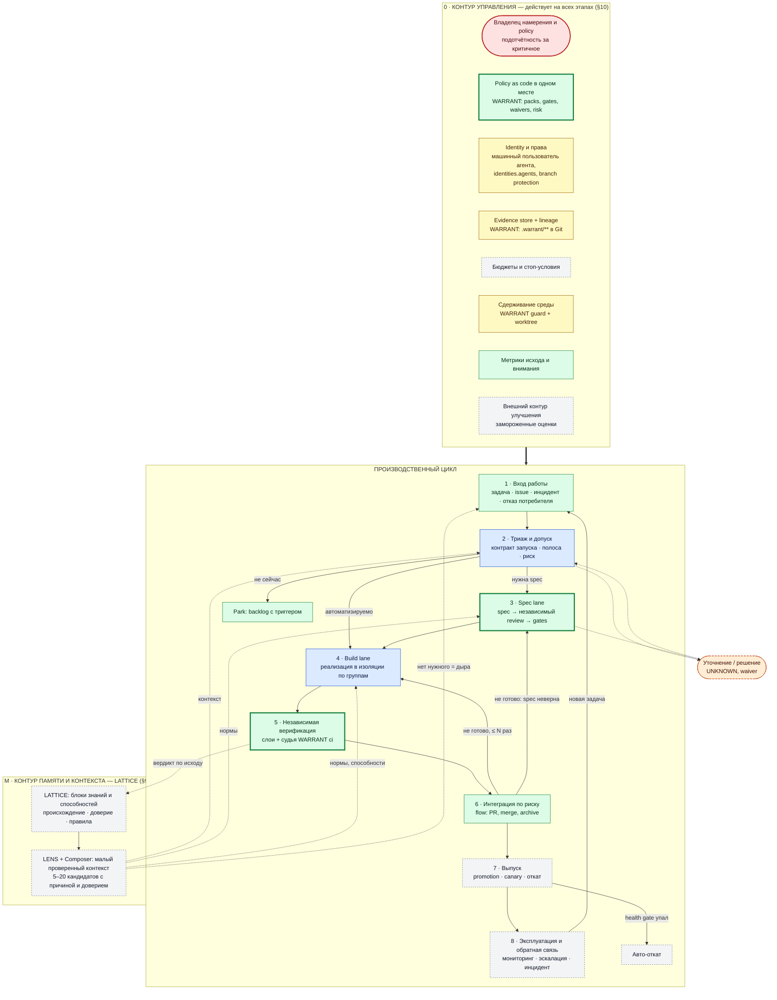
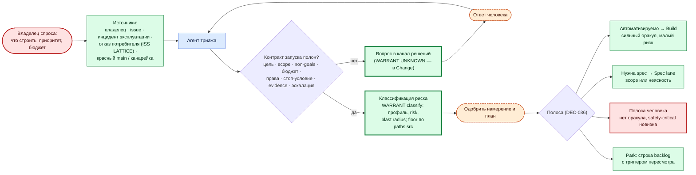
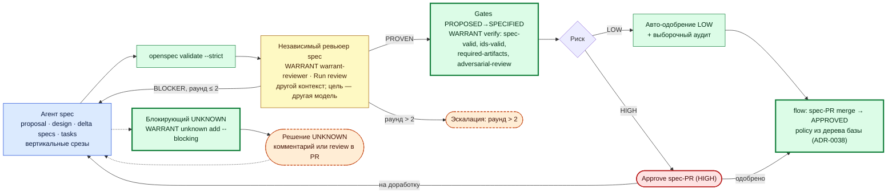
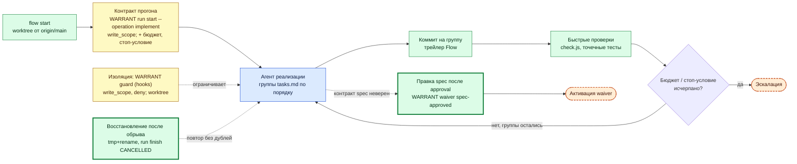
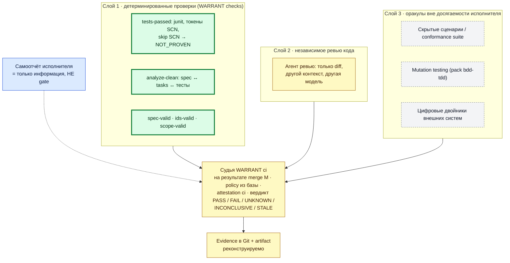
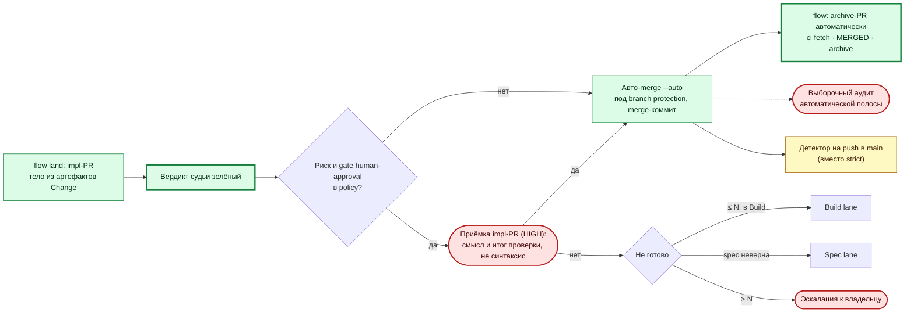
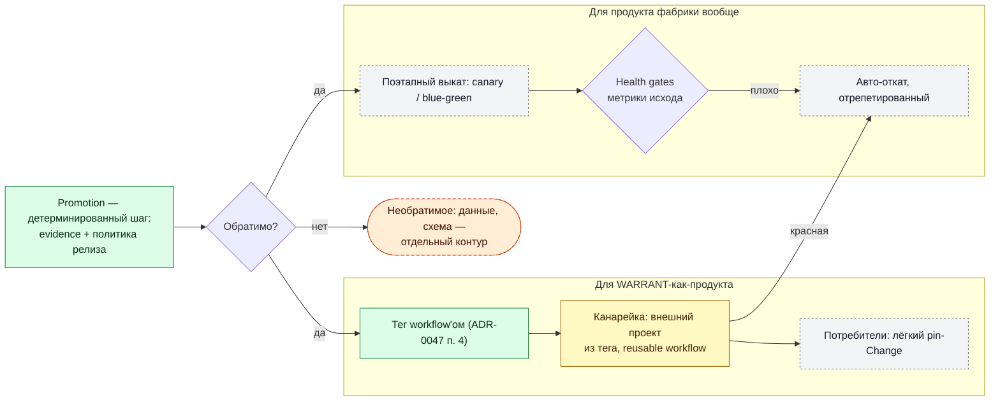
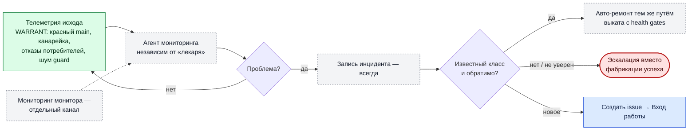
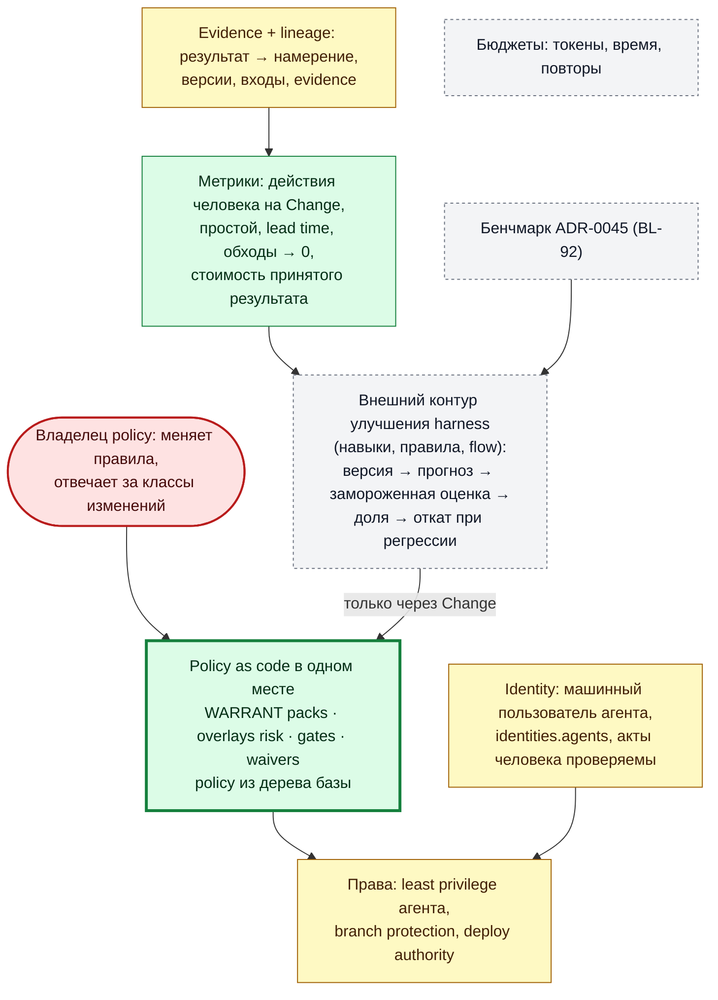
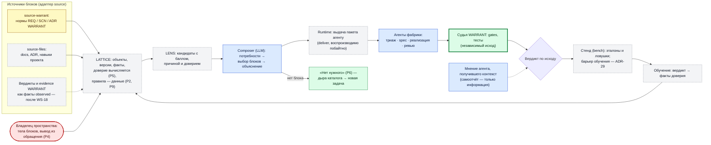

# Тёмная фабрика — схема v2 (перенесена из inbox 2026-09-29)

Источник: `D:/tmp/warrant-inbox/темная фабрика схема v2.md` (maintainer, 2026-09-29), перенесён без правок содержания; дальше правится здесь. Схема писалась **до** решений Q1–Q7: в ней человек стоит между этапами (оранжевые узлы). Что перестроить под модель «человек до запуска» — [03-open](03-open.md) §1; итоговый документ — `docs/process/dark-factory.md` (ADR-0050).

## Проблема

Нужна общая модель фабрики от задачи до эксплуатации: кто действует, кто проверяет, где человек, какую часть закрывает WARRANT, где LATTICE. Без неё автоматизация доставки (flow) и правки судьи (цикл 1) делаются по частям и не складываются в цикл.

## Идея

Версия 2 от 2026-09-29. За основу взята схема слайда (`темная фабрика процесс.md`), исправлены 7 расхождений с базой (там же, раздел «вердикт») и добавлено всё, что нашлось в darkfactory.dev через базу D:\kb. Ссылки на карточки даны ID. Как пройти от карточки до исходного файла darkfactory.dev (`raw/…` → URL → DF-REF), описано в `темная фабрика процесс.md`.

### Как я понял задачу

1. **Общая схема** — один цикл фабрики от задачи до эксплуатации и обратно плюс контур управления, который действует на всех этапах.
2. **Компоненты** — каждый этап отдельной подробной схемой: кто действует, что проверяется, где петли, где человек, какой частью закрыт WARRANT.
3. **Человек на первом этапе есть везде, где решение пока нельзя доверить машине, но он помечен как временный** — у каждого такого узла записано условие удаления. Источник разделяет:
   - **рутинное участие** — его можно и нужно убирать;
   - **ответственность** — владелец намерения и policy, подотчётный за критичное, выборочный аудит. Она остаётся: «темнота» — это отсутствие рутинного труда, а не отсутствие governance (TERM-073, DEC-034, PAT-083).
4. **WARRANT** показан там, где он соответствует архитектуре: контур изменения от spec до merge, независимый детерминированный судья, policy as code, хранилище evidence. Где его роль требует исправлений, стоит ссылка на реестр аудита (WS-NN).
5. **Где WARRANT не нужен** — триаж, выпуск, эксплуатация. Там показаны отдельные компоненты: будущие или внешние.
6. **LATTICE** (`D:\project\LATTICE\design`) входит как **третий контур — память и контекст фабрики** (§9б). Он поставляет агентам малый проверенный контекст и учится по вердиктам исхода.

**Быстрый обзор без схем — §13, «Матрицы»:**
1. кто кого потребляет;
2. кто решает, делает и проверяет;
3. кто что пишет;
4. светофор этапов;
5. радиус поражения;
6. обещание против проверки.

### Легенда

| Обозначение | Смысл |
|---|---|
| 🟦 синий | Агент (LLM) |
| 🟩 зелёный, жирная рамка | **WARRANT** — детерминированный компонент, есть в коде |
| 🟩 зелёный, тонкая рамка | Детерминированный компонент вне WARRANT (git, CI, flow, скрипт) |
| 🟧 оранжевый, пунктир | **Человек временно** — убрать по условию из таблицы §11 |
| 🟥 красный | **Человек постоянно** — ответственность, не рутина |
| ⬜ серый, пунктир | Будущий компонент, в WARRANT и фабрике пока нет |
| 🟨 жёлтый | Есть, но с дырой (WS-NN) — исправить до удаления человека |

---

### 1. Общая схема

**Как читать.**
- **Цикл замкнут.** Эксплуатация и отказы потребителей порождают новые задачи (ANT-035: merge — не финиш).
- **У каждой петли есть лимит и эскалация** (ANT-026). «Не готово» может вернуть задачу и в реализацию, и в spec: следующий шаг — по результату (ANT-025).
- **Контур управления не шаг, а среда.** Policy, identity, evidence, бюджеты и изоляция действуют на каждом этапе (ch09, ch16).
- **WARRANT закрывает этапы 3–6 и часть контура управления.** Этапы 1, 7, 8 — не его задача, для них нужны отдельные компоненты.
- **LATTICE — третий контур, память и контекст.** Он даёт агентам малый проверенный контекст на триаже, spec и реализации, а после проверки получает вердикт по исходу и меняет доверие. Честное «нет нужного» становится новой задачей. Подробно — §9б.

---

### 2. Этап 1–2 · Вход работы, триаж и допуск

| Элемент | Что делает | Опора в базе | WARRANT |
|---|---|---|---|
| Владелец спроса 🟥 | Решает, **что** строить. Пока за людьми: автономная оптимизация метрик ведёт к Гудхарту | DEC-016, ch01 (low) | — |
| Агент триажа | Разбирает вход, заполняет контракт, предлагает полосу | Astro (DF-REF-004) | Нет; кандидат — шаг `flow start` |
| Допуск по контракту | Неполный контракт не входит в очередь | PAT-092, ANT-026, ch03 | Частично: Run несёт `operation` и `write_scope`, но не бюджет и стоп-условие |
| Классификация риска | Риск задаёт глубину ревью и автономию | TERM-173, PAT-049, PAT-108 | `classify` есть; дыра WS-15 (profile выбирает LLM → floor по `paths.src`) |
| Полосы | Агенту — работа с оракулом и швами; человеку — без оракула | DEC-036, ch21 (high) | — |
| Внимание человека | Ресурс ограничен; триаж его бережёт | TERM-075, DF-REF-182 | Метрика «действия человека на Change» (`80-flow` §7) |

---

### 3. Этап 3 · Spec lane

| Элемент | Опора | WARRANT и дыры |
|---|---|---|
| Spec — не промпт: намерение с rationale и non-goals | ch02, TERM-086 | OpenSpec + схема артефактов — есть |
| Spec не должна разрастаться до размеров кода; вертикальные срезы | ANT-025, PAT-094 | Правило навыка; проверки нет |
| Ревьюер независим от автора: контекст, только diff, другая модель | DEC-026, ANT-032, TERM-195 | `warrant-reviewer` — другой контекст, но та же семья моделей (BL-28) → 🟨 |
| Одобрение по риску: LOW — автоматически с выборочным аудитом, HIGH — подотчётный человек | PAT-108, DEC-026, DF-REF-054 (Meta RADAR) | Решение Р-F1 (`80-flow`); аудит выборки — нового нет |
| Лимит раундов и эскалация | ANT-026 | Правило `fast-mode` (≤ 2 раунда) — есть текстом |
| Решение человека проверяемо (ссылка на review) | ch16, TERM-133 | UNKNOWN — есть; одобрение spec — «merge #N» словом → Approve машинного PR (WS-04) |

---

### 4. Этап 4 · Build lane

| Элемент | Опора | WARRANT и дыры |
|---|---|---|
| Изоляция архитектурой, а не подтверждениями | ch09 (high), ANT-031, PAT-104 | guard — это process boundary; обходы: symlink, регистр, `.claude/**` не policy-путь (WS-13, F-F-09) → 🟨 |
| Восстановимые прогоны: идемпотентность, явное восстановление | PAT-097, ch05 (high) | Run и evidence — есть (0.8.2); составные команды — WS-22 |
| Бюджет и стоп-условие у каждого прогона | PAT-092, ANT-026, ch08 | Нет ⬜ |
| Git не входит в мышление агента | — (наше, `80-flow`) | `flow` — план волны 1 |
| Сбой агента повторяется → сигнал архитектуры, документации, тестов | Astro, DF-REF-004 | Не собирается; кандидат — метрика повторов flow |

---

### 5. Этап 5 · Независимая верификация (слои)

| Элемент | Опора | WARRANT и дыры |
|---|---|---|
| Promotion только по независимым, слоистым, реконструируемым evidence; слои не делят модель и допущения | DEC-025, ch10 (high) | Слой 1 и судья — ядро WARRANT ✅ |
| Самоотчёт исполнителя — никогда не gate | ANT-032 | ✅ по устройству: evidence пишет CLI, CI судит сам |
| Скрытые сценарии, двойники, удовлетворённость вместо pass/fail | PAT-107, DF-REF-018 (StrongDM), PAT-105 | Нет ⬜ (фаза 5) |
| Правдоподобный сбой — худший режим | ANT-036 | Судья проверяет только PASS-gates (**WS-03**), `factory-golden-passed` закрывается любым тестом (WS-12), `ci` берётся из env (WS-17) → 🟨 |
| Evidence реконструируемо | DEC-025, TERM-133 | Проверка не сохраняется, 90-дневные artifact (**WS-18**) → 🟨 |

---

### 6. Этап 6 · Интеграция и ревью по риску

| Элемент | Опора | WARRANT и дыры |
|---|---|---|
| Калибровка по риску: не каждый diff и не «никто не читает» | PAT-108, DEC-026, ANT-034, DF-REF-054 | gate `human-approval` по risk — есть |
| Человек — не единственный детектор, а подотчётный владелец смысла | ANT-033, DF-REF-051, PAT-083 | ✅ детекцию несёт судья |
| Выборочный аудит авто-полосы | PAT-108 | Нет — новый процесс |
| Акт человека атрибутирован | ch16, PAT-083 | Общий аккаунт (**WS-04**) → машинный пользователь |
| Merge не пропускает непроверенное | — | Судья не на push в `main` (WS-16), PR без Change с кодом (**WS-14**) → 🟨 |

---

### 7. Этап 7 · Выпуск

| Элемент | Опора | WARRANT и дыры |
|---|---|---|
| Право на деплой отделено от возможности | PAT-109, ch12 (low) | Merge и тег — только через флоу и workflow |
| Поэтапный выкат, health gates, авто-откат | PAT-109, DEC-027 | Для WARRANT: откат = pin на прошлый тег; миграций нет (WS-08) |
| Автономный деплой — только обратимого | PAT-049, DEC-027 | — |
| Необратимые изменения данных — отдельный контур | PAT-111, ch14 | Не касается WARRANT |
| Канарейка ловит сломанную поставку до потребителя | — (аудит, С-1) | **WS-01/02** — первым |

---

### 8. Этап 8 · Эксплуатация и обратная связь

| Элемент | Опора | Статус |
|---|---|---|
| Фабрика без эксплуатации неполна | ANT-035, ch13 (medium) | У WARRANT аналог — отказы потребителей и канарейка, вручную |
| Эскалация вместо фабрикации; abstention | PAT-110, ANT-036, TERM-178 | Начинать отсюда |
| Автономию расширять постепенно: диагностика → известные классы → замкнутый цикл только для обратимого | DEC-028 (speculative) | FUTURE после стабилизации |
| Монитор независим от «лекаря» | DEC-028 | — |

---

### 9. Контур управления (control plane)

| Элемент | Опора | WARRANT |
|---|---|---|
| Политика в точках принуждения, в одном месте, одинаковая везде | PAT-050, TERM-169, DEC-031, ch16 | Packs и gates ✅; воспроизводимость — WS-18 |
| Реконструируемый исход (lineage) | TERM-133 | Частично (WS-18) |
| Least privilege, identity агента | ch15, PAT-048 | WS-04, WS-16 |
| Бюджеты как управление | ch08, PAT-045 | Нет |
| Самоулучшение только во внешнем контуре с замороженной оценкой | ANT-038, ch17 | Бенчмарк ADR-0045 — заготовка |
| Уровень автономии — доменный assurance case, а не самоприсвоенный | ANT-039, ch20 | Счёт §26 аудита как исполняемые проверки (I-05) |

---

### 9б. Контур памяти и контекста — LATTICE

Сверено с `D:\project\LATTICE\design` (v0.4/v0.5): `00-vision` (роли, P1–P13), `01-first-run`, `domains/22-run` (§4 выдача, §5 вердикт, §6 обучение), `domains/30-adapters` (`source-warrant`), ADR-24, ADR-29, ADR-37.

LATTICE по своему определению — «память решений с происхождением и доверием». Он хранит проверенные блоки (знания и способности). LENS сужает каталог до 5–20 кандидатов, Composer собирает решение, Runtime его выдаёт, а вердикт потребителя возвращается и меняет доверие. В фабрике это **цепочка поставок контекста**: PAT-101 — у контекста и навыков агента есть владелец, тесты, свежесть, provenance. Способ доставки знания выбирается по DEC-022, раздел ch07 (medium).

#### Соответствие LATTICE архитектуре фабрики

| Требование базы | LATTICE (дизайн) | Вердикт |
|---|---|---|
| Контекст — цепочка поставок: владелец, provenance, свежесть, тесты (PAT-101, ch07) | P4 (тело говорит владелец), происхождение и доверие по основанию (`declared` / `derived` / `observed` / `inferred`, домен 14), версии неизменны (P3) | ✅ Совпадает по сути |
| Малый контекст вместо «всего»; инструкции не копятся (ANT-029, DEC-022) | 5–20 кандидатов с причиной и доверием; повтор потребности — без поиска | ✅ Лечит тот же симптом, что шум guard в WARRANT (~6 КБ правил на каждую правку, WS-26) |
| Честный отказ вместо выдумки (ANT-036, TERM-178) | P6: «нужного нет» — сигнал дыры каталога | ✅ Прямо ложится в «эскалация вместо фабрикации» и во вход работы |
| Суждение модели — не факт; оценщик не владеет истиной (ANT-032, TERM-195) | P13 / ADR-37: judge отвечает «релевантно / то же ли», знание — только в LATTICE | ✅ |
| Самоулучшение — во внешнем контуре с замороженной оценкой (ANT-038, ch17) | P11 «стенд — часть системы»; ADR-29 — барьер на фактах обучения (необратимое), а не на смене настройки | ✅ Строже, чем у WARRANT (бенчмарк ADR-0045 — только заготовка) |
| Польза контекста измерена абляцией (PAT-102) | Стенд, базовая линия, «повтор дешевле и не хуже» (01-first-run) | ✅ Отвечает на вопрос LATTICE S-6 («польза контекста не измерена») |
| Контракт порта — у потребителя (DEC-041) | ADR-24: контракт порта принадлежит домену-потребителю | ✅ Правильная сторона границы |

#### Где стык с WARRANT и что проверить

1. **Вердикт должен приходить из независимого исхода, а не от агента, который получил контекст.** Если вердикт «контекст помог» даёт тот же агент, что им пользовался, это самоотчёт исполнителя (ANT-032) — теперь для памяти. Предложение: главным источником вердикта для LATTICE сделать **исход по судье WARRANT** (gates, тесты, review). Мнение агента — только информация. Это совпадает с целью LATTICE v2 «вердикт со следом исхода» (`00-vision`, таблица v1 → цель).
2. **Evidence WARRANT как знание (`observed`) — только после WS-18.** Сейчас результат проверки WARRANT не хранится и не реконструируем, имена обещают больше, чем проверяется (WS-12, WS-17). До исправления такие записи в LATTICE — основание не выше `declared`.
3. **`source-warrant` опирается на то, чего в WARRANT нет** (WS-11): ID `TERM-…` (в `02-vocabulary` их ноль), units доменов в `.kb-search/` вне git, путь `D:/project/WARRANT`. Нужно решение Р-2 (`40-action-plan`): WARRANT обещает стабильными только REQ / SCN / ADR-ID и файлы main specs.
4. **LATTICE — одновременно компонент фабрики и продукт, который фабрика строит.** Его репозиторий судит WARRANT (режим «процесс»), а сам он кормит агентов контекстом (режим «данные»). Это нормально (dogfooding, как у WARRANT), но версии нужно закреплять: фабрика пользуется **закреплённой** версией LATTICE, иначе правка памяти меняет поведение фабрики мимо её же контура улучшения (ANT-038).
5. **Статус — FUTURE.** Код LATTICE — только ядро (~850 строк), первый запуск ещё не проведён. В схеме v2 контур памяти серый. Подключать после стабилизации WARRANT (волны 0–3) и первого запуска LATTICE (критерии `01-first-run`).

#### Где LATTICE встаёт в цикл (точки подключения)

| Этап | Что даёт LATTICE | Что возвращается в LATTICE |
|---|---|---|
| 2 · Триаж | «Эту потребность уже решали?» → повтор без поиска; похожие задачи и решения | — |
| 3 · Spec | Нормы WARRANT, относящиеся к задаче (REQ / SCN / ADR) с доверием, вместо чтения всей нормы | Дыра: нормы нет → задача «дописать норму» |
| 4 · Build | Нормы и способности (блоки-стадии), правила проекта — малым пакетом | — |
| 5–6 · Проверка и ревью | Чек-лист норм для ревьюера | **Вердикт по исходу** (судья WARRANT) → доверие к выданным блокам |
| 8 · Эксплуатация | — | Промахи и дыры → ловушки стенда (P11) и новые задачи |
| Контур управления | — | Смена настройки или обучения — только через стенд (ADR-29); изменение навыков фабрики — только с замером (PAT-102) |

---

### 10. Где WARRANT соответствует архитектуре фабрики

| Роль в фабрике | Компонент WARRANT | Соответствие | Что исправить (реестр аудита) |
|---|---|---|---|
| Хребет состояния работы | Record Change: `PROPOSED → … → ARCHIVED` в Git | ✅ Как в Astro: состояние наблюдаемо, журнал в репозитории | — |
| Классификация риска | `classify`, overlays risk | ⚠️ | WS-15 — floor по `paths.src` |
| Независимый оракул promotion | `verify` + судья `warrant ci` | ✅ по устройству (не самоотчёт) | **WS-03**, WS-12, WS-17 |
| Policy as code | Packs, gates, waivers, policy из базы | ✅ | WS-19, WS-20 |
| Канал решений человека | UNKNOWN, waiver, `human-approval` | ⚠️ | **WS-04** — атрибуция |
| Evidence store | `.warrant/evidence`, artifact CI | ⚠️ | WS-18 — сохранять факт проверки |
| Сдерживание агента | guard + `write_scope` | ⚠️ Process boundary, не security | **WS-13**, F-F-09 |
| Ревьюер spec | `warrant-reviewer` | ⚠️ Та же семья моделей | BL-28 |
| Доставка (git-механика) | — | ⬜ | `flow` (`80-flow`) — отдельно от судьи |
| Триаж, выпуск, эксплуатация, бюджеты, контур улучшения | — | ⬜ Не задача WARRANT | Отдельные компоненты фабрики |

**Вывод.** WARRANT по архитектуре — это **контур управления изменением и независимый судья фабрики**: этапы 3–6 и policy + evidence в контуре управления. Именно так фабрику описывает источник: доверять ей можно настолько, насколько сильны независимые от исполнителя evidence и точки принуждения (паспорт darkfactory). Чтобы убрать человека из этапов 3–6, нужно закрыть **WS-03, WS-04, WS-13, WS-14**. Иначе автоматизация протащит их дыры.

---

### 11. Человек: что временно, что навсегда, условие удаления

| Узел | Этап 1 (сейчас) | Условие удаления (по evidence) | Что остаётся навсегда |
|---|---|---|---|
| Одобрение намерения и плана | Каждая задача | LOW: триаж совпадает с решением человека N раз подряд (метрика) | Владелец спроса: приоритеты, бюджет (DEC-016) |
| Ответ на уточнение (UNKNOWN) | Синхронно в чате | Не удаляется, а сжимается: асинхронно (review/комментарий), частота падает с полнотой контрактов | Канал эскалации |
| Одобрение spec | Все | LOW — сразу после: машинный пользователь, независимый ревьюер, выборочный аудит (Р-F1) | HIGH — подотчётный человек (PAT-108) |
| Приёмка кода | «merge #N» на всё | LOW — когда судья закрыл WS-03/13/14 и есть аудит выборки | HIGH — смысл и доменная корректность (ANT-034) |
| Активация waiver | Слово в чате | Не удаляется — это исключение из policy | Подотчётный человек, с проверяемой ссылкой (WS-04) |
| Merge archive-PR и docs-PR | «merge #N» | **Сразу** (Р-F2) — это механика | — |
| Выпуск (тег, pin) | Вручную | Тег — workflow; pin — после канарейки | Необратимые изменения |
| Эскалация инцидента | — | Не удаляется | Цель эскалации (PAT-110) |
| **Выборочный аудитор** | — | Новая постоянная роль | Держит доверие к автоматической полосе на данных (PAT-108) |

**Итог.** По источнику «человек → 0» недостижимо и не нужно. Цель — **рутинное участие → 0, ответственность — у названных людей**. Порядок снятия задают сила evidence и риск (TERM-173, PAT-049), а не желание ускориться.

### 12. Что сделать, чтобы схема заработала (связь с планом)

1. **Волна 0–1 из `80-flow`:** машинный пользователь, auto-merge archive и docs, `flow` v0, канарейка (WS-01/02) — этапы 6–7 без рутины человека.
2. **Судья — до снятия человека:** WS-03, WS-13, WS-14, WS-04. Это этапы 5–6.
3. **Контракт запуска и бюджеты** — в `flow start` и Run (этапы 2, 4).
4. **Выборочный аудит** автоматической полосы — процесс и метрика (этап 6).
5. **FUTURE:** скрытые сценарии и mutation (этап 5, фаза 5), мониторинг → issue (этап 8), внешний контур улучшения с бенчмарком ADR-0045 (§9).
6. **LATTICE (§9б) — после стабилизации WARRANT и первого запуска LATTICE.**
   - Решение Р-2 по `source-warrant`.
   - Вердикт для LATTICE берётся из исхода по судье WARRANT, а не из мнения агента.
   - Фабрика пользуется закреплённой версией LATTICE.

---

### 13. Матрицы — фабрика на одной странице

Участники (коды для таблиц):

| Код | Участник | Код | Участник |
|---|---|---|---|
| **H** | Человек (владелец, подотчётный) | **W** | WARRANT: CLI + судья `warrant ci` |
| **TA** | Агент триажа | **F** | flow (доставка: git, PR, merge) |
| **SA** | Агент spec | **G** | Git / GitHub (форж, CI-раннер) |
| **IA** | Агент реализации | **L** | LATTICE (память и контекст) |
| **RA** | Агенты ревью (spec, код) | | |

Значки: ✅ есть · ⚠️ есть с дырой (WS-NN) · ⬜ будет · ⛔ **запрещено** (ломает независимость) · — связи нет.

#### 13.1 Кто кого потребляет

Строка — **потребитель**, столбец — **поставщик**. В ячейке — что именно потребляется.

| потребляет ↓ \ у кого → | H | TA | SA | IA | RA | W | F | G | L |
|---|---|---|---|---|---|---|---|---|---|
| **H** | — | план, полоса на одобрение ⚠️ (в чате) | spec на одобрение (HIGH) ✅ | — (код не читает построчно) | отчёт ревью (HIGH) ✅ | `status`: вердикт, что ждут от меня ✅ | входящие решений ⬜ | уведомления, Approve ⚠️ WS-04 | дыры каталога ⬜ |
| **TA** | намерение, ответы ✅ | — | — | — | — | риск, профиль (`classify`) ⚠️ WS-15 | — | issue, отказы, красный `main` ⬜ | «уже решали?» ⬜ |
| **SA** | намерение, решения UNKNOWN ✅ | контракт запуска ⬜ | — | — | находки review ✅ | gates, Context Pack ✅ | — | — | нормы для задачи ⬜ |
| **IA** | waiver при правке spec ✅ | — | spec, tasks ✅ | — | находки ревью кода ⚠️ (в `fast-mode` пропущено) | Run, guard, `write_scope` ⚠️ WS-13 | worktree, ветка ⬜ | — | нормы, способности ⬜ |
| **RA** | — | — | артефакты spec ✅ | **только diff** ✅ / рассуждение исполнителя ⛔ | — | Context Pack `run review` ✅ | — | — | чек-лист норм ⬜ |
| **W** | решения по ссылке ⚠️ WS-04 | — | артефакты ✅ | код и тесты через checks ✅ / **самоотчёт** ⛔ | evidence review ⚠️ WS-20 | — | ⛔ (судья не зависит от доставки) | PR, merge, artifact, комментарии ✅ / `ci` из env ⚠️ WS-17 | ⛔ (судья не берёт знание из памяти) |
| **F** | Approve (через G) ⬜ | задача для `start` ⬜ | — | — | — | **только публичный JSON**: `status`, `verify`, `transition` ⬜ | — | PR, checks, review ✅ | — |
| **G** | настройки защиты ✅ | — | — | — | — | required check `warrant / warrant` ✅ | push, PR, `--auto` ⬜ (сейчас руками агента) | — | — |
| **L** | тела блоков от владельца ✅ | — | мнение агента — **только информация** ⛔ как вердикт | мнение — ⛔ как вердикт | — | нормы (`source-warrant`) ⚠️ WS-11; исход как `observed` ⬜ WS-18 | — | — | — |

**Что видно из матрицы:**
- **W — самый потребляемый поставщик** (его потребляют 7 из 8 остальных). Его надёжность и честность — узкое место всей фабрики: отсюда приоритет WS-03, WS-13, WS-17.
- **H потребляет у 7 поставщиков, и почти всё синхронно, в чате** — это главный источник простоя. Цель: всё через одну очередь входящих решений (`flow status`) и Approve на GitHub.
- **⛔-ячейки — архитектурные запреты, а не пробелы.**
  - Судья не читает самоотчёт исполнителя (ANT-032).
  - Судья не зависит от flow и от LATTICE: иначе проверка коррелирует с исполнением (DEC-025).
  - LATTICE не учится на мнении агента, который пользовался контекстом (P13).
  - Ревьюер видит diff, а не рассуждение автора (DEC-026).
- **F читает только публичный вывод W** — flow становится первым потребителем контракта CLI (WS-05).
- **Столбец L почти весь ⬜** — память пока будущий слой. Строка L показывает, чего LATTICE ждёт от WARRANT: исправить WS-11 и WS-18.

#### 13.2 Кто решает, кто делает, кто проверяет (по этапам)

| Этап | Решает | Делает | Проверяет **независимо** | Хранит итог | Человек: сейчас → цель |
|---|---|---|---|---|---|
| 1 Вход | H (владелец спроса) | TA, G (issue) | — | backlog, issues | всё → только спрос |
| 2 Триаж | TA предлагает, H одобряет | TA | W `classify` + floor | record: классификация | каждый план → LOW авто |
| 3 Spec | policy (LOW) / H (HIGH) | SA | RA (другой контекст) + W gates | OpenSpec, record, evidence | каждый spec → только HIGH |
| 4 Build | — (по контракту) | IA | W guard (процесс) | коммиты на группу | — |
| 5 Верификация | policy (gates) | W checks | **W судья на M** + RA | evidence + artifact | — |
| 6 Интеграция | policy / H (HIGH) | F | W `ci` (required check) | `main`, record `MERGED` / `ARCHIVED` | «merge #N» везде → приёмка только HIGH |
| 7 Выпуск | policy релиза | workflow тега, F | канарейка | тег | вручную → авто |
| 8 Эксплуатация | H (эскалация) | агент мониторинга | независимый монитор | инциденты → issues | — |
| Память | владелец пространства | L: LENS, Composer | стенд (ADR-29) | журнал LATTICE | — |

**Правило, которое держит таблица:** в каждой строке «Делает» ≠ «Проверяет». Где они совпали бы, это ANT-032. Единственная строка, где проверка — только процесс (4, guard), закрывается этапом 5.

#### 13.3 Кто что пишет (единственный писатель)

| Объект | Единственный писатель | Читают | Писать **не должен** | Нарушение сейчас |
|---|---|---|---|---|
| Артефакты spec | SA (в Run, `write_scope`) | RA, W, L | RA (ревью только читает) | — |
| Record Change (`.warrant/changes`) | W CLI | F, W `ci`, L | агент руками, человек | — (правило «JSON только через CLI») |
| Evidence | W CLI (`verify`, `ci fetch`) | W `ci`, L | агент, человек | R-28; `ci` из env — WS-17 |
| Waiver | W CLI после решения H | W | агент без ссылки на решение | WS-04, BL-75 |
| Решение UNKNOWN | H (комментарий или review в PR) | W `ci` | агент под аккаунтом H | **WS-04** |
| Policy, packs | владелец policy через Change | W | PR, который этой же policy судится | **WS-13** (`.claude/**` не policy-путь) |
| `main` | G merge по вердикту | все | прямой push | WS-16 |
| Тег | workflow | потребители, канарейка | человек руками | BL-93 |
| Тела блоков LATTICE | владелец пространства (P4) | LENS | агент, Composer (P6) | — (дизайн) |
| Факты доверия LATTICE | обучение по вердикту через стенд | LENS | judge (P13) | — (дизайн) |

Опора: TERM-084 single-writer control. Каждое «нарушение» — место, где запись может сделать не тот, кто должен. Ровно эти места аудит пометил S1/S2.

#### 13.4 Светофор этапов (где мы сейчас)

| Этап | Сейчас | Главный блокер | Чем закрывается | Волна |
|---|---|---|---|---|
| 1 Вход | 🔴 вручную | нет триажа и контракта | `flow start` + контракт запуска | 3 |
| 2 Триаж | 🟡 `classify` есть | WS-15 | floor `paths.src` ⇒ `feature` | 1–3 |
| 3 Spec | 🟢 работает | WS-04, BL-28 | машинный пользователь | **0** |
| 4 Build | 🟡 | WS-13, нет бюджета | судья, контракт | 2–3 |
| 5 Верификация | 🟡 ядро есть | **WS-03**, WS-17, WS-18 | судья | 3 |
| 6 Интеграция | 🟡 | WS-14, WS-16, «merge #N» | flow, ADR | **0–3** |
| 7 Выпуск | 🔴 | **WS-01** | `npm pack` → tgz, канарейка | **0** |
| 8 Эксплуатация | 🔴 нет | — | FUTURE | после |
| Память | ⬜ | нет кода, WS-11 | первый запуск LATTICE | после |

#### 13.5 Если сломан X — что встаёт (радиус поражения)

| Отказал | Что встаёт | Что продолжает работать | Отказ безопасен? |
|---|---|---|---|
| W CLI | переходы Change, guard | всё вне Change | ✅ закрыто по умолчанию (`INCONCLUSIVE` / `BLOCKED`), но коды выхода смешаны (WS-06) |
| W `ci` (судья) | merge (required check) | локальная работа | ✅ при branch protection; ❌ без неё (у LATTICE её нет) |
| flow | механика возвращается к навыкам и ручному git | всё остальное | ✅ мягкая деградация — flow не держит состояния |
| GitHub | `MERGED`, merge, CI, решения человека | локальная работа, spec | ⚠️ жёсткая зависимость не названа (C-20) |
| LATTICE | агенты читают нормы целиком, как сейчас | всё | ✅ должно быть: контекст открыт при отказе и **не влияет на вердикт** |
| Identity (машинный пользователь) | атрибуция решений человека | всё | ❌ **тихо** (`SHARED_IDENTITY` — только информация) |
| Человек не отвечает | узлы Ч копятся в очереди | авто-полоса LOW | ✅, если решения асинхронны |
| Модель LLM | все агенты | судья, flow, история | ✅ судья детерминирован |

**Что видно:** опасные отказы — тихие (identity), а не громкие. Их нужно превращать в громкие: `doctor` (I-04) и блокирующая находка для HIGH.

#### 13.6 Обещание против проверки («имена сильнее проверок»)

| Что написано в записи | Как звучит | Что на самом деле проверено | Статус |
|---|---|---|---|
| gate `WAIVED` у `MERGED` | есть действующий waiver | судья не сверяет | ❌ **WS-03** |
| `human-approval --by <maintainer>` | одобрил человек | логин из `roles`; аккаунт общий | ❌ **WS-04** |
| `attestation.type: ci` | сделано в CI | переменные окружения | ⚠️ WS-17 |
| `factory-golden-passed: PASS` | golden-тесты прошли | любой `test-report` | ⚠️ WS-12 |
| review `PROVEN` | spec проверена независимо | та же семья моделей, локально, без attestation | ⚠️ BL-28, WS-20 |
| `waiver_state: ACTIVE` | действует | не пересчитывается после срока | ⚠️ WS-18 |
| тест SCN пропущен | — | `NOT_PROVEN` | ✅ исправлено (S-4) |
| доверие LATTICE `observed` | наблюдалось | основание вычисляется, не присваивается (P5) | ✅ по дизайну |

**Как пользоваться:** каждая строка ❌/⚠️ — либо проверку добавить в судью, либо поле переименовать или пометить как claim (I-07). Пока строка не зелёная, **человека из соответствующего узла не убирать** (§11).

## Вопросы для grilling

Решены в [01-accepted](01-accepted.md) (Q1–Q7). Перестройка узлов человека под эти решения — [03-open](03-open.md) §1.

## Вне объёма

- Этапы 7 (выпуск продукта вообще), 8 (эксплуатация) и контур памяти LATTICE (§9б) — будущие компоненты.
